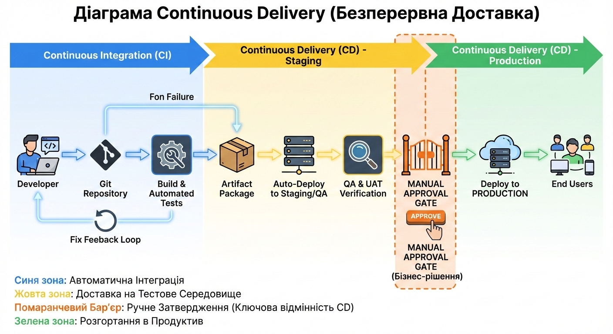

# Вступ до Continuous Delivery

Уявіть знайому сцену релізного дня: команда щойно виправила критичний баг. Патч готовий, протестований і погоджений, але користувачі побачать його лише за два тижні, коли відкриється наступне вікно релізу. Тим часом зростає невдоволення клієнтів, накопичуються звернення в підтримку, а конкуренти рухаються швидше.

Саме таке тертя й покликана прибрати Continuous Delivery.

  

## Що таке Continuous Delivery?

Continuous Delivery (CD), або безперервна доставка, змінює сам підхід до того, як програмне забезпечення потрапляє до користувачів. Як сформулював Джез Хамбл на [continuousdelivery.com](https://continuousdelivery.com):

> "Continuous Delivery — це здатність доставляти зміни всіх типів, включаючи нові функції, зміни конфігурації, виправлення помилок та експерименти, у production-середовище або до рук користувачів, безпечно та швидко, в стійкий спосіб."

Подібно до DevOps, Continuous Delivery — це не просто набір інструментів. Це водночас **технологічна** і **культурна** зміна: новий спосіб мислити, будувати процеси та працювати разом так, щоб безпечна й часта доставка стала сталою практикою.

## Які проблеми вирішує Continuous Delivery?

Continuous Delivery вирішує декілька критичних викликів, з якими стикаються організації при випуску програмного забезпечення:

### Автоматизація схильних до помилок ручних процесів

CD автоматизує ручний, схильний до помилок процес випуску коду в production-середовище (або будь-яке інше середовище). Усуваючи людський фактор із повторюваних завдань розгортання, організації можуть досягти більш надійних та послідовних релізів.

### Кодифікація знань

Мета полягає в тому, щоб **кодифікувати** спеціалізовані знання як розробників, так і операторів, відповідальних за випуск програмного забезпечення. Це звільняє їх від рутинної роботи з релізами, дозволяючи зосередитися на доставці цінності та вирішенні значущих бізнес-завдань. Коли процеси випуску автоматизовані та задокументовані як код, організаційні знання стають передавальними та стійкими.

### Покращення прозорості

Кодифікація процесу випуску драматично покращує **прозорість** у конвеєрі розгортання (deployment pipeline). Кроки, необхідні для переходу від збірки до запуску в production, чітко викладені та зроблені доступними. Ця прозорість допомагає виявити обмеження продуктивності розробників і заохочує спільний підхід до покращення щоденної роботи.

### Прискорення виходу на ринок

Автоматизація випуску змін коду **прискорює** доставку цінності клієнтам. Організації можуть перейти від очікування тижнів чи місяців перед баченням змін у production до доставки їх до рук користувачів протягом днів або навіть годин. Цей швидкий цикл зворотного зв'язку дозволяє швидше ітерувати та навчатися.

### Забезпечення масштабованості

**Масштабування** процесу випуску, що залежить від людей-операторів, вимагає пошуку кваліфікованого персоналу та його навчання — трудомістка та дорога перспектива. Continuous Delivery можна масштабувати через покращення самого автоматизованого процесу, які залишаються актуальними надовго в майбутньому без потреби в пропорційному збільшенні чисельності персоналу.

### Інфраструктура як код

Continuous Delivery природно охоплює базову інфраструктуру та конфігурацію для середовищ. Це призводить до глибшого розуміння того, як складаються середовища, і дозволяє легко їх відтворювати. Підтримуючи нижчі середовища максимально подібними до production, організації можуть значно знизити ризик проблем при випуску через невідповідності між середовищами.

## Чим Continuous Delivery відрізняється від Continuous Integration?

Continuous Integration (CI) та Continuous Delivery (CD) зазвичай зустрічаються разом і часто згадуються як одна уніфікована практика (CI/CD). Однак це окремі концепції, хоча й глибоко переплетені, оскільки **CI є обов'язковою передумовою для CD**.

### Continuous Integration (CI)

**CI** зосереджується на регулярному об'єднанні (merge) коду в централізовану гілку. Його основна мета — виявлення проблем з вихідним кодом на ранніх стадіях циклу розробки за допомогою автоматизованого тестування та лінтингу. Це надає швидкий зворотний зв'язок розробникам, дозволяючи їм створювати цінність швидше та виправляти проблеми, коли це менш затратно.

### Continuous Delivery (CD)

**CD** бере зміни, які були протестовані та інтегровані в кодову базу, і автоматизує їх розгортання в середовище.

### Процес збірки: CI чи CD?

Сам процес збірки (build) може вважатися частиною або CI, або CD, залежно від реалізації:

- Якщо автоматизовані тести запускаються проти збірки, це зазвичай вважається **CI**
- Якщо збірка не створюється до тих пір, поки код не буде інтегрований в основну гілку і стане частиною конвеєра розгортання в середовище, тоді це **CD**

## А що з іншим CD? Continuous Deployment проти Continuous Delivery

Ви могли зустріти термін Continuous Deployment, який також часто скорочується як CD, так само як і Continuous Delivery. Хоча обидві практики пов'язані, вони мають різні значення та наслідки.

### Continuous Delivery (Безперервна Доставка)

**Continuous Delivery** автоматизує розгортання артефакту збірки в середовище. Зазвичай випуск у production контролюється вимогою до людини схвалити його вручну. Ця практика не обов'язково враховує просування між середовищами (наприклад, зі staging до production) або надає вбудовані механізми для рішень про відкат (rollback) — це залишається людськими контрольованими рішеннями.

### Continuous Deployment (Безперервне Розгортання)

**Continuous Deployment** йде далі в автоматизації, впроваджуючи практику автоматизації всього життєвого циклу розгортання додатку **без будь-якого втручання людини**.

Наприклад, як тільки код потрапляє в основну гілку репозиторію, він автоматично:
1. Проходить тестування
2. Генерує збірку
3. Випускається в staging-середовище
4. Просувається в production

Автоматизована система зупиняє прогресію тільки якщо тести провалюються або виявлена проблема з телеметрії (наприклад, забагато 500 статус-кодів або помилок в логах додатку), автоматично запускаючи відкат (rollback).

### Досягнення Continuous Deployment

Перехід до Continuous Deployment вимагає повного впровадження практик як CI, так і CD (Continuous Delivery), з достатньою довірою, вбудованою в автоматизоване тестування, моніторинг та механізми відкату, щоб повністю усунути ручні шлюзи випуску. Це представляє вершину зрілості автоматизації розгортання.

## Ключові висновки

Щоб закріпити ваше розуміння Continuous Delivery, розгляньте ці важливі моменти:

1. **CD — це трансформація**: Continuous Delivery — це і технологічна, і культурна трансформація для організації, а не просто набір інструментів.

2. **Фокус на автоматизації**: CD — це практика розробки програмного забезпечення, яка зосереджується на доставці змін усіх типів у production або до рук користувачів, безпечно та швидко, в стійкий спосіб.

3. **Не про усунення людей**: Мета не в тому, щоб заощадити кошти, усунувши персонал, необхідний для управління релізами. Скоріше, це звільнити інженерів від рутинної роботи з релізами, щоб вони могли зосередитися на створенні цінності та вирішенні бізнес-завдань.

4. **Автоматизація замість ручних процесів**: CD зосереджується на автоматизації випуску змін коду, а не на залежності від кваліфікованого персоналу, що слідує ручним процесам.

5. **CI є обов'язковим**: Continuous Integration не є незалежним від Continuous Delivery — CI є обов'язковою передумовою для успішного впровадження CD.

6. **Continuous Deployment є опціональним**: Хоча Continuous Deployment представляє просунуту еволюцію практик CD, він не є обов'язковою частиною Continuous Delivery. Багато успішних організацій практикують CD з ручними шлюзами схвалення для production-релізів.

## Переваги впровадження Continuous Delivery

Організації, які успішно впроваджують CD, отримують численні переваги:

- **Швидший час виходу на ринок**: Зміни доставляються користувачам швидше
- **Зменшення ризиків**: Менші, більш часті релізи означають меншу поверхню для потенційних проблем
- **Покращена якість**: Автоматизоване тестування та стандартизовані процеси підвищують якість коду
- **Краща співпраця**: Команди працюють більш узгоджено завдяки спільним цілям та прозорості
- **Підвищена продуктивність**: Інженери звільняються від рутинних завдань для більш значущої роботи
- **Економія коштів**: Автоматизація зменшує витрати на ручну роботу та виправлення помилок

---

## Подальше навчання

Щоб поглибити свої знання про Continuous Delivery:

- Відвідайте [continuousdelivery.com](https://continuousdelivery.com) для авторитетних ресурсів
- Прочитайте книгу "Continuous Delivery" Джеза Хамбла та Девіда Фарлі
- Досліджуйте практики GitOps як сучасний патерн реалізації CD
- Вивчайте інструменти, що підтримують CD-конвеєри в вашому технологічному стеку
- Розгляньте курси та сертифікації з DevOps та Continuous Delivery

Пам'ятайте: шлях до Continuous Delivery є ітеративним. Починайте з малого, автоматизуйте поступово та безперервно покращуйте свої процеси на основі зворотного зв'язку та метрик. Успіх приходить не одразу, але кожен крок до автоматизації та покращення процесів наближає вас до мети створення ефективної та надійної системи доставки програмного забезпечення.

---

[Повернутися до огляду курсу](../../README.md) | [Далі: Вступ до GitOps](../../1-Intrduction-GitOps/UA/ВступДоGitOps.md)

