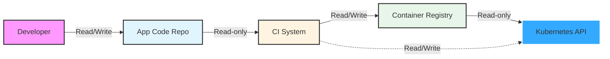
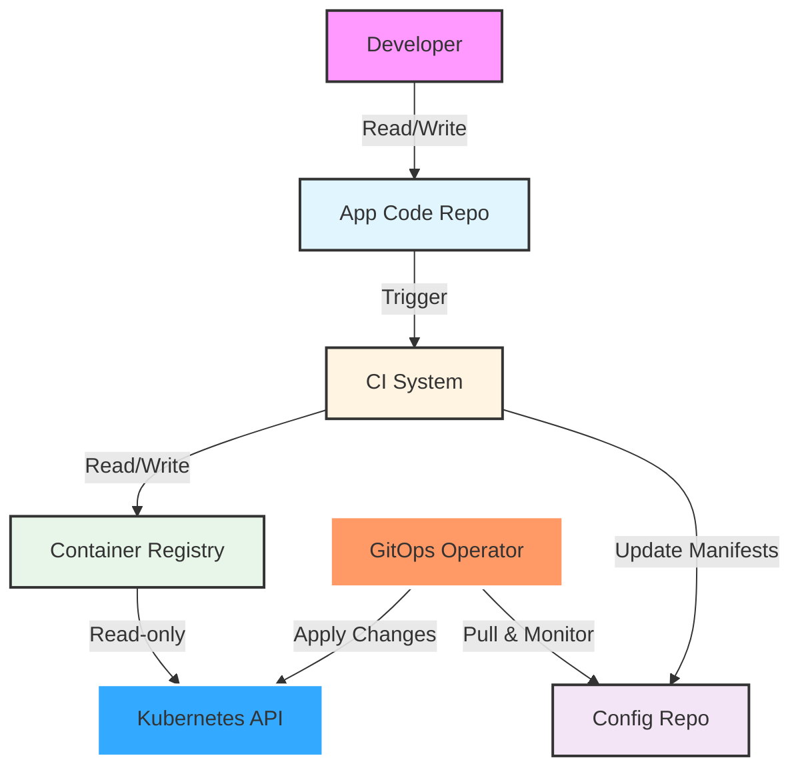
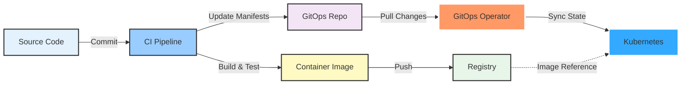

# Introduction to GitOps

> **Note:** This document contains Mermaid diagrams. To view them properly:
> - **VS Code**: Install the "Markdown Preview Mermaid Support" extension
> - **GitHub/GitLab**: Diagrams render automatically
> - **Other editors**: Install a Mermaid preview extension

## What is GitOps?

GitOps represents a modern approach to infrastructure and application management that leverages Git as the single source of truth for declarative infrastructure and applications. The OpenGitOps project has established four foundational principles that define the GitOps methodology:

### The Four Principles of GitOps

#### 1. **Declarative**
*"A system managed by GitOps must have its desired state expressed declaratively."*

Rather than writing imperative scripts that describe *how* to achieve a state, GitOps requires you to declare *what* the desired state should be. This declarative approach makes systems more predictable, reproducible, and easier to understand.

#### 2. **Versioned and Immutable**
*"Desired State is stored in a way that supports versioning, immutability of versions, and retains a complete version history."*

By storing your desired state in Git, you automatically gain:
- Complete audit trail of all changes
- Ability to roll back to any previous state
- Clear understanding of who changed what and when
- Immutable history that can't be altered

#### 3. **Pulled Automatically**
*"Software agents automatically pull the desired state declarations from the source."*

Unlike traditional push-based deployments where CI/CD systems actively push changes to environments, GitOps uses agents that continuously monitor the Git repository and automatically pull updates when changes are detected.

#### 4. **Continuously Reconciled**
*"Software agents continuously observe actual system state and attempt to apply the desired state."*

GitOps operators constantly compare the actual state of your system with the desired state declared in Git. When drift is detected, the system automatically attempts to reconcile, bringing the actual state back in line with what's defined in the repository.

---

> *"The OpenGitOps [project] is a set of open-source standards, best practices, and community-focused education to help organizations adopt a structured, standardized approach to implementing GitOps."* ~ opengitops.dev

---

### GitOps in One Sentence

**GitOps is declaratively storing the desired state with immutable versions and using a software agent to reconcile the live state with the desired state.**

### GitOps in the Context of Kubernetes

When practicing GitOps with Kubernetes, you store the Kubernetes manifests used in a cluster within Git and utilize a tool (such as a GitOps operator) to apply those manifests to your cluster. The operator continuously monitors the Git repository and automatically syncs any changes to the cluster, ensuring that what's running always matches what's defined in Git.

---

## Push vs. Pull Models

Understanding the difference between traditional push-based deployment and GitOps pull-based deployment is crucial to appreciating GitOps's advantages.

### Traditional Push Model

Before GitOps gained popularity, most organizations employed the push model for deployments, where modifications are applied to the cluster through a CI/CD pipeline. Here's how it works:

**The Push Model Workflow:**
1. Developer pushes code changes to the repository
2. CI/CD pipeline is triggered
3. Build process creates container images
4. Images are pushed to a container registry
5. Pipeline applies manifests directly to the Kubernetes API

### Problems with the Push Model

The push model is considered **"imperative"** - it defines a sequence of steps necessary to achieve the end goal. This approach presents several significant disadvantages:

- **Security Risks**: The workflow requires credentials with write access to the cluster and direct access to the cluster's API server. If the CI/CD system is compromised, attackers gain full cluster access.

- **Lack of Reproducibility**: Since the cluster's state is established imperatively through a series of commands, reproducing it requires re-executing all workflows that have modified the cluster in the correct order.

- **Complexity and Fragility**: To achieve the desired state, you must meticulously plan every step in the sequence. Any modifications to the steps demand detailed consideration and thorough testing to avoid unintended consequences.

- **No Drift Detection**: Once deployed, there's no mechanism to detect if the cluster state has deviated from what was intended.

---

### The GitOps Pull Model

GitOps transforms this paradigm by implementing the pull model. After changes are committed to the repository, the build process completes and updates the manifests representing the desired state in an environment configuration repository. A GitOps operator running within the cluster monitors this repository and automatically pulls changes, applying them to maintain the desired state.

### Advantages of the Pull Model

The pull model is **"declarative"** - you define what should exist, and the tooling determines how to implement it. This paradigm shift provides numerous benefits:

#### **Repeatability**
With a declarative desired state, deployments become inherently repeatable. Environments can be effortlessly recreated from the Git repository at any time, making disaster recovery and environment provisioning straightforward.

#### **Enhanced Collaboration**
Changes are proposed through Pull Requests (or Merge Requests), enabling a familiar review process identical to source code changes. Teams can collaborate effectively, review proposed infrastructure changes, and maintain quality standards before deployment.

#### **Complete Visibility**
The commit history provides a comprehensive audit trail, clearly indicating how the desired state evolved over time and the rationale behind each change. You can see exactly what was changed, when, by whom, and why.

#### **Consistency and Integration**
Modifications to the collective desired state of the cluster must first be integrated into the environment configuration repository. This ensures that all changes go through the same review and approval process, maintaining consistency across teams.

#### **Improved Security**
The workflow eliminates the need for credentials with write access or direct access to the cluster's API. The source of truth originates from a trusted Git repository and is applied by a service operating within your infrastructure (or cluster). This significantly reduces the attack surface and follows the principle of least privilege.

---

## How Are GitOps and Continuous Delivery Related?

GitOps and Continuous Delivery are complementary practices that work synergistically to achieve the shared objective of delivering software faster and with superior quality through automation and continuous feedback.

### The Relationship Between GitOps and CD

**GitOps is a framework for managing the state of environments, while Continuous Delivery focuses on automating the flow of changes.**

Think of it this way:
- **Continuous Delivery** provides the *automation pipeline* that builds, tests, and prepares your software for deployment
- **GitOps** provides the *deployment and management mechanism* that ensures your environments match the desired state defined in Git

### How They Work Together

**The Combined Workflow:**
1. Developers commit code changes (CD begins)
2. CI pipeline runs automated tests and builds (CD)
3. Container images are created and stored (CD)
4. Deployment manifests are updated in the GitOps repository (CD→GitOps transition)
5. GitOps operator detects changes and pulls them (GitOps)
6. Operator reconciles the cluster state with desired state (GitOps)

### Key Differences

| Aspect | Continuous Delivery | GitOps |
|--------|-------------------|---------|
| **Primary Focus** | Automating the software release process | Managing infrastructure and application state |
| **Deployment Method** | Often uses push-based deployments | Uses pull-based deployments |
| **State Management** | Focuses on the pipeline | Focuses on the desired state in Git |
| **Scope** | Build, test, and deliver artifacts | Deploy and maintain environments |

### GitOps as a CD Implementation

**GitOps fundamentally transforms how CD workflows interact with infrastructure by pulling changes from an environment configuration repository instead of pushing them directly into the cluster.**

This shift provides:
- **Better separation of concerns**: Build pipelines don't need cluster access
- **Enhanced security**: No credentials stored in CI/CD systems
- **Automatic drift correction**: System self-heals when manual changes are made
- **Simplified rollbacks**: Just revert the Git commit

---

## Benefits of GitOps

Implementing GitOps delivers significant advantages across multiple dimensions:

### **Developer Productivity**
- Developers work with familiar Git workflows
- No need to learn cluster-specific deployment tools
- Faster iteration through automated deployments
- Easy rollbacks via Git revert

### **Operational Excellence**
- Automatic drift detection and correction
- Self-healing systems that continuously reconcile
- Reduced mean time to recovery (MTTR)
- Infrastructure as Code (IaC) best practices enforced

### **Security and Compliance**
- Complete audit trail of all changes
- No direct cluster access required for deployments
- Credentials never leave the cluster
- Policy enforcement through Git branch protection

### **Reliability and Consistency**
- Environments are reproducible from Git
- Consistent deployment process across all environments
- Reduced human error through automation
- Tested disaster recovery through Git history

---

## Common GitOps Operators

While this course focuses on GitOps principles rather than specific tools, several GitOps operators are commonly used:

- **Flux CD** - CNCF graduated project for GitOps on Kubernetes
- **ArgoCD** - Popular GitOps operator with powerful UI
- **Jenkins X** - Cloud-native CI/CD with built-in GitOps
- **Rancher Fleet** - Lightweight GitOps for multi-cluster management

Each operator implements the core GitOps principles while offering different features and user experiences. The key is understanding the principles, which remain constant regardless of the tooling.

---

## Best Practices for GitOps

### Repository Structure
- Separate application code repositories from configuration repositories
- Organize manifests by environment (dev, staging, production)
- Use branches or directories to isolate environments

### Security Considerations
- Encrypt secrets using tools like Sealed Secrets or External Secrets Operator
- Use RBAC to control who can approve changes
- Implement branch protection and require reviews
- Scan repositories for sensitive data

### Workflow Optimization
- Keep manifests DRY (Don't Repeat Yourself) using tools like Kustomize or Helm
- Automate image tag updates in manifests
- Use progressive delivery strategies (canary, blue-green)
- Implement automated testing of manifests

### Monitoring and Observability
- Monitor the GitOps operator's sync status
- Alert on sync failures or drift detection
- Track deployment metrics and frequency
- Maintain logs of all reconciliation events

---

## Getting Started with GitOps

Ready to implement GitOps? Here's a roadmap:

1. **Understand the Principles**: Ensure your team grasps the four GitOps principles
2. **Choose Your Operator**: Select a GitOps operator that fits your needs
3. **Structure Your Repositories**: Design your Git repository structure
4. **Start Small**: Begin with a non-production environment
5. **Implement Security**: Set up secrets management and access controls
6. **Automate Gradually**: Incrementally add automation and testing
7. **Monitor and Iterate**: Continuously improve based on metrics and feedback

---

## Further Learning

To deepen your understanding of GitOps:

- Visit [opengitops.dev](https://opengitops.dev) for official standards and best practices
- Explore the CNCF GitOps Working Group
- Read "GitOps and Kubernetes" by Manning Publications
- Join GitOps community forums and conferences
- Experiment with different GitOps operators in lab environments

Remember: GitOps is not just about tools—it's about adopting a mindset of declarative, version-controlled infrastructure management. Start with the principles, choose tools that support them, and continuously refine your approach.

---

**Ready to test your knowledge? Try the GitOps quiz to see how well you understand these concepts!**

