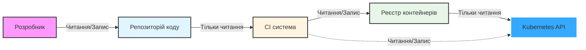
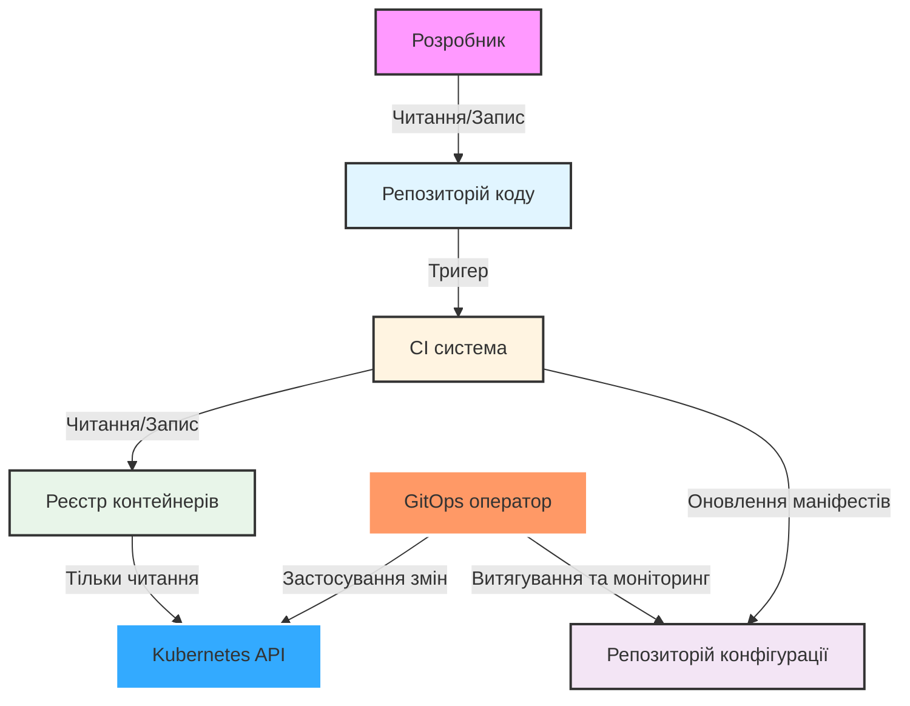
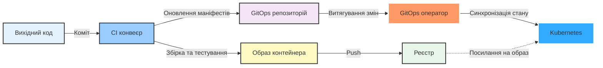

# Вступ до GitOps

## Що таке GitOps?

GitOps представляє сучасний підхід до управління інфраструктурою та додатками, який використовує Git як єдине джерело правди для декларативної інфраструктури та додатків. Проєкт OpenGitOps встановив чотири фундаментальні принципи, що визначають методологію GitOps:

### Чотири принципи GitOps

#### 1. **Декларативність**
*"Система, керована GitOps, повинна мати свій бажаний стан, виражений декларативно."*

Замість написання імперативних скриптів, що описують *як* досягти стану, GitOps вимагає декларувати *який* бажаний стан має бути. Цей декларативний підхід робить системи більш передбачуваними, відтворюваними та легшими для розуміння.

#### 2. **Версійність та Незмінність**
*"Бажаний стан зберігається способом, який підтримує версіонування, незмінність версій та зберігає повну історію версій."*

Зберігаючи ваш бажаний стан у Git, ви автоматично отримуєте:
- Повний аудит всіх змін
- Можливість відкоту до будь-якого попереднього стану
- Чітке розуміння, хто, що і коли змінив
- Незмінну історію, яку неможливо змінити

#### 3. **Автоматичне Витягування**
*"Програмні агенти автоматично витягують декларації бажаного стану з джерела."*

На відміну від традиційних розгортань на основі push, де CI/CD системи активно проштовхують зміни в середовища, GitOps використовує агентів, які безперервно моніторять Git-репозиторій і автоматично витягують оновлення при виявленні змін.

#### 4. **Безперервна Узгодженість**
*"Програмні агенти безперервно спостерігають за фактичним станом системи та намагаються застосувати бажаний стан."*

GitOps-оператори постійно порівнюють фактичний стан вашої системи з бажаним станом, оголошеним у Git. Коли виявляється відхилення, система автоматично намагається узгодити стани, повертаючи фактичний стан до того, що визначено в репозиторії.

---

> *"Проєкт OpenGitOps - це набір стандартів з відкритим вихідним кодом, найкращих практик та освіти, орієнтованої на спільноту, щоб допомогти організаціям прийняти структурований, стандартизований підхід до впровадження GitOps."* ~ opengitops.dev

---

### GitOps в одному реченні

**GitOps - це декларативне зберігання бажаного стану з незмінними версіями та використання програмного агента для узгодження поточного стану з бажаним.**

### GitOps в контексті Kubernetes

При практикуванні GitOps з Kubernetes ви зберігаєте маніфести Kubernetes, що використовуються в кластері, в Git і використовуєте інструмент (такий як GitOps-оператор) для застосування цих маніфестів до вашого кластера. Оператор безперервно моніторить Git-репозиторій і автоматично синхронізує будь-які зміни з кластером, забезпечуючи, що те, що працює, завжди відповідає тому, що визначено в Git.

---

## Моделі Push проти Pull

Розуміння різниці між традиційним розгортанням на основі push та розгортанням на основі pull у GitOps є вирішальним для оцінки переваг GitOps.

### Традиційна модель Push

До того, як GitOps набув популярності, більшість організацій використовували модель push для розгортань, де модифікації застосовуються до кластера через конвеєр CI/CD. Ось як це працює:

**Робочий процес моделі Push:**
1. Розробник відправляє зміни коду в репозиторій
2. Запускається конвеєр CI/CD
3. Процес збірки створює образи контейнерів
4. Образи відправляються в реєстр контейнерів
5. Конвеєр застосовує маніфести безпосередньо до Kubernetes API

### Проблеми з моделлю Push

Модель push вважається **"імперативною"** - вона визначає послідовність кроків, необхідних для досягнення кінцевої мети. Цей підхід представляє кілька значних недоліків:

- **Ризики безпеки**: Робочий процес вимагає облікових даних з правом запису до кластера та прямого доступу до API-сервера кластера. Якщо система CI/CD скомпрометована, зловмисники отримують повний доступ до кластера.

- **Відсутність відтворюваності**: Оскільки стан кластера встановлюється імперативно через серію команд, його відтворення вимагає повторного виконання всіх робочих процесів, які модифікували кластер, у правильному порядку.

- **Складність та крихкість**: Щоб досягти бажаного стану, ви повинні ретельно спланувати кожен крок у послідовності. Будь-які модифікації кроків вимагають детального розгляду та ретельного тестування, щоб уникнути ненавмисних наслідків.

- **Відсутність виявлення дрейфу**: Після розгортання немає механізму для виявлення, чи відхилився стан кластера від того, що було задумано.

---

### Модель Pull у GitOps

GitOps трансформує цю парадигму, впроваджуючи модель pull. Після фіксації змін у репозиторії процес збірки завершується та оновлює маніфести, що представляють бажаний стан у репозиторії конфігурації середовища. GitOps-оператор, що працює всередині кластера, моніторить цей репозиторій і автоматично витягує зміни, застосовуючи їх для підтримки бажаного стану.

### Переваги моделі Pull

Модель pull є **"декларативною"** - ви визначаєте, що має існувати, а інструментарій визначає, як це реалізувати. Ця зміна парадигми надає численні переваги:

#### **Повторюваність**
З декларативним бажаним станом розгортання стають по суті повторюваними. Середовища можна без зусиль відтворити з Git-репозиторію в будь-який час, що робить відновлення після аварій та підготовку середовищ простими.

#### **Покращена співпраця**
Зміни пропонуються через Pull Requests (або Merge Requests), що дозволяє знайомий процес перегляду, ідентичний змінам вихідного коду. Команди можуть ефективно співпрацювати, переглядати запропоновані зміни інфраструктури та підтримувати стандарти якості перед розгортанням.

#### **Повна прозорість**
Історія комітів надає комплексний аудит, чітко вказуючи, як бажаний стан розвивався з часом та обґрунтування кожної зміни. Ви можете побачити точно, що було змінено, коли, ким і чому.

#### **Узгодженість та інтеграція**
Модифікації колективного бажаного стану кластера повинні спочатку бути інтегровані в репозиторій конфігурації середовища. Це забезпечує, що всі зміни проходять через той самий процес перегляду та затвердження, підтримуючи узгодженість між командами.

#### **Покращена безпека**
Робочий процес усуває потребу в облікових даних з правом запису або прямого доступу до API кластера. Джерело правди походить з довіреного Git-репозиторію і застосовується сервісом, що працює всередині вашої інфраструктури (або кластера). Це значно зменшує поверхню атаки та дотримується принципу найменших привілеїв.

---

## Як пов'язані GitOps та Continuous Delivery?

GitOps та Continuous Delivery є взаємодоповнюючими практиками, які працюють синергетично для досягнення спільної мети - доставки програмного забезпечення швидше та з вищою якістю через автоматизацію та безперервний зворотний зв'язок.

### Відносини між GitOps та CD

**GitOps - це фреймворк для управління станом середовищ, тоді як Continuous Delivery зосереджується на автоматизації потоку змін.**

Подумайте про це так:
- **Continuous Delivery** забезпечує *конвеєр автоматизації*, який збирає, тестує та готує ваше програмне забезпечення до розгортання
- **GitOps** забезпечує *механізм розгортання та управління*, що гарантує відповідність ваших середовищ бажаному стану, визначеному в Git

### Як вони працюють разом

**Комбінований робочий процес:**
1. Розробники фіксують зміни коду (початок CD)
2. CI конвеєр запускає автоматизовані тести та збірку (CD)
3. Створюються та зберігаються образи контейнерів (CD)
4. Маніфести розгортання оновлюються в GitOps репозиторії (перехід CD→GitOps)
5. GitOps оператор виявляє зміни та витягує їх (GitOps)
6. Оператор узгоджує стан кластера з бажаним станом (GitOps)

### Ключові відмінності

| Аспект | Continuous Delivery | GitOps |
|--------|-------------------|---------|
| **Основний фокус** | Автоматизація процесу випуску програмного забезпечення | Управління станом інфраструктури та додатків |
| **Метод розгортання** | Часто використовує розгортання на основі push | Використовує розгортання на основі pull |
| **Управління станом** | Зосереджується на конвеєрі | Зосереджується на бажаному стані в Git |
| **Область застосування** | Збірка, тестування та доставка артефактів | Розгортання та підтримка середовищ |

### GitOps як реалізація CD

**GitOps фундаментально трансформує те, як робочі процеси CD взаємодіють з інфраструктурою, витягуючи зміни з репозиторію конфігурації середовища замість того, щоб проштовхувати їх безпосередньо в кластер.**

Ця зміна забезпечує:
- **Кращий розподіл обов'язків**: Конвеєри збірки не потребують доступу до кластера
- **Покращена безпека**: Облікові дані не зберігаються в системах CI/CD
- **Автоматичне виправлення дрейфу**: Система самовідновлюється при внесенні ручних змін
- **Спрощені відкати**: Просто відкатіть коміт у Git

---

## Переваги GitOps

Впровадження GitOps забезпечує значні переваги в різних вимірах:

### **Продуктивність розробників**
- Розробники працюють зі знайомими робочими процесами Git
- Не потрібно вивчати специфічні інструменти розгортання кластера
- Швидша ітерація через автоматизовані розгортання
- Легкі відкати через Git revert

### **Операційна досконалість**
- Автоматичне виявлення та виправлення дрейфу
- Самовідновлювальні системи, що безперервно узгоджуються
- Скорочений середній час відновлення (MTTR)
- Примусове дотримання найкращих практик Infrastructure as Code (IaC)

### **Безпека та відповідність**
- Повний аудит всіх змін
- Не потрібен прямий доступ до кластера для розгортань
- Облікові дані ніколи не покидають кластер
- Примусове дотримання політик через захист гілок Git

### **Надійність та узгодженість**
- Середовища відтворювані з Git
- Узгоджений процес розгортання для всіх середовищ
- Зменшення людських помилок через автоматизацію
- Перевірене відновлення після аварій через історію Git

---

## Поширені GitOps оператори

Хоча цей курс зосереджується на принципах GitOps, а не на конкретних інструментах, зазвичай використовується кілька GitOps операторів:

- **Flux CD** - проєкт CNCF graduated для GitOps на Kubernetes
- **ArgoCD** - популярний GitOps оператор з потужним UI
- **Jenkins X** - Cloud-native CI/CD з вбудованим GitOps
- **Rancher Fleet** - легкий GitOps для управління багатокластерними конфігураціями

Кожен оператор реалізує основні принципи GitOps, пропонуючи різні функції та користувацький досвід. Ключ у розумінні принципів, які залишаються постійними незалежно від інструментарію.

---

## Найкращі практики для GitOps

### Структура репозиторію
- Розділяйте репозиторії коду додатків від репозиторіїв конфігурації
- Організуйте маніфести за середовищами (dev, staging, production)
- Використовуйте гілки або каталоги для ізоляції середовищ

### Міркування безпеки
- Шифруйте секрети за допомогою інструментів, таких як Sealed Secrets або External Secrets Operator
- Використовуйте RBAC для контролю, хто може затверджувати зміни
- Впроваджуйте захист гілок та вимагайте переглядів
- Скануйте репозиторії на наявність конфіденційних даних

### Оптимізація робочого процесу
- Тримайте маніфести DRY (Don't Repeat Yourself) за допомогою інструментів, таких як Kustomize або Helm
- Автоматизуйте оновлення тегів образів у маніфестах
- Використовуйте стратегії прогресивної доставки (canary, blue-green)
- Впроваджуйте автоматизоване тестування маніфестів

### Моніторинг та спостережуваність
- Моніторте статус синхронізації GitOps оператора
- Налаштуйте сповіщення про збої синхронізації або виявлення дрейфу
- Відстежуйте метрики розгортання та частоту
- Ведіть журнали всіх подій узгодження

---

## Початок роботи з GitOps

Готові впровадити GitOps? Ось дорожня карта:

1. **Зрозумійте принципи**: Переконайтеся, що ваша команда розуміє чотири принципи GitOps
2. **Виберіть свого оператора**: Виберіть GitOps оператора, який відповідає вашим потребам
3. **Структуруйте свої репозиторії**: Розробіть структуру вашого Git-репозиторію
4. **Почніть з малого**: Почніть з не-production середовища
5. **Впровадьте безпеку**: Налаштуйте управління секретами та контроль доступу
6. **Автоматизуйте поступово**: Інкрементально додавайте автоматизацію та тестування
7. **Моніторте та ітеруйте**: Безперервно покращуйте на основі метрик та зворотного зв'язку

---

## Подальше навчання

Щоб поглибити своє розуміння GitOps:

- Відвідайте [opengitops.dev](https://opengitops.dev) для офіційних стандартів та найкращих практик
- Досліджуйте CNCF GitOps Working Group
- Прочитайте "GitOps and Kubernetes" від Manning Publications
- Приєднайтеся до форумів спільноти GitOps та конференцій
- Експериментуйте з різними GitOps операторами в лабораторних середовищах

Пам'ятайте: GitOps - це не тільки про інструменти, це про прийняття мислення декларативного управління інфраструктурою, контрольованого версіями. Почніть з принципів, виберіть інструменти, що їх підтримують, та безперервно вдосконалюйте свій підхід.

---

**Готові перевірити свої знання? Спробуйте тест з GitOps, щоб побачити, наскільки добре ви розумієте ці концепції!**
