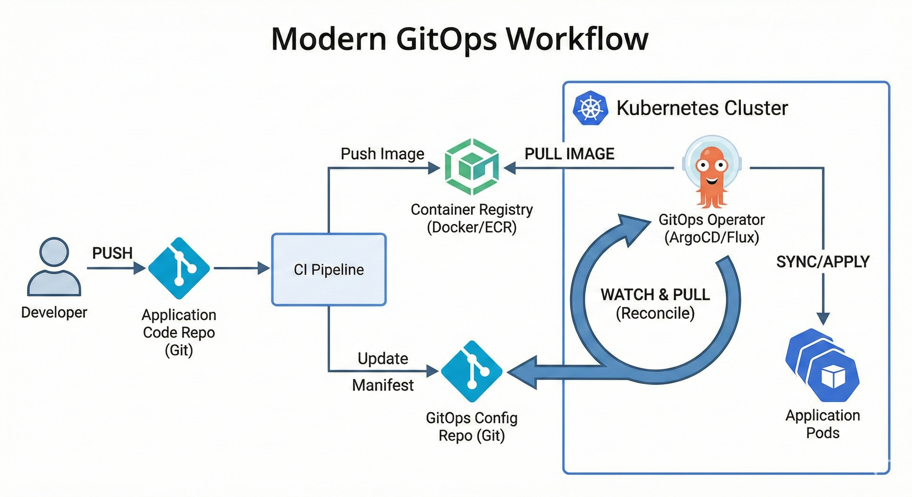
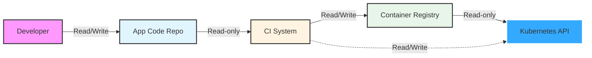
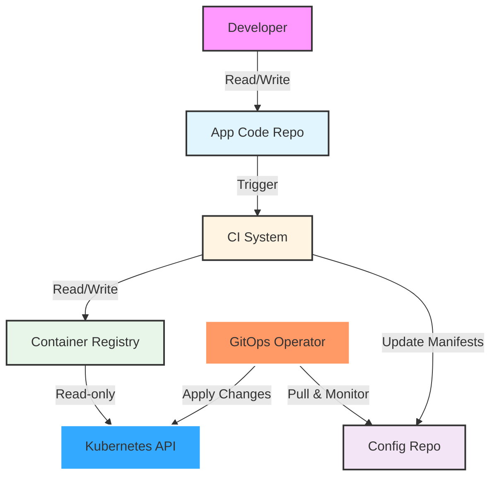
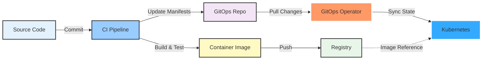

# Введение в GitOps

*Два часа ночи. Production-кластер лежит. Человек, который в последний раз его настраивал, уволился несколько месяцев назад. Никто не знает, что изменилось, никто не может заново собрать конфигурацию, а каждая минута простоя стоит денег. А теперь представьте обратное: всю среду можно восстановить из одного Git-репозитория, имея перед глазами понятную историю каждого изменения. Именно в этой разнице и раскрывается смысл GitOps.*

*В этом и состоит обещание GitOps.*

> **Примечание:** Этот документ содержит диаграммы Mermaid. Для лучшего просмотра используйте GitHub или редактор с поддержкой Mermaid.

## Что такое GitOps?

GitOps — это современная модель управления инфраструктурой и доставкой приложений. Она использует Git как единый источник истины для декларативных систем и опирается на программные агенты, которые приводят живую среду в соответствие с тем, что описано в репозитории. Проект OpenGitOps формулирует этот подход через четыре основополагающих принципа:

### Четыре принципа GitOps

#### 1. **Declarative (Декларативность)**
*"Система, управляемая с помощью GitOps, должна иметь свое желаемое состояние, выраженное декларативно."*

Вместо написания императивных сценариев, описывающих, *как* достичь состояния, GitOps требует от вас объявить, *каким* должно быть желаемое состояние. Этот декларативный подход делает системы более предсказуемыми, воспроизводимыми и простыми для понимания.

#### 2. **Versioned and Immutable (Версионность и Неизменяемость)**
*"Желаемое состояние хранится таким образом, который поддерживает версионность, неизменяемость версий и сохраняет полную историю версий."*

Храня желаемое состояние в Git, вы автоматически получаете:
- Полный журнал аудита всех изменений
- Возможность отката (rollback) к любому предыдущему состоянию
- Четкое понимание того, кто изменил что и когда
- Неизменяемую историю, которую нельзя подделать

#### 3. **Pulled Automatically (Автоматическое получение)**
*"Программные агенты автоматически получают декларации желаемого состояния из источника."*

В отличие от традиционных push-развертываний, где системы CI/CD активно проталкивают изменения в среды, GitOps использует агентов, которые постоянно отслеживают репозиторий Git и автоматически затягивают обновления при обнаружении изменений.

#### 4. **Continuously Reconciled (Непрерывное согласование)**
*"Программные агенты непрерывно наблюдают за фактическим состоянием системы и пытаются применить желаемое состояние."*

Операторы GitOps постоянно сравнивают фактическое состояние вашей системы с желаемым состоянием, объявленным в Git. При обнаружении расхождения (drift) система автоматически пытается выполнить согласование, возвращая фактическое состояние в соответствие с тем, что определено в репозитории.

---

> *"Проект OpenGitOps — это набор стандартов с открытым исходным кодом, лучших практик и образования, ориентированного на сообщество, чтобы помочь организациям внедрить структурированный, стандартизированный подход к реализации GitOps."* ~ opengitops.dev

---

### GitOps в одном предложении

**GitOps — это декларативное хранение желаемого состояния с использованием неизменяемых версий и программного агента для согласования текущего состояния с желаемым.**

### GitOps в контексте Kubernetes

При использовании GitOps с Kubernetes вы храните манифесты Kubernetes, используемые в кластере, в Git и используете инструмент (например, оператор GitOps) для применения этих манифестов к вашему кластеру. Оператор непрерывно отслеживает репозиторий Git и автоматически синхронизирует любые изменения с кластером, гарантируя, что запущенное состояние всегда соответствует тому, что определено в Git.

---

## Модели Push vs. Pull

Понимание разницы между традиционным push-развертыванием и pull-развертыванием GitOps имеет решающее значение для оценки преимуществ GitOps.

### Традиционная модель Push

До того, как GitOps приобрел популярность, большинство организаций использовали модель push для развертываний, где изменения вносятся в кластер через конвейер CI/CD. Вот как это работает:

**Рабочий процесс модели Push:**
1. Разработчик отправляет изменения кода в репозиторий
2. Запускается конвейер CI/CD
3. Процесс сборки создает образы контейнеров
4. Образы отправляются в Container Registry
5. Конвейер применяет манифесты напрямую к Kubernetes API

### Проблемы модели Push

Модель push считается **"императивной"** — она определяет последовательность шагов, необходимых для достижения конечной цели. Этот подход имеет несколько существенных недостатков:

- **Риски безопасности**: Рабочий процесс требует учетных данных с правами записи в кластер и прямого доступа к API-серверу кластера. Если система CI/CD будет скомпрометирована, злоумышленники получат полный доступ к кластеру.

- **Отсутствие воспроизводимости**: Поскольку состояние кластера устанавливается императивно с помощью ряда команд, для его воспроизведения требуется повторное выполнение всех рабочих процессов, которые изменяли кластер, в правильном порядке.

- **Сложность и хрупкость**: Чтобы достичь желаемого состояния, вы должны тщательно планировать каждый шаг в последовательности. Любые изменения шагов требуют детального рассмотрения и тщательного тестирования, чтобы избежать непредвиденных последствий.

- **Отсутствие обнаружения расхождений (Drift Detection)**: После развертывания нет механизма для обнаружения отклонения состояния кластера от намеченного.

---

### Модель Pull в GitOps

GitOps трансформирует эту парадигму, реализуя модель pull. После того, как изменения зафиксированы в репозитории, процесс сборки завершается и обновляет манифесты, представляющие желаемое состояние, в репозитории конфигурации среды. Оператор GitOps, работающий внутри кластера, отслеживает этот репозиторий и автоматически затягивает изменения, применяя их для поддержания желаемого состояния.

### Преимущества модели Pull

Модель pull является **"декларативной"** — вы определяете, что должно существовать, а инструментарий определяет, как это реализовать. Этот сдвиг парадигмы дает многочисленные преимущества:

#### **Repeatability (Повторяемость)**
С декларативным желаемым состоянием развертывания становятся по своей сути повторяемыми. Среды можно без усилий воссоздать из репозитория Git в любое время, что упрощает аварийное восстановление и инициализацию сред.

#### **Enhanced Collaboration (Улучшенное сотрудничество)**
Изменения предлагаются через Pull Requests (или Merge Requests), что позволяет использовать привычный процесс проверки, идентичный изменениям исходного кода. Команды могут эффективно сотрудничать, проверять предлагаемые изменения инфраструктуры и поддерживать стандарты качества перед развертыванием.

#### **Complete Visibility (Полная видимость)**
История коммитов обеспечивает полный журнал аудита, четко указывая, как желаемое состояние развивалось со временем, и обоснование каждого изменения. Вы можете видеть, что именно было изменено, когда, кем и почему.

#### **Consistency and Integration (Согласованность и интеграция)**
Изменения в коллективном желаемом состоянии кластера должны быть сначала интегрированы в репозиторий конфигурации среды. Это гарантирует, что все изменения проходят через один и тот же процесс проверки и утверждения, поддерживая согласованность между командами.

#### **Improved Security (Повышенная безопасность)**
Рабочий процесс устраняет необходимость в учетных данных с правами записи или прямом доступе к API кластера. Источник истины исходит из доверенного репозитория Git и применяется сервисом, работающим внутри вашей инфраструктуры (или кластера). Это значительно сокращает поверхность атаки и следует принципу наименьших привилегий.

---

## Как связаны GitOps и Continuous Delivery?

GitOps и Continuous Delivery — это взаимодополняющие практики, которые работают синергетически для достижения общей цели: доставки программного обеспечения быстрее и с превосходным качеством за счет автоматизации и непрерывной обратной связи.

### Связь между GitOps и CD

**GitOps — это фреймворк для управления состоянием сред, в то время как Continuous Delivery фокусируется на автоматизации потока изменений.**

Подумайте об этом так:
- **Continuous Delivery** обеспечивает *конвейер автоматизации*, который собирает, тестирует и готовит ваше программное обеспечение к развертыванию.
- **GitOps** обеспечивает *механизм развертывания и управления*, который гарантирует, что ваши среды соответствуют желаемому состоянию, определенному в Git.

### Как они работают вместе

**Комбинированный рабочий процесс:**
1. Разработчики фиксируют изменения кода (начало CD)
2. Конвейер CI запускает автоматические тесты и сборки (CD)
3. Создаются и сохраняются образы контейнеров (CD)
4. Манифесты развертывания обновляются в репозитории GitOps (переход CD→GitOps)
5. Оператор GitOps обнаруживает изменения и затягивает их (GitOps)
6. Оператор согласовывает состояние кластера с желаемым состоянием (GitOps)

### Основные различия

| Аспект | Continuous Delivery | GitOps |
|--------|-------------------|---------|
| **Основной фокус** | Автоматизация процесса выпуска ПО | Управление состоянием инфраструктуры и приложений |
| **Метод развертывания** | Часто использует push-развертывания | Использует pull-развертывания |
| **Управление состоянием** | Фокусируется на конвейере | Фокусируется на желаемом состоянии в Git |
| **Область применения** | Сборка, тестирование и доставка артефактов | Развертывание и обслуживание сред |

### GitOps как реализация CD

**GitOps фундаментально трансформирует то, как рабочие процессы CD взаимодействуют с инфраструктурой, затягивая изменения из репозитория конфигурации среды вместо того, чтобы проталкивать их напрямую в кластер.**

Этот сдвиг обеспечивает:
- **Лучшее разделение ответственности**: Конвейерам сборки не нужен доступ к кластеру.
- **Повышенная безопасность**: В системах CI/CD не хранятся учетные данные.
- **Автоматическое исправление расхождений**: Система самовосстанавливается при внесении ручных изменений.
- **Упрощенные откаты (rollbacks)**: Просто отмените коммит в Git.

---

## Преимущества GitOps

Внедрение GitOps дает значительные преимущества по нескольким направлениям:

### **Производительность разработчиков**
- Разработчики работают с привычными рабочими процессами Git.
- Нет необходимости изучать специфические для кластера инструменты развертывания.
- Более быстрая итерация за счет автоматизированных развертываний.
- Легкие откаты через Git revert.

### **Операционное совершенство**
- Автоматическое обнаружение и исправление расхождений (drift).
- Самовосстанавливающиеся системы, которые непрерывно выполняют согласование.
- Сокращение среднего времени восстановления (MTTR).
- Соблюдение лучших практик Infrastructure as Code (IaC).

### **Безопасность и комлпаенс**
- Полный журнал аудита всех изменений.
- Для развертываний не требуется прямой доступ к кластеру.
- Учетные данные никогда не покидают кластер.
- Обеспечение политик через защиту веток Git.

### **Надежность и согласованность**
- Среды воспроизводимы из Git.
- Согласованный процесс развертывания во всех средах.
- Сокращение человеческих ошибок за счет автоматизации.
- Проверенное аварийное восстановление через историю Git.

---

## Популярные операторы GitOps

Хотя этот курс фокусируется на принципах GitOps, а не на конкретных инструментах, часто используются несколько операторов GitOps:

- **Flux CD** — проект CNCF для GitOps на Kubernetes.
- **ArgoCD** — популярный оператор GitOps с мощным пользовательским интерфейсом (рассматривается в этом курсе!).
- **Rancher Fleet** — легкий GitOps для управления несколькими кластерами.

Каждый оператор реализует основные принципы GitOps, предлагая различные функции и пользовательский опыт. Главное — понимать принципы, которые остаются неизменными независимо от инструментария.

---

## Лучшие практики GitOps

### Структура репозитория
- Разделяйте репозитории кода приложений и репозитории конфигурации.
- Организуйте манифесты по средам (dev, staging, production).
- Используйте ветки или каталоги для изоляции сред.

### Вопросы безопасности
- Шифруйте секреты с помощью таких инструментов, как Sealed Secrets или External Secrets Operator.
- Используйте RBAC для контроля того, кто может утверждать изменения.
- Внедрите защиту веток и требуйте проверки (reviews).
- Сканируйте репозитории на наличие конфиденциальных данных.

### Оптимизация рабочего процесса
- Используйте принцип DRY (Don't Repeat Yourself) для манифестов, используя такие инструменты, как Kustomize или Helm.
- Автоматизируйте обновление тегов образов в манифестах.
- Используйте стратегии прогрессивной доставки (canary, blue-green).
- Внедрите автоматическое тестирование манифестов.

### Мониторинг и наблюдаемость
- Отслеживайте статус синхронизации оператора GitOps.
- Настраивайте оповещения о сбоях синхронизации или обнаружении расхождений.
- Отслеживайте метрики и частоту развертываний.
- Ведите логи всех событий согласования (reconciliation).

---

## С чего начать работу с GitOps

Готовы внедрить GitOps? Вот дорожная карта:

1. **Поймите принципы**: Убедитесь, что ваша команда понимает четыре принципа GitOps.
2. **Выберите оператора**: Выберите оператора GitOps, который соответствует вашим потребностям.
3. **Структурируйте свои репозитории**: Спроектируйте структуру репозитория Git.
4. **Начните с малого**: Начните с непромышленной (non-production) среды.
5. **Внедрите безопасность**: Настройте управление секретами и контроль доступа.
6. **Автоматизируйте постепенно**: Постепенно добавляйте автоматизацию и тестирование.
7. **Мониторьте и итерируйте**: Постоянно улучшайте на основе метрик и обратной связи.

---

## Дальнейшее обучение

Чтобы углубить свое понимание GitOps:

- Посетите [opengitops.dev](https://opengitops.dev) для ознакомления с официальными стандартами и лучшими практиками.
- Изучите рабочую группу CNCF по GitOps.
- Прочитайте книгу "GitOps and Kubernetes" издательства Manning Publications.
- Присоединяйтесь к форумам и конференциям сообщества GitOps.
- Экспериментируйте с различными операторами GitOps в лабораторных средах.

Помните: GitOps — это не только инструменты, но и принятие менталитета декларативного управления инфраструктурой с контролем версий. Начните с принципов, выбирайте инструменты, которые их поддерживают, и постоянно совершенствуйте свой подход.

---

**Готовы проверить свои знания? Попробуйте пройти [тест по GitOps](quiz.md), чтобы увидеть, насколько хорошо вы понимаете эти концепции!**

---

[&larr; Назад: Введение в Continuous Delivery](../../0-Introduction-CD/other/IntroductionToCD.md) | [Далее: Введение в ArgoCD &rarr;](../../2-Introduction-to-ArgoCD/other/IntroductionToArgoCD.md)
