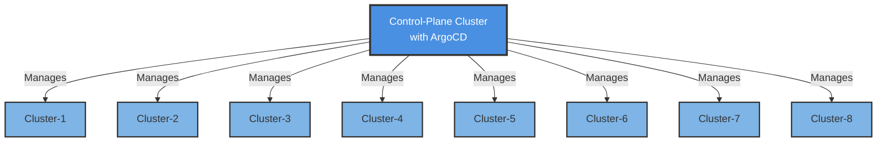
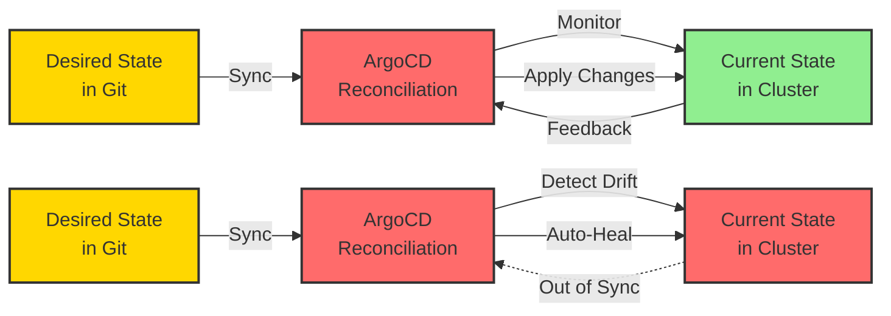
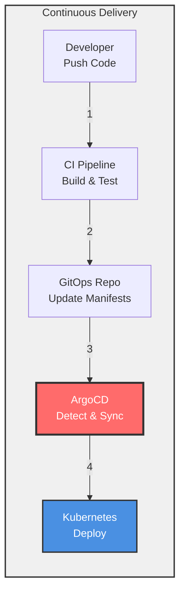
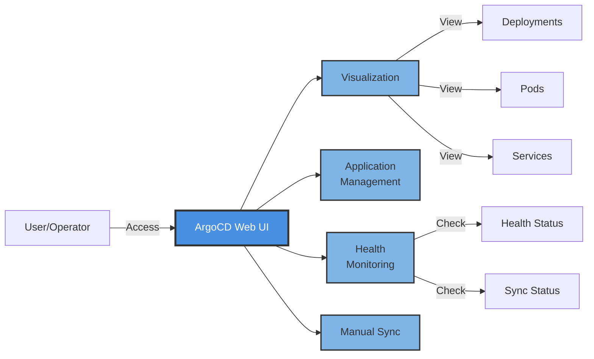

# Introduction to ArgoCD

> **Note for VS Code Users:** To view Mermaid diagrams in this document, install the [Markdown Preview Enhanced](https://marketplace.visualstudio.com/items?itemName=shd101wyy.markdown-preview-enhanced) or [Markdown Preview Mermaid Support](https://marketplace.visualstudio.com/items?itemName=bierner.markdown-mermaid) extension.

## Table of Contents
- [What is ArgoCD?](#what-is-argocd)
- [ArgoCD Architecture](#argocd-architecture)
- [How ArgoCD Relates to GitOps](#how-argocd-relates-to-gitops)
- [How ArgoCD Relates to Continuous Delivery](#how-argocd-relates-to-continuous-delivery)
- [ArgoCD and Kubernetes](#argocd-and-kubernetes)
- [ArgoCD User Interface](#argocd-user-interface)
- [Key Features](#key-features)
- [Benefits of Using ArgoCD](#benefits-of-using-argocd)
- [Getting Started](#getting-started)
- [Best Practices](#best-practices)
- [Key Takeaways](#key-takeaways)

---

## What is ArgoCD?

**ArgoCD** is a declarative, GitOps continuous delivery tool for Kubernetes. It is a tool that automates deploying, updating, and managing applications in Kubernetes clusters.

ArgoCD follows the GitOps pattern of using Git repositories as the source of truth for defining the desired application state. It continuously monitors the running applications and compares their live state to the desired state specified in Git. When it detects a difference (drift), ArgoCD can automatically synchronize the live state with the desired state.

### Core Capabilities

- **Automated Deployment**: Automatically deploy applications to Kubernetes based on Git repository changes
- **Application Management**: Manage the entire lifecycle of your applications declaratively
- **Multi-Cluster Management**: Deploy and manage applications across multiple Kubernetes clusters from a single control plane
- **Drift Detection**: Continuously compare live state with desired state and detect configuration drift
- **Self-Healing**: Automatically correct drift and maintain the desired state
- **Rollback**: Easy rollback to previous application states using Git history

---

## ArgoCD Architecture

ArgoCD operates with a **hub-and-spoke model** where a central control plane cluster manages deployments to multiple target clusters:



### Architecture Benefits

- **Centralized Management**: Single pane of glass for managing all clusters
- **Scalability**: Manage hundreds of clusters from one control plane
- **Security**: No need to expose cluster APIs externally
- **Consistency**: Ensure consistent deployments across all environments

---

## How ArgoCD Relates to GitOps

ArgoCD is one of the most popular tools for implementing GitOps practices with Kubernetes. It acts as the **software agent** that automatically pulls the desired state from the specified source (e.g., the environment configuration repository) and continuously reconciles it with the live state of the cluster.

### Continuous Reconciliation



**Left Scenario (Synced)**: ArgoCD keeps the desired state and current state aligned.

**Right Scenario (Drift Detected)**: When drift is detected, ArgoCD automatically corrects it by applying the desired state from Git.

### GitOps Principles in ArgoCD

1. **Declarative**: Application definitions are declared in Git using Kubernetes manifests, Helm charts, Kustomize, etc.
2. **Versioned and Immutable**: All changes are tracked in Git with complete audit history
3. **Pulled Automatically**: ArgoCD pulls changes from Git rather than having CI/CD push to the cluster
4. **Continuously Reconciled**: ArgoCD constantly monitors and corrects drift

---

## How ArgoCD Relates to Continuous Delivery

In a Continuous Delivery workflow, where building, testing, configuring, and deploying an application is automated, **ArgoCD is used to deploy the application and its configuration to Kubernetes**.

### CD Workflow with ArgoCD



### Integration Points

- **CI/CD Pipeline**: Builds, tests, and creates container images
- **GitOps Repository**: CI updates Kubernetes manifests with new image tags
- **ArgoCD**: Detects changes in GitOps repo and deploys to clusters
- **Kubernetes**: Runs the deployed applications

The ArgoCD API and CLI can be integrated into workflows to trigger deployments. When following GitOps principles, the workflows can update the manifests in a configuration repository, and ArgoCD will automatically pick up the changes and deploy them to the cluster.

### Benefits of ArgoCD in CD

- **Separation of Concerns**: CI focuses on building/testing, ArgoCD focuses on deployment
- **Declarative Deployments**: No imperative scripts needed
- **Auditability**: Complete deployment history in Git
- **Rollback**: Simple `git revert` to roll back deployments

---

## ArgoCD and Kubernetes

ArgoCD and its configurations are represented by **Custom Resource Definitions (CRDs)** in Kubernetes. Administrators already familiar with Kubernetes will be able to easily understand and work with the configuration in the YAML manifests.

### ArgoCD Application CRD Example

```yaml
apiVersion: argoproj.io/v1alpha1
kind: Application
metadata:
  name: guestbook
spec:
  project: default
  source:
    repoURL: https://github.com/argoproj/argocd-example-apps
    path: helm-guestbook/
    helm:
      valueFiles:
        - values-production.yaml
  destination:
    name: 'dev'
    namespace: 'guestbook'
  syncPolicy:
    automated: {}
```

### Key Configuration Fields

- **`source`**: Defines the Git repository and path containing application manifests
- **`destination`**: Specifies the target cluster and namespace
- **`syncPolicy`**: Configures automatic or manual synchronization
- **`project`**: Groups applications for access control and resource limits

### Benefits of Kubernetes-Native Approach

1. **Familiar Interface**: Use standard Kubernetes tools (kubectl, YAML)
2. **Declarative Management**: ArgoCD configuration itself follows GitOps principles
3. **Integration**: Better integration with the Kubernetes ecosystem
4. **Self-Management**: After initial bootstrapping, ArgoCD can manage itself like any other Kubernetes resource

### ArgoCD Ecosystem

The configurations are portable between Kubernetes clusters, regardless of the underlying infrastructure. Being Kubernetes-native allows for better integration with the rest of the Kubernetes ecosystem. This enables community-driven projects to extend the functionality of ArgoCD.

**Example**: The `argocd-vault-plugin` project helps solve the issue of secret management with GitOps and ArgoCD. More ArgoCD Project ecosystem and community projects can be found in the [argoproj-labs GitHub organization](https://github.com/argoproj-labs).

---

## ArgoCD User Interface

One of ArgoCD's most powerful features is its **web-based user interface** that enables users to visualize and interact with Kubernetes resources.

### UI Capabilities



### Key UI Features

- **Application Dashboard**: Overview of all managed applications
- **Resource Tree**: Visual representation of Kubernetes resources and their relationships
- **Sync Status**: Real-time view of sync state (Synced, OutOfSync, Unknown)
- **Health Status**: Application health indicators (Healthy, Progressing, Degraded, Suspended, Missing, Unknown)
- **Logs and Events**: Access to pod logs and Kubernetes events
- **Manual Sync**: Trigger synchronization manually when needed
- **Rollback**: Easy rollback to previous versions
- **Diff View**: Compare desired state (Git) with live state (cluster)

### Benefits of the UI

- **Accessibility**: Non-kubectl users can manage applications
- **Troubleshooting**: Quickly identify and debug issues
- **Operational Visibility**: Real-time insights into application state
- **Educational**: Great for learning Kubernetes resource relationships

---

## Key Features

### 1. Automated Sync Policies

Configure automatic or manual synchronization:
- **Auto-Sync**: Automatically deploy changes from Git
- **Self-Heal**: Automatically revert manual changes
- **Pruning**: Automatically remove resources deleted from Git

### 2. Multiple Config Management Tools

ArgoCD supports various configuration management tools:
- **Kubernetes Manifests** (plain YAML)
- **Helm Charts**
- **Kustomize**
- **Jsonnet**
- **Custom Config Management Plugins**

### 3. SSO and RBAC Integration

- **Single Sign-On**: Integrate with corporate identity providers (OIDC, SAML, LDAP)
- **Role-Based Access Control**: Fine-grained permissions for teams and projects
- **Multi-Tenancy**: Support for multiple teams with isolated applications

### 4. Health Assessment

ArgoCD performs sophisticated health checks:
- Built-in health assessment for common Kubernetes resources
- Custom health checks for CRDs
- Resource hooks for complex deployment scenarios

### 5. Rollback and History

- Complete deployment history
- One-click rollback to any previous version
- Git-based auditing of all changes

---

## Benefits of Using ArgoCD

### 1. **GitOps Implementation**
ArgoCD is purpose-built for GitOps, making it easy to adopt GitOps practices without building custom tooling.

### 2. **Declarative Everything**
Applications, their configuration, and even ArgoCD itself are defined declaratively, ensuring consistency and reproducibility.

### 3. **Security**
- No need to expose Kubernetes API externally
- Pull-based model reduces attack surface
- Secrets can be integrated with external secret managers

### 4. **Disaster Recovery**
Since all configuration is in Git, recovering from disasters is as simple as pointing ArgoCD to the Git repository.

### 5. **Multi-Cluster Management**
Manage applications across development, staging, and production clusters from a single ArgoCD instance.

### 6. **Developer Self-Service**
Developers can deploy applications by updating Git, without needing direct cluster access.

### 7. **Auditability**
Complete audit trail of who changed what and when through Git history.

### 8. **Progressive Delivery**
Integration with tools like Argo Rollouts enables canary deployments, blue-green deployments, and A/B testing.

---

## Getting Started

### Prerequisites

- A Kubernetes cluster (v1.21 or newer)
- `kubectl` installed and configured
- Git repository for storing application manifests

### Quick Installation

```bash
# Create namespace
kubectl create namespace argocd

# Install ArgoCD
kubectl apply -n argocd -f https://raw.githubusercontent.com/argoproj/argo-cd/stable/manifests/install.yaml

# Access the ArgoCD API server
kubectl port-forward svc/argocd-server -n argocd 8080:443

# Get initial admin password
kubectl -n argocd get secret argocd-initial-admin-secret -o jsonpath="{.data.password}" | base64 -d
```

### Creating Your First Application

```bash
# Using CLI
argocd app create guestbook \
  --repo https://github.com/argoproj/argocd-example-apps.git \
  --path guestbook \
  --dest-server https://kubernetes.default.svc \
  --dest-namespace default

# Sync the application
argocd app sync guestbook
```

Or use the web UI to create applications visually.

---

## Best Practices

### 1. Use Separate Repositories

- **Application Code Repository**: Source code and application logic
- **Configuration Repository**: Kubernetes manifests and configuration

This separation follows the GitOps principle and provides better security and separation of concerns.

### 2. Structure Your Repositories

```
gitops-repo/
├── apps/
│   ├── production/
│   │   ├── app1/
│   │   └── app2/
│   └── staging/
│       ├── app1/
│       └── app2/
└── infrastructure/
    ├── monitoring/
    └── networking/
```

### 3. Implement Environment Promotion

Use branches or directories to represent environments:
- Development → Staging → Production
- Use Git workflows (PRs, approvals) for promotions

### 4. Enable Auto-Sync with Caution

- Start with manual sync for production
- Enable auto-sync for non-critical environments first
- Use sync windows to control when deployments occur

### 5. Use Projects for Multi-Tenancy

Create ArgoCD Projects to isolate teams:
- Restrict source repositories
- Limit destination clusters/namespaces
- Implement RBAC per project

### 6. Monitor and Alert

- Set up Prometheus metrics
- Configure Slack/PagerDuty notifications
- Monitor sync failures and health degradation

### 7. Use App of Apps Pattern

Manage multiple applications as a single unit:

```yaml
apiVersion: argoproj.io/v1alpha1
kind: Application
metadata:
  name: apps
spec:
  source:
    path: apps/
  syncPolicy:
    automated: {}
```

### 8. Implement Secret Management

Integrate with secret management solutions:
- Sealed Secrets
- External Secrets Operator
- HashiCorp Vault (via argocd-vault-plugin)

---

## Key Takeaways

1. **ArgoCD is the GitOps Agent**: It's the software component that makes GitOps work with Kubernetes by continuously pulling from Git and reconciling with cluster state.

2. **Kubernetes-Native**: ArgoCD uses CRDs and integrates seamlessly with the Kubernetes ecosystem, making it familiar to Kubernetes users.

3. **Multi-Cluster Management**: One ArgoCD instance can manage deployments across many Kubernetes clusters, perfect for enterprise scenarios.

4. **Continuous Reconciliation**: ArgoCD doesn't just deploy once - it continuously monitors and corrects drift, ensuring the cluster always matches Git.

5. **Part of CD, Not CI**: ArgoCD focuses on the deployment phase of Continuous Delivery, working alongside CI tools like Jenkins, GitLab CI, or GitHub Actions.

6. **Powerful UI**: The web interface makes Kubernetes resources accessible and understandable, even for those less familiar with `kubectl`.

7. **Security by Design**: The pull-based model means clusters don't need to be exposed, and ArgoCD doesn't need write credentials in CI/CD pipelines.

8. **Extensible**: Through CRDs and plugins, ArgoCD can be extended to support custom workflows and integrations.

9. **Self-Healing**: Automatic correction of drift means your clusters stay in the desired state without manual intervention.

10. **Git as Single Source of Truth**: Everything is versioned, auditable, and recoverable through Git history.

---

## Additional Resources

- [Official ArgoCD Documentation](https://argo-cd.readthedocs.io/)
- [ArgoCD GitHub Repository](https://github.com/argoproj/argo-cd)
- [ArgoCD Labs - Community Projects](https://github.com/argoproj-labs)
- [CNCF ArgoCD Project Page](https://www.cncf.io/projects/argo/)
- [ArgoCD Best Practices](https://argo-cd.readthedocs.io/en/stable/user-guide/best_practices/)

---

**Next Steps:**
- Take the [Knowledge Assessment Quiz](quiz.md) to test your understanding
- Practice deploying a sample application with ArgoCD
- Explore advanced features like Argo Rollouts for progressive delivery
- Join the ArgoCD community on Slack and GitHub

Happy GitOps-ing! 🚀

