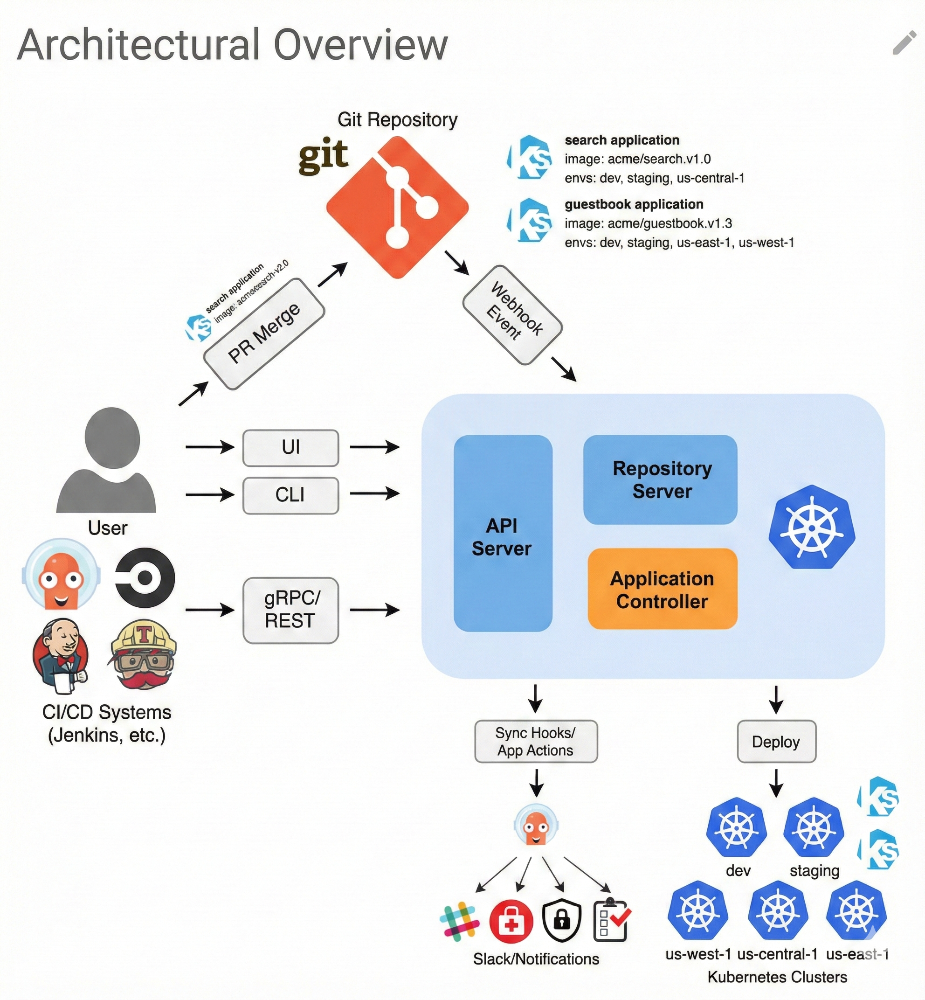
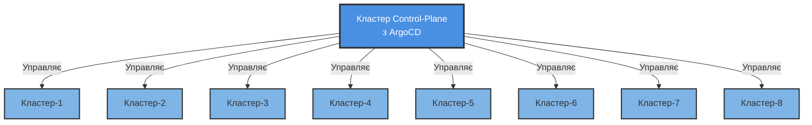
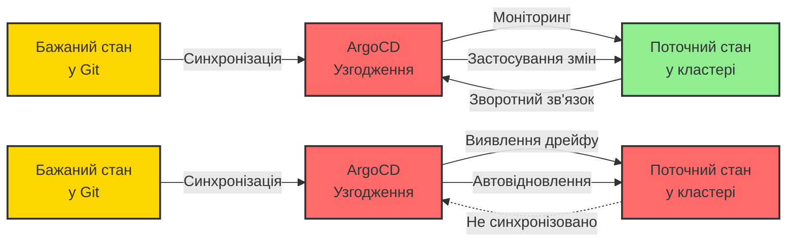
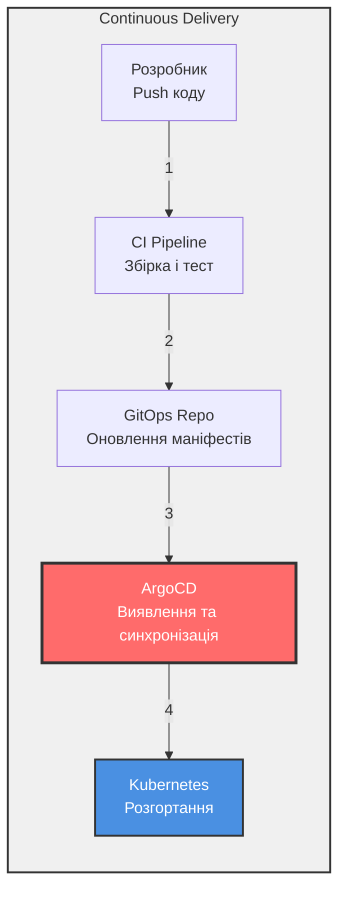
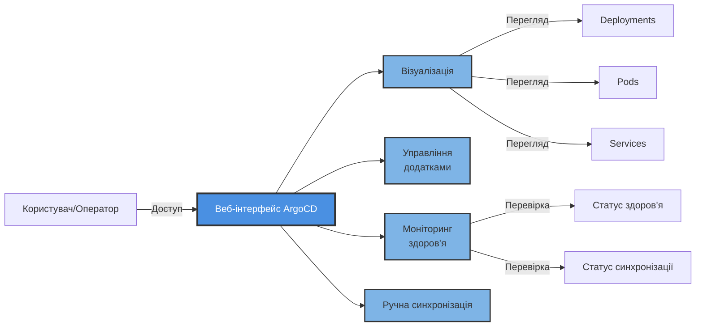

# Вступ до ArgoCD

Ви дізналися, що таке GitOps і чому він важливий. Тепер познайомтеся з інструментом, який втілює його в життя. Уявіть невтомного оператора, який спостерігає за вашим Git-репозиторієм 24/7, миттєво помічає кожен коміт і розгортає його у ваші Kubernetes-кластери — без ручного `kubectl apply`, без скриптів деплою, без нічних дзвінків через невдале розгортання. Цей оператор — **ArgoCD**, і як тільки ви побачите його в дії, ви здивуєтесь, як взагалі деплоїли без нього.

> **Користувачі VS Code:** Встановіть [Markdown Preview Mermaid Support](https://marketplace.visualstudio.com/items?itemName=bierner.markdown-mermaid), щоб переглядати діаграми нижче.



## Зміст
- [Що таке ArgoCD?](#що-таке-argocd)
- [Архітектура ArgoCD](#архітектура-argocd)
- [Як ArgoCD пов'язаний з GitOps](#як-argocd-повязаний-з-gitops)
- [Як ArgoCD пов'язаний з Continuous Delivery](#як-argocd-повязаний-з-continuous-delivery)
- [ArgoCD та Kubernetes](#argocd-та-kubernetes)
- [Користувацький інтерфейс ArgoCD](#користувацький-інтерфейс-argocd)
- [Ключові функції](#ключові-функції)
- [Переваги використання ArgoCD](#переваги-використання-argocd)
- [Початок роботи](#початок-роботи)
- [Найкращі практики](#найкращі-практики)
- [Ключові висновки](#ключові-висновки)

---

## Що таке ArgoCD?

**ArgoCD** — це декларативний інструмент безперервної доставки для Kubernetes, що реалізує GitOps практики. Це інструмент, який автоматизує розгортання, оновлення та управління додатками в кластерах Kubernetes.

ArgoCD слідує шаблону GitOps, використовуючи Git-репозиторії як джерело правди для визначення бажаного стану додатків. Він безперервно моніторить запущені додатки та порівнює їх живий стан з бажаним станом, визначеним у Git. Коли він виявляє різницю (дрейф), ArgoCD може автоматично синхронізувати живий стан з бажаним станом.

### Основні можливості

- **Автоматизоване розгортання**: Автоматично розгортайте додатки в Kubernetes на основі змін у Git-репозиторії
- **Управління додатками**: Керуйте всім життєвим циклом ваших додатків декларативно
- **Мультикластерне управління**: Розгортайте та керуйте додатками в кількох кластерах Kubernetes з єдиної панелі управління
- **Виявлення дрейфу**: Безперервно порівнюйте живий стан з бажаним станом та виявляйте дрейф конфігурації
- **Самовідновлення**: Автоматично виправляйте дрейф та підтримуйте бажаний стан
- **Відкат**: Легкий відкат до попередніх станів додатків за допомогою історії Git

---

## Архітектура ArgoCD

ArgoCD працює за **моделлю hub-and-spoke**, де центральний кластер керування управляє розгортаннями в кількох цільових кластерах:



### Переваги архітектури

- **Централізоване управління**: Єдина панель для управління всіма кластерами
- **Масштабованість**: Управління сотнями кластерів з однієї панелі управління
- **Безпека**: Не потрібно відкривати API кластерів зовні
- **Консистентність**: Забезпечення однакових розгортань в усіх середовищах

---

## Як ArgoCD пов'язаний з GitOps

ArgoCD є одним із найпопулярніших інструментів для впровадження практик GitOps з Kubernetes. Він діє як **програмний агент**, який автоматично витягує бажаний стан із зазначеного джерела (наприклад, репозиторію конфігурації середовища) та безперервно узгоджує його з живим станом кластера.

### Безперервна узгодженість



**Лівий сценарій (Синхронізовано)**: ArgoCD підтримує вирівнювання бажаного стану та поточного стану.

**Правий сценарій (Виявлено дрейф)**: Коли виявлено дрейф, ArgoCD автоматично виправляє його, застосовуючи бажаний стан з Git.

### Принципи GitOps у ArgoCD

1. **Декларативність**: Визначення додатків оголошені в Git з використанням маніфестів Kubernetes, Helm charts, Kustomize тощо.
2. **Версійність та незмінність**: Усі зміни відстежуються в Git з повною історією аудиту
3. **Автоматичне витягування**: ArgoCD витягує зміни з Git, а не отримує їх через push з CI/CD
4. **Безперервне узгодження**: ArgoCD постійно моніторить та виправляє дрейф

---

## Як ArgoCD пов'язаний з Continuous Delivery

У робочому процесі Continuous Delivery, де автоматизовано збірку, тестування, налаштування та розгортання додатку, **ArgoCD використовується для розгортання додатку та його конфігурації в Kubernetes**.

### Робочий процес CD з ArgoCD



### Точки інтеграції

- **CI/CD Pipeline**: Збирає, тестує та створює образи контейнерів
- **GitOps-репозиторій**: CI оновлює маніфести Kubernetes новими тегами образів
- **ArgoCD**: Виявляє зміни в GitOps-репозиторії та розгортає в кластери
- **Kubernetes**: Запускає розгорнуті додатки

API та CLI ArgoCD можна інтегрувати в робочі процеси для тригерування розгортань. При дотриманні принципів GitOps робочі процеси можуть оновлювати маніфести в репозиторії конфігурації, і ArgoCD автоматично підхопить зміни та розгорне їх у кластері.

### Переваги ArgoCD у CD

- **Розділення відповідальності**: CI зосереджується на збірці/тестуванні, ArgoCD — на розгортанні
- **Декларативні розгортання**: Не потрібні імперативні скрипти
- **Аудит**: Повна історія розгортань у Git
- **Відкат**: Простий `git revert` для відкату розгортань

---

## ArgoCD та Kubernetes

ArgoCD та його конфігурації представлені **Custom Resource Definitions (CRDs)** у Kubernetes. Адміністратори, які вже знайомі з Kubernetes, зможуть легко зрозуміти та працювати з конфігурацією в YAML-маніфестах.

### Приклад CRD додатку ArgoCD

```yaml
apiVersion: argoproj.io/v1alpha1
kind: Application
metadata:
  name: guestbook
spec:
  project: default
  source:
    repoURL: https://github.com/argoproj/argocd-example-apps
    path: helm-guestbook/
    helm:
      valueFiles:
        - values-production.yaml
  destination:
    name: 'dev'
    namespace: 'guestbook'
  syncPolicy:
    automated: {}
```

### Ключові поля конфігурації

- **`source`**: Визначає Git-репозиторій та шлях, що містить маніфести додатку
- **`destination`**: Вказує цільовий кластер та namespace
- **`syncPolicy`**: Налаштовує автоматичну або ручну синхронізацію
- **`project`**: Групує додатки для контролю доступу та обмеження ресурсів

### Переваги Kubernetes-native підходу

1. **Знайомий інтерфейс**: Використання стандартних інструментів Kubernetes (kubectl, YAML)
2. **Декларативне управління**: Конфігурація ArgoCD сама слідує принципам GitOps
3. **Інтеграція**: Краща інтеграція з екосистемою Kubernetes
4. **Самоуправління**: Після початкового налаштування ArgoCD може управляти сам собою, як будь-яким іншим ресурсом Kubernetes

### Екосистема ArgoCD

Конфігурації є портативними між кластерами Kubernetes, незалежно від базової інфраструктури. Kubernetes-native підхід дозволяє кращу інтеграцію з рештою екосистеми Kubernetes. Це дозволяє проектам, керованим спільнотою, розширювати функціональність ArgoCD.

**Приклад**: Проект `argocd-vault-plugin` допомагає вирішити проблему управління секретами з GitOps та ArgoCD. Більше проектів екосистеми та спільноти ArgoCD можна знайти в [GitHub організації argoproj-labs](https://github.com/argoproj-labs).

---

## Користувацький інтерфейс ArgoCD

Однією з найпотужніших функцій ArgoCD є його **веб-інтерфейс**, який дозволяє користувачам візуалізувати та взаємодіяти з ресурсами Kubernetes.

### Можливості UI



### Ключові функції UI

- **Панель додатків**: Огляд усіх керованих додатків
- **Дерево ресурсів**: Візуальне представлення ресурсів Kubernetes та їх взаємозв'язків
- **Статус синхронізації**: Вид стану синхронізації в реальному часі (Synced, OutOfSync, Unknown)
- **Статус здоров'я**: Індикатори здоров'я додатків (Healthy, Progressing, Degraded, Suspended, Missing, Unknown)
- **Логи та події**: Доступ до логів pod'ів та подій Kubernetes
- **Ручна синхронізація**: Тригер синхронізації вручну при потребі
- **Відкат**: Легкий відкат до попередніх версій
- **Перегляд різниці**: Порівняння бажаного стану (Git) з живим станом (кластер)

### Переваги UI

- **Доступність**: Користувачі без kubectl можуть керувати додатками
- **Усунення несправностей**: Швидке виявлення та налагодження проблем
- **Операційна видимість**: Інсайти в реальному часі щодо стану додатків
- **Освітня цінність**: Чудово для вивчення взаємозв'язків ресурсів Kubernetes

---

## Ключові функції

### 1. Автоматичні політики синхронізації

Налаштування автоматичної або ручної синхронізації:
- **Auto-Sync**: Автоматичне розгортання змін з Git
- **Self-Heal**: Автоматичне відновлення ручних змін
- **Pruning**: Автоматичне видалення ресурсів, видалених з Git

### 2. Підтримка кількох інструментів управління конфігурацією

ArgoCD підтримує різні інструменти управління конфігурацією:
- **Kubernetes Manifests** (звичайний YAML)
- **Helm Charts**
- **Kustomize**
- **Jsonnet**
- **Користувацькі плагіни управління конфігурацією**

### 3. Інтеграція SSO та RBAC

- **Single Sign-On**: Інтеграція з корпоративними провайдерами ідентичності (OIDC, SAML, LDAP)
- **Рольовий контроль доступу**: Детальні права доступу для команд та проектів
- **Мультитенантність**: Підтримка кількох команд з ізольованими додатками

### 4. Оцінка здоров'я

ArgoCD виконує складні перевірки здоров'я:
- Вбудована оцінка здоров'я для звичайних ресурсів Kubernetes
- Користувацькі перевірки здоров'я для CRD
- Resource hooks для складних сценаріїв розгортання

### 5. Відкат та історія

- Повна історія розгортань
- Відкат одним кліком до будь-якої попередньої версії
- Git-based аудит усіх змін

---

## Переваги використання ArgoCD

### 1. **Впровадження GitOps**
ArgoCD спеціально створений для GitOps, що полегшує прийняття практик GitOps без створення власного інструментарію.

### 2. **Декларативність усього**
Додатки, їх конфігурація та навіть сам ArgoCD визначені декларативно, забезпечуючи консистентність та відтворюваність.

### 3. **Безпека**
- Не потрібно відкривати Kubernetes API зовні
- Модель pull зменшує поверхню атаки
- Секрети можуть бути інтегровані з зовнішніми менеджерами секретів

### 4. **Відновлення після аварій**
Оскільки вся конфігурація в Git, відновлення після аварій так само просте, як вказування ArgoCD на Git-репозиторій.

### 5. **Мультикластерне управління**
Управління додатками в кластерах розробки, staging та production з єдиного екземпляра ArgoCD.

### 6. **Самообслуговування розробників**
Розробники можуть розгортати додатки, оновлюючи Git, без необхідності прямого доступу до кластера.

### 7. **Аудит**
Повний аудиторський слід того, хто що змінив і коли через історію Git.

### 8. **Прогресивна доставка**
Інтеграція з інструментами, такими як Argo Rollouts, дозволяє canary deployments, blue-green deployments та A/B тестування.

---

## Початок роботи

### Передумови

- Кластер Kubernetes (v1.26 або новіший)
- Встановлений та налаштований `kubectl`
- Git-репозиторій для зберігання маніфестів додатків

### Швидке встановлення

```bash
# Створення namespace
kubectl create namespace argocd

# Встановлення ArgoCD
kubectl apply -n argocd -f https://raw.githubusercontent.com/argoproj/argo-cd/stable/manifests/install.yaml

# Доступ до API сервера ArgoCD
kubectl port-forward svc/argocd-server -n argocd 8080:443

# Отримання початкового пароля адміністратора
kubectl -n argocd get secret argocd-initial-admin-secret -o jsonpath="{.data.password}" | base64 -d
```

### Створення першого додатку

```bash
# Використання CLI
argocd app create guestbook \
  --repo https://github.com/argoproj/argocd-example-apps.git \
  --path guestbook \
  --dest-server https://kubernetes.default.svc \
  --dest-namespace default

# Синхронізація додатку
argocd app sync guestbook
```

Або використовуйте веб-інтерфейс для візуального створення додатків.

---

## Найкращі практики

### 1. Використовуйте окремі репозиторії

- **Репозиторій коду додатку**: Вихідний код та логіка додатку
- **Репозиторій конфігурації**: Маніфести Kubernetes та конфігурація

Це розділення слідує принципу GitOps та забезпечує кращу безпеку та розділення обов'язків.

### 2. Структуруйте свої репозиторії

```
gitops-repo/
├── apps/
│   ├── production/
│   │   ├── app1/
│   │   └── app2/
│   └── staging/
│       ├── app1/
│       └── app2/
└── infrastructure/
    ├── monitoring/
    └── networking/
```

### 3. Впровадьте просування середовищ

Використовуйте гілки або директорії для представлення середовищ:
- Development → Staging → Production
- Використовуйте Git workflows (PR, схвалення) для просувань

### 4. Увімкніть Auto-Sync з обережністю

- Почніть з ручної синхронізації для production
- Увімкніть auto-sync для некритичних середовищ спочатку
- Використовуйте sync windows для контролю часу розгортань

### 5. Використовуйте проекти для мультитенантності

Створюйте проекти ArgoCD для ізоляції команд:
- Обмежте вихідні репозиторії
- Обмежте цільові кластери/namespace'и
- Впровадьте RBAC для кожного проекту

### 6. Моніторинг та сповіщення

- Налаштуйте метрики Prometheus
- Налаштуйте сповіщення Slack/PagerDuty
- Моніторте помилки синхронізації та погіршення здоров'я

### 7. Використовуйте шаблон App of Apps

Керуйте кількома додатками як одиницею:

```yaml
apiVersion: argoproj.io/v1alpha1
kind: Application
metadata:
  name: apps
spec:
  source:
    path: apps/
  syncPolicy:
    automated: {}
```

### 8. Впровадьте управління секретами

Інтегруйтеся з рішеннями управління секретами:
- Sealed Secrets
- External Secrets Operator
- HashiCorp Vault (через argocd-vault-plugin)

---

## Ключові висновки

1. **ArgoCD — це агент GitOps**: Це програмний компонент, який робить GitOps робочим з Kubernetes через безперервне витягування з Git та узгодження зі станом кластера.

2. **Kubernetes-native**: ArgoCD використовує CRD та безшовно інтегрується з екосистемою Kubernetes, роблячи його знайомим для користувачів Kubernetes.

3. **Мультикластерне управління**: Один екземпляр ArgoCD може управляти розгортаннями в багатьох кластерах Kubernetes, ідеально для корпоративних сценаріїв.

4. **Безперервне узгодження**: ArgoCD не просто розгортає один раз — він безперервно моніторить та виправляє дрейф, забезпечуючи відповідність кластера Git.

5. **Частина CD, а не CI**: ArgoCD зосереджується на фазі розгортання Continuous Delivery, працюючи разом з CI інструментами, такими як Jenkins, GitLab CI або GitHub Actions.

6. **Потужний UI**: Веб-інтерфейс робить ресурси Kubernetes доступними та зрозумілими, навіть для тих, хто менш знайомий з `kubectl`.

7. **Безпека за дизайном**: Pull-based модель означає, що кластери не потрібно відкривати, а ArgoCD не потребує облікових даних для запису в CI/CD конвеєрах.

8. **Розширюваність**: Через CRD та плагіни ArgoCD може бути розширений для підтримки користувацьких робочих процесів та інтеграцій.

9. **Самовідновлення**: Автоматичне виправлення дрейфу означає, що ваші кластери залишаються в бажаному стані без ручного втручання.

10. **Git як єдине джерело правди**: Все версійоване, піддається аудиту та відновлюється через історію Git.

---

## Додаткові ресурси

- [Офіційна документація ArgoCD](https://argo-cd.readthedocs.io/)
- [GitHub репозиторій ArgoCD](https://github.com/argoproj/argo-cd)
- [ArgoCD Labs - Проекти спільноти](https://github.com/argoproj-labs)
- [Сторінка проекту CNCF ArgoCD](https://www.cncf.io/projects/argo/)
- [Найкращі практики ArgoCD](https://argo-cd.readthedocs.io/en/stable/user-guide/best_practices/)

---

**Готові перевірити свої знання з ArgoCD?** Пройдіть [Тест для оцінки знань](перевірка-знань.md) або спробуйте [Інтерактивний тест](quiz.html), щоб отримати миттєвий зворотний зв'язок.

---

*Цей модуль є частиною курсу GitOps та Continuous Delivery.*

| Попередній | Головна | Наступний |
|------------|---------|-----------|
| [Модуль 1 — Вступ до GitOps](../../1-Intrduction-GitOps/UA/ВступДоGitOps.md) | [Огляд курсу](../../README.md) | [Модуль 3 — CRD ArgoCD](../../3-CRD-ArgoCD/UA/CRD-ArgoCD.md) |

