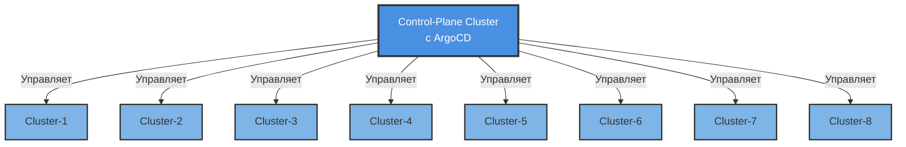
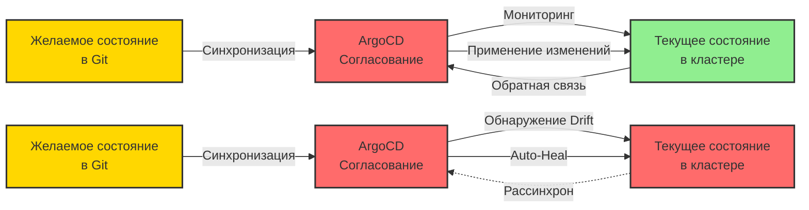
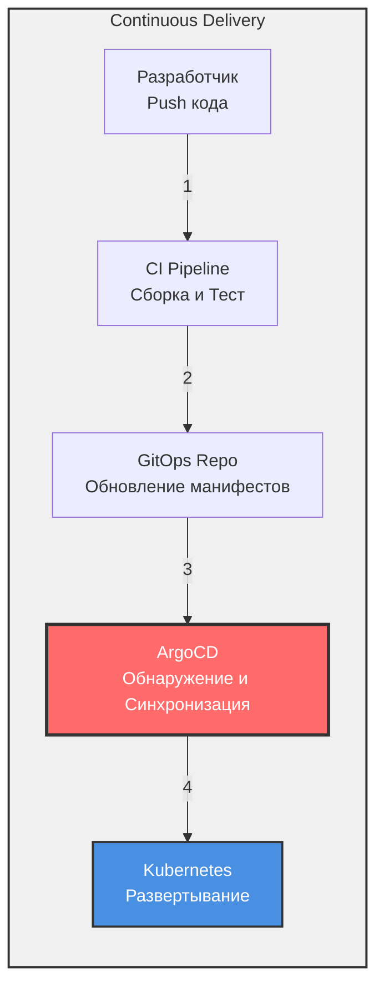
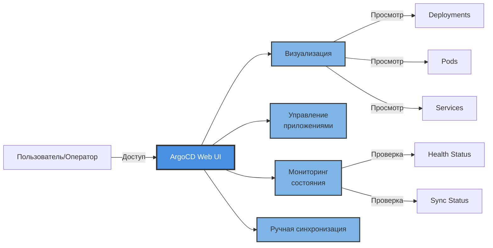

# Введение в ArgoCD

Вы узнали, что такое GitOps и почему он важен. Теперь познакомьтесь с инструментом, который воплощает его в жизнь. Представьте неутомимого оператора, который следит за вашим Git-репозиторием 24/7, мгновенно замечает каждый коммит и разворачивает его в ваши Kubernetes-кластеры — без ручного `kubectl apply`, без скриптов деплоя, без ночных звонков из-за неудачного развертывания. Этот оператор — **ArgoCD**, и как только вы увидите его в действии, вы удивитесь, как вообще деплоили без него.

> **Пользователи VS Code:** Установите [Markdown Preview Mermaid Support](https://marketplace.visualstudio.com/items?itemName=bierner.markdown-mermaid) для отображения диаграмм ниже.


## Содержание
- [Что такое ArgoCD?](#что-такое-argocd)
- [Архитектура ArgoCD](#архитектура-argocd)
- [Как ArgoCD соотносится с GitOps](#как-argocd-соотносится-с-gitops)
- [Как ArgoCD соотносится с Continuous Delivery](#как-argocd-соотносится-с-continuous-delivery)
- [ArgoCD и Kubernetes](#argocd-и-kubernetes)
- [Пользовательский интерфейс ArgoCD](#пользовательский-интерфейс-argocd)
- [Основные функции](#основные-функции)
- [Преимущества использования ArgoCD](#преимущества-использования-argocd)
- [С чего начать](#с-чего-начать)
- [Лучшие практики](#лучшие-практики)
- [Ключевые выводы](#ключевые-выводы)

---

## Что такое ArgoCD?

**ArgoCD** — это декларативный инструмент Continuous Delivery для Kubernetes, основанный на принципах GitOps. Это инструмент, который автоматизирует развертывание, обновление и управление приложениями в кластерах Kubernetes.

ArgoCD следует паттерну GitOps, используя репозитории Git как единственный источник истины (source of truth) для определения желаемого состояния приложения. Он непрерывно отслеживает работающие приложения и сравнивает их текущее состояние (live state) с желаемым состоянием (desired state), указанным в Git. При обнаружении различий (drift) ArgoCD может автоматически синхронизировать текущее состояние с желаемым.

### Основные возможности

- **Automated Deployment**: Автоматическое развертывание приложений в Kubernetes на основе изменений в репозитории Git.
- **Application Management**: Декларативное управление всем жизненным циклом приложений.
- **Multi-Cluster Management**: Развертывание и управление приложениями в нескольких кластерах Kubernetes из одной панели управления.
- **Drift Detection**: Непрерывное сравнение текущего состояния с желаемым и обнаружение отклонений конфигурации.
- **Self-Healing**: Автоматическое исправление отклонений и поддержание желаемого состояния.
- **Rollback**: Легкий откат к предыдущим состояниям приложения с использованием истории Git.

---

## Архитектура ArgoCD

ArgoCD работает по модели **hub-and-spoke**, где центральный кластер управления (control plane cluster) управляет развертываниями в несколько целевых кластеров (target clusters):



### Преимущества архитектуры

- **Centralized Management**: Единое окно управления всеми кластерами.
- **Scalability**: Управление сотнями кластеров из одного центра управления.
- **Security**: Нет необходимости открывать API кластеров вовне.
- **Consistency**: Обеспечение согласованного развертывания во всех средах.

---

## Как ArgoCD соотносится с GitOps

ArgoCD является одним из самых популярных инструментов для внедрения практик GitOps в Kubernetes. Он выступает в роли **программного агента** (software agent), который автоматически затягивает желаемое состояние из указанного источника (например, репозитория конфигурации среды) и непрерывно согласовывает его с текущим состоянием кластера.

### Непрерывное согласование (Continuous Reconciliation)



**Левый сценарий (Synced)**: ArgoCD поддерживает соответствие желаемого и текущего состояний.

**Правый сценарий (Drift Detected)**: При обнаружении отклонения (drift) ArgoCD автоматически исправляет его, применяя желаемое состояние из Git.

### Принципы GitOps в ArgoCD

1. **Declarative**: Определения приложений объявляются в Git с использованием манифестов Kubernetes, Helm-чартов, Kustomize и т.д.
2. **Versioned and Immutable**: Все изменения отслеживаются в Git с полной историей аудита.
3. **Pulled Automatically**: ArgoCD затягивает изменения из Git, а не ждет, пока CI/CD протолкнет их в кластер.
4. **Continuously Reconciled**: ArgoCD постоянно отслеживает и исправляет отклонения (drift).

---

## Как ArgoCD соотносится с Continuous Delivery

В рабочем процессе Continuous Delivery, где сборка, тестирование, конфигурирование и развертывание приложения автоматизированы, **ArgoCD используется для развертывания приложения и его конфигурации в Kubernetes**.

### Рабочий процесс CD с ArgoCD



### Точки интеграции

- **CI Pipeline**: Собирает, тестирует и создает образы контейнеров.
- **GitOps Repository**: CI обновляет манифесты Kubernetes новыми тегами образов.
- **ArgoCD**: Обнаруживает изменения в GitOps репозитории и развертывает их в кластеры.
- **Kubernetes**: Запускает развернутые приложения.

API и CLI ArgoCD могут быть интегрированы в рабочие процессы для запуска развертываний. При следовании принципам GitOps рабочие процессы обновляют манифесты в репозитории конфигурации, а ArgoCD автоматически подхватывает изменения и развертывает их в кластер.

### Преимущества ArgoCD в CD

- **Separation of Concerns**: CI фокусируется на сборке/тестировании, ArgoCD — на развертывании.
- **Declarative Deployments**: Нет необходимости в императивных скриптах.
- **Auditability**: Полная история развертываний в Git.
- **Rollback**: Простой `git revert` для отката развертываний.

---

## ArgoCD и Kubernetes

ArgoCD и его конфигурации представлены в Kubernetes в виде **Custom Resource Definitions (CRDs)**. Администраторы, знакомые с Kubernetes, смогут легко понять конфигурацию в YAML-манифестах и работать с ней.

### Пример Application CRD в ArgoCD

```yaml
apiVersion: argoproj.io/v1alpha1
kind: Application
metadata:
  name: guestbook
spec:
  project: default
  source:
    repoURL: https://github.com/argoproj/argocd-example-apps
    path: helm-guestbook/
    helm:
      valueFiles:
        - values-production.yaml
  destination:
    name: 'dev'
    namespace: 'guestbook'
  syncPolicy:
    automated: {}
```

### Ключевые поля конфигурации

- **`source`**: Определяет репозиторий Git и путь, содержащий манифесты приложения.
- **`destination`**: Указывает целевой кластер и пространство имен (namespace).
- **`syncPolicy`**: Настраивает автоматическую или ручную синхронизацию.
- **`project`**: Группирует приложения для управления доступом и ограничения ресурсов.

### Преимущества Kubernetes-Native подхода

1. **Familiar Interface**: Использование стандартных инструментов Kubernetes (kubectl, YAML).
2. **Declarative Management**: Сама конфигурация ArgoCD следует принципам GitOps.
3. **Integration**: Лучшая интеграция с экосистемой Kubernetes.
4. **Self-Management**: После начальной загрузки (bootstrapping) ArgoCD может управлять собой как любым другим ресурсом Kubernetes.

### Экосистема ArgoCD

Конфигурации переносимы между кластерами Kubernetes независимо от базовой инфраструктуры. Будучи Kubernetes-native, ArgoCD позволяет сообществу создавать расширения.

**Пример**: Проект `argocd-vault-plugin` помогает решить проблему управления секретами в GitOps и ArgoCD. Больше проектов экосистемы можно найти в организации [argoproj-labs на GitHub](https://github.com/argoproj-labs).

---

## Пользовательский интерфейс ArgoCD

Одной из самых мощных функций ArgoCD является его **веб-интерфейс**, который позволяет визуализировать ресурсы Kubernetes и взаимодействовать с ними.

### Возможности UI



### Ключевые функции UI

- **Application Dashboard**: Обзор всех управляемых приложений.
- **Resource Tree**: Визуальное представление ресурсов Kubernetes и их связей.
- **Sync Status**: Просмотр состояния синхронизации в реальном времени (Synced, OutOfSync, Unknown).
- **Health Status**: Индикаторы здоровья приложения (Healthy, Progressing, Degraded, Suspended, Missing, Unknown).
- **Logs and Events**: Доступ к логам подов и событиям Kubernetes.
- **Manual Sync**: Запуск синхронизации вручную при необходимости.
- **Rollback**: Легкий откат к предыдущим версиям.
- **Diff View**: Сравнение желаемого состояния (Git) с текущим состоянием (кластер).

### Преимущества UI

- **Accessibility**: Пользователи, не владеющие `kubectl`, могут управлять приложениями.
- **Troubleshooting**: Быстрое выявление и отладка проблем.
- **Operational Visibility**: Понимание состояния приложения в реальном времени.
- **Educational**: Отлично подходит для изучения связей между ресурсами Kubernetes.

---

## Основные функции

### 1. Automated Sync Policies

Настройка автоматической или ручной синхронизации:
- **Auto-Sync**: Автоматическое развертывание изменений из Git.
- **Self-Heal**: Автоматический откат ручных изменений в кластере.
- **Pruning**: Автоматическое удаление ресурсов, удаленных из Git.

### 2. Поддержка инструментов управления конфигурацией

ArgoCD поддерживает различные инструменты:
- **Kubernetes Manifests** (обычный YAML).
- **Helm Charts**.
- **Kustomize**.
- **Jsonnet**.
- **Custom Config Management Plugins**.

### 3. Интеграция с SSO и RBAC

- **Single Sign-On (SSO)**: Интеграция с корпоративными провайдерами идентификации (OIDC, SAML, LDAP).
- **Role-Based Access Control (RBAC)**: Тонкая настройка прав для команд и проектов.
- **Multi-Tenancy**: Поддержка нескольких команд с изолированными приложениями.

### 4. Оценка здоровья (Health Assessment)

ArgoCD выполняет сложные проверки здоровья:
- Встроенная оценка здоровья для стандартных ресурсов Kubernetes.
- Пользовательские проверки здоровья для CRDs.
- Ресурсные хуки (hooks) для сложных сценариев развертывания.

### 5. Rollback и история

- Полная история развертываний.
- Откат к любой предыдущей версии в один клик.
- Аудит всех изменений на основе Git.

---

## Преимущества использования ArgoCD

### 1. **Реализация GitOps**
ArgoCD специально создан для GitOps, что позволяет легко внедрить эти практики без создания собственных инструментов.

### 2. **Declarative Everything**
Приложения, их конфигурация и даже сам ArgoCD определяются декларативно, обеспечивая согласованность и воспроизводимость.

### 3. **Безопасность**
- Нет необходимости открывать API Kubernetes вовне.
- Модель Pull снижает поверхность атаки.
- Секреты могут быть интегрированы с внешними менеджерами секретов.

### 4. **Аварийное восстановление (Disaster Recovery)**
Поскольку вся конфигурация находится в Git, восстановление после сбоев сводится к указанию ArgoCD на репозиторий Git.

### 5. **Multi-Cluster Management**
Управляйте приложениями в средах разработки, тестирования и промышленной эксплуатации из одного экземпляра ArgoCD.

### 6. **Self-Service для разработчиков**
Разработчики могут развертывать приложения, обновляя Git, без прямого доступа к кластеру.

### 7. **Auditability**
Полный журнал аудита того, кто, что и когда изменил через историю Git.

### 8. **Progressive Delivery**
Интеграция с инструментами типа Argo Rollouts позволяет использовать Canary развертывания, Blue-green развертывания и A/B тестирование.

---

## С чего начать

### Предварительные условия

- Кластер Kubernetes (v1.26 или новее).
- Установленный и настроенный `kubectl`.
- Репозиторий Git для хранения манифестов приложений.

### Быстрая установка

```bash
# Создание пространства имен
kubectl create namespace argocd

# Установка ArgoCD
kubectl apply -n argocd -f https://raw.githubusercontent.com/argoproj/argo-cd/stable/manifests/install.yaml

# Доступ к API серверу ArgoCD
kubectl port-forward svc/argocd-server -n argocd 8080:443

# Получение начального пароля администратора
kubectl -n argocd get secret argocd-initial-admin-secret -o jsonpath="{.data.password}" | base64 -d
```

### Создание вашего первого приложения

```bash
# Через CLI
argocd app create guestbook \
  --repo https://github.com/argoproj/argocd-example-apps.git \
  --path guestbook \
  --dest-server https://kubernetes.default.svc \
  --dest-namespace default

# Синхронизация приложения
argocd app sync guestbook
```

Или используйте веб-интерфейс для визуального создания приложений.

---

## Лучшие практики

### 1. Используйте раздельные репозитории

- **Application Code Repository**: Исходный код и логика приложения.
- **Configuration Repository**: Манифесты Kubernetes и конфигурация.

Это разделение следует принципу GitOps и обеспечивает лучшую безопасность и разделение ответственности.

### 2. Структурируйте ваши репозитории

```
gitops-repo/
├── apps/
│   ├── production/
│   │   ├── app1/
│   │   └── app2/
│   └── staging/
│       ├── app1/
│       └── app2/
└── infrastructure/
    ├── monitoring/
    └── networking/
```

### 3. Внедрите продвижение по средам (Environment Promotion)

Используйте ветки или каталоги для представления сред:
- Development → Staging → Production.
- Используйте рабочие процессы Git (PRs, утверждения) для продвижения изменений.

### 4. Включайте Auto-Sync с осторожностью

- Начинайте с ручной синхронизации для продакшена.
- Сначала включите автосинхронизацию для некритичных сред.
- Используйте окна синхронизации (sync windows) для контроля времени развертываний.

### 5. Используйте Projects для Multi-Tenancy

Создавайте проекты ArgoCD для изоляции команд:
- Ограничивайте репозитории-источники.
- Ограничивайте целевые кластеры/пространства имен.
- Внедряйте RBAC для каждого проекта.

### 6. Мониторинг и оповещения

- Настройте метрики Prometheus.
- Настройте уведомления в Slack/PagerDuty.
- Отслеживайте сбои синхронизации и ухудшение состояния здоровья приложений.

### 7. Используйте паттерн App of Apps

Управляйте несколькими приложениями как единым целым:

```yaml
apiVersion: argoproj.io/v1alpha1
kind: Application
metadata:
  name: apps
spec:
  source:
    path: apps/
  syncPolicy:
    automated: {}
```

### 8. Управление секретами

Интегрируйте решения для управления секретами:
- Sealed Secrets.
- External Secrets Operator.
- HashiCorp Vault (через argocd-vault-plugin).

---

## Ключевые выводы

1. **ArgoCD — это агент GitOps**: Это программный компонент, который обеспечивает работу GitOps в Kubernetes, непрерывно затягивая данные из Git и согласовывая их с состоянием кластера.

2. **Kubernetes-Native**: ArgoCD использует CRDs и бесшовно интегрируется с экосистемой Kubernetes.

3. **Multi-Cluster Management**: Один экземпляр ArgoCD может управлять развертываниями во многих кластерах Kubernetes.

4. **Continuous Reconciliation**: ArgoCD не просто развертывает один раз — он непрерывно отслеживает и исправляет отклонения, гарантируя соответствие кластера репозиторию Git.

5. **Часть CD, а не CI**: ArgoCD фокусируется на фазе развертывания Continuous Delivery, работая вместе с инструментами CI, такими как Jenkins, GitLab CI или GitHub Actions.

6. **Мощный UI**: Веб-интерфейс делает ресурсы Kubernetes понятными даже для тех, кто плохо знаком с `kubectl`.

7. **Безопасность по умолчанию**: Модель Pull означает, что кластеры не нужно открывать вовне, а ArgoCD не требуются учетные данные с правами записи в конвейерах CI/CD.

8. **Расширяемость**: Через CRDs и плагины ArgoCD можно расширить для поддержки пользовательских рабочих процессов.

9. **Self-Healing**: Автоматическое исправление отклонений (drift) означает, что ваши кластеры остаются в желаемом состоянии без ручного вмешательства.

10. **Git как единственный источник истины**: Все версионируется, доступно для аудита и восстановления через историю Git.

---

## Дополнительные ресурсы

- [Официальная документация ArgoCD](https://argo-cd.readthedocs.io/)
- [Репозиторий ArgoCD на GitHub](https://github.com/argoproj/argo-cd)
- [ArgoCD Labs — проекты сообщества](https://github.com/argoproj-labs)
- [Страница проекта ArgoCD на сайте CNCF](https://www.cncf.io/projects/argo/)
- [Лучшие практики ArgoCD](https://argo-cd.readthedocs.io/en/stable/user-guide/best_practices/)

---

**Готовы проверить свои знания ArgoCD?** Пройдите [Тест на проверку знаний](quiz.md) или попробуйте [Интерактивный тест](quiz.html) для мгновенной обратной связи.

---

*Этот модуль является частью курса GitOps и Continuous Delivery.*

| Предыдущий | Главная | Следующий |
|------------|---------|-----------|
| [Модуль 1 — Введение в GitOps](../../1-Intrduction-GitOps/other/IntroductionToGitOps.md) | [Обзор курса](../../README.md) | [Модуль 3 — CRD ArgoCD](../../3-CRD-ArgoCD/other/CRD-ArgoCD.md) |
