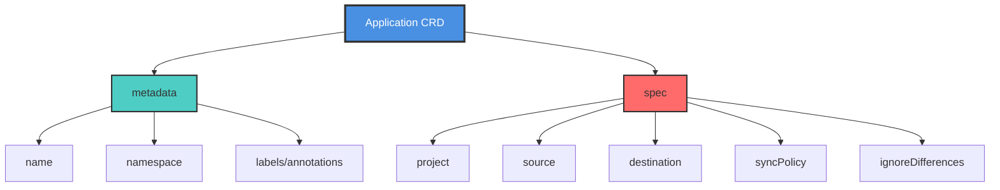
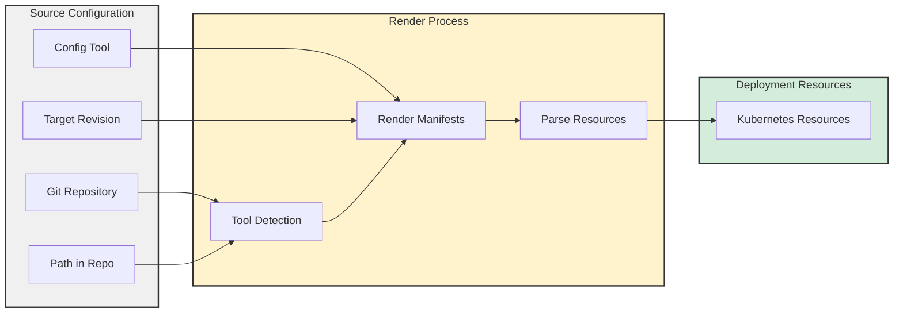
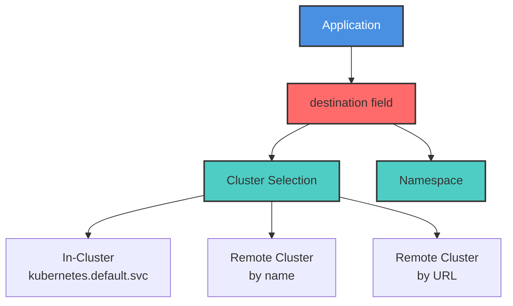
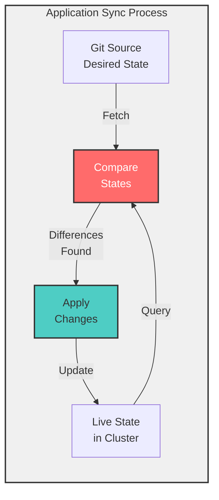
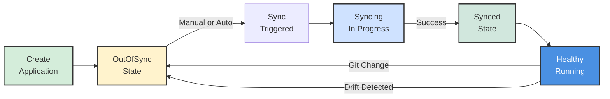

# ArgoCD Application CRD

> **Note for VS Code Users:** To view Mermaid diagrams in this document, install the [Markdown Preview Enhanced](https://marketplace.visualstudio.com/items?itemName=shd101wyy.markdown-preview-enhanced) or [Markdown Preview Mermaid Support](https://marketplace.visualstudio.com/items?itemName=bierner.markdown-mermaid) extension.

## Table of Contents
- [Introduction](#introduction)
- [What is an ArgoCD Application?](#what-is-an-argocd-application)
- [Application CRD Structure](#application-crd-structure)
- [How Applications Determine What Resources to Deploy](#how-applications-determine-what-resources-to-deploy)
- [How Applications Know Where to Deploy](#how-applications-know-where-to-deploy)
- [Understanding Application Sync](#understanding-application-sync)
- [Sync Policies](#sync-policies)
- [Application Lifecycle](#application-lifecycle)
- [Best Practices](#best-practices)
- [Common Use Cases](#common-use-cases)
- [Troubleshooting](#troubleshooting)
- [Key Takeaways](#key-takeaways)

---

## Introduction

The **Application CRD (Custom Resource Definition)** is the most significant resource introduced by ArgoCD. It declaratively defines the deployment process for manifests into Kubernetes, including:
- Where to source the manifests
- How to render them
- When to deploy the resources
- When to reconcile the live state with the desired state
- And much more

This document provides a comprehensive guide to understanding and working with ArgoCD Application CRDs.

---

## What is an ArgoCD Application?

An **ArgoCD Application** is a Kubernetes Custom Resource (CR) that represents a deployed application in your cluster. It's the primary way to manage applications with ArgoCD.

### Key Characteristics

- **Declarative Definition**: Applications are defined as YAML manifests
- **Kubernetes-Native**: Uses standard Kubernetes CR patterns
- **Git-Centric**: Points to Git repositories as the source of truth
- **Self-Contained**: Contains all information needed for deployment
- **Reconciliation Loop**: Continuously ensures desired state matches live state

### Complete Application Example

Below is a complete and functional example of an ArgoCD Application manifest:

```yaml
apiVersion: argoproj.io/v1alpha1
kind: Application
metadata:
  name: guestbook
spec:
  project: default
  source:
    repoURL: https://github.com/argoproj/argocd-example-apps
    path: helm-guestbook/
    helm:
      valueFiles:
        - values-production.yaml
  destination:
    name: 'dev'
    namespace: 'guestbook'
  syncPolicy:
    syncOptions:
      - CreateNamespace=true
    automated:
      selfHeal: true
```

This Application will automatically deploy the Helm chart from the `helm-guestbook/` path in the `argoproj/argocd-example-apps` GitHub repository with the `values-production.yaml` values file to the `guestbook` namespace in the `dev` cluster.

The sync policy will run automatically as changes are made in the repository, self-heal resources that deviate from the desired state, and create the namespace if needed.

---

## Application CRD Structure



### Core Fields

| Field | Description | Required |
|-------|-------------|----------|
| `metadata.name` | Unique name for the Application | Yes |
| `spec.project` | ArgoCD Project to which this Application belongs | Yes |
| `spec.source` | Defines where to get the manifests | Yes |
| `spec.destination` | Defines where to deploy the resources | Yes |
| `spec.syncPolicy` | Defines how and when to sync | No |
| `spec.ignoreDifferences` | Fields to ignore during sync | No |

---

## How Applications Determine What Resources to Deploy

Applications use a **config management tool**, a **source repository and path**, and a **target revision** to render the manifests and determine the difference between the desired and live states.



### Source Configuration

In the example below, the source is the `argoproj/argocd-example-apps` GitHub repository and its `helm-guestbook` path:

```yaml
source:
  repoURL: https://github.com/argoproj/argocd-example-apps
  path: helm-guestbook/
  helm:
    valueFiles:
      - values-production.yaml
```

The source also specifies to use the `values-production.yaml` file from the path as a values file for the Helm chart.

### Config Management Tools

ArgoCD has built-in support for common config management tools and also supports plain YAML. Supported tools include:

- **Helm** - Package manager for Kubernetes
- **Kustomize** - Template-free customization
- **Jsonnet** - Data templating language
- **Plain YAML/JSON** - Direct Kubernetes manifests
- **Custom Plugins (CMP)** - Config Management Plugins for custom tools

Beyond this, you can integrate any tool into ArgoCD using a config management plugin (CMP). This mechanism provides a way to add additional tooling for use by Applications.

### Tool Detection

Tool detection can happen automatically based on the files found in the source repository path:

| File/Directory | Detected Tool |
|----------------|---------------|
| `Chart.yaml` | Helm |
| `kustomization.yaml` | Kustomize |
| `*.jsonnet` | Jsonnet |
| `*.yaml` | Plain YAML |

### Source Types

The source can be:
- **Git Repository**: Most common, any Git repository
- **Helm Chart Repository**: OCI or traditional Helm repositories

When using a Git repository, the target revision can track:
- **Branches**: e.g., `main`, `develop`, `production`
- **Tags**: e.g., `v1.0.0`, `release-2023`
- **Specific Commits**: Pinned to a specific commit SHA

For Helm repositories, the target revision will be the chart version (e.g., `1.2.3`).

### Tracking Resources

ArgoCD adds **labels or annotations** (depending on the method used) to the resources deployed by an Application to keep track of them. This allows ArgoCD to:
- Monitor the health status of resources
- Detect drift from the desired state
- Perform cleanup when resources are removed from source
- Show relationships in the UI

---

## How Applications Know Where to Deploy

ArgoCD can deploy resources to the cluster it is running in or to connected clusters. In the Application manifest, the desired location is represented in the `destination` field with either the **name** or **server URL** of the cluster and the **namespace** in it.



### Destination Configuration

In this example, the resources will be deployed to the `guestbook` namespace in the connected cluster named `dev`:

```yaml
destination:
  name: 'dev'
  namespace: 'guestbook'
```

### Cluster Identification

You can specify the target cluster in two ways:

#### 1. By Cluster Name

```yaml
destination:
  name: 'production'
  namespace: 'my-app'
```

#### 2. By Server URL

```yaml
destination:
  server: 'https://kubernetes.default.svc'
  namespace: 'my-app'
```

**In-Cluster Deployment**: Use `https://kubernetes.default.svc` as the server URL to deploy to the same cluster where ArgoCD is running.

### Namespace Management

The `namespace` field specifies where the resources will be deployed:
- Must exist before deployment (unless `CreateNamespace` sync option is enabled)
- Can be created automatically with `CreateNamespace=true` sync option
- Namespace-scoped resources will be created in this namespace
- Cluster-scoped resources (like ClusterRoles) ignore this field

---

## Understanding Application Sync

**Syncing an Application** will reconcile the live state of the cluster with the desired state as defined in the source. Each Application has a **sync policy** that defines how to handle the reconciliation.



### What Happens During Sync?

1. **Fetch**: ArgoCD retrieves the desired state from the Git source
2. **Render**: Manifests are rendered using the appropriate config tool
3. **Compare**: Desired state is compared with the live cluster state
4. **Diff**: Differences are identified (added, modified, removed resources)
5. **Apply**: Changes are applied to the cluster to match desired state
6. **Track**: Resources are labeled/annotated for tracking

### Sync Triggers

The sync policy defines whether the sync should be triggered:

#### Manual Sync
- **By clicking a button** in the ArgoCD UI
- **Using the CLI**: `argocd app sync <app-name>`
- **Using the API**: REST API call to trigger sync
- **On-Demand**: Only when explicitly requested

#### Automatic Sync
- **As changes are made to the source**: ArgoCD polls the Git repository
- **Continuous Reconciliation**: Automatically applies changes
- **No manual intervention required**: Seamless deployment

### Sync Phases

| Phase | Description |
|-------|-------------|
| **PreSync** | Run before the sync operation (e.g., database backup) |
| **Sync** | Apply the changes to the cluster |
| **Skip** | Skip certain resources during sync |
| **PostSync** | Run after successful sync (e.g., notifications) |
| **SyncFail** | Run if sync fails (e.g., rollback, alerts) |

---

## Sync Policies

The `syncPolicy` field customizes numerous characteristics of how the Application syncs resources.

### Automated Sync

Enable automatic synchronization when changes are detected in Git:

```yaml
syncPolicy:
  automated: {}
```

This enables auto-sync with default settings. Once enabled, ArgoCD will automatically deploy changes without manual intervention.

### Self-Heal

Automatically revert manual changes made directly to the cluster:

```yaml
syncPolicy:
  automated:
    selfHeal: true
```

If a resource in the cluster deviates from the desired state (e.g., someone manually edits a Deployment), ArgoCD will automatically restore it to match Git.

**Example Scenario**:
- Developer manually scales Deployment replicas from 3 to 5
- Self-heal detects the drift
- ArgoCD automatically scales back to 3 (as defined in Git)

### Prune Resources

Automatically delete resources that are removed from Git:

```yaml
syncPolicy:
  automated:
    prune: true
```

When a resource is deleted from the Git repository, ArgoCD will also delete it from the cluster.

### Sync Options

Additional options to customize sync behavior:

```yaml
syncPolicy:
  syncOptions:
    - CreateNamespace=true      # Create namespace if it doesn't exist
    - PrunePropagationPolicy=foreground  # How to delete resources
    - PruneLast=true             # Prune resources after everything else
    - Validate=false             # Skip kubectl validation
    - ApplyOutOfSyncOnly=true    # Only sync out-of-sync resources
    - RespectIgnoreDifferences=true  # Honor ignoreDifferences config
```

#### CreateNamespace

In this example from our guestbook application, it will automatically **create the namespace** in the destination cluster and **self-heal** itself if a resource in the cluster deviates from the desired state:

```yaml
syncPolicy:
  syncOptions:
    - CreateNamespace=true
  automated:
    selfHeal: true
```

### Complete Sync Policy Example

```yaml
syncPolicy:
  automated:
    prune: true       # Auto-delete removed resources
    selfHeal: true    # Auto-correct manual changes
    allowEmpty: false # Prevent deleting all resources
  syncOptions:
    - CreateNamespace=true
    - PrunePropagationPolicy=foreground
    - PruneLast=true
  retry:
    limit: 5
    backoff:
      duration: 5s
      factor: 2
      maxDuration: 3m
```

---

## Application Lifecycle



### Application States

#### Sync Status
- **Synced**: Live state matches desired state in Git
- **OutOfSync**: Live state differs from Git
- **Unknown**: Unable to determine sync status

#### Health Status
- **Healthy**: All resources are running properly
- **Progressing**: Resources are being created/updated
- **Degraded**: Some resources are failing
- **Suspended**: Application is suspended (e.g., CronJob)
- **Missing**: Resources expected but not found
- **Unknown**: Unable to determine health

---

## Best Practices

### 1. Use Projects for Multi-Tenancy

Organize Applications into Projects for better access control:

```yaml
spec:
  project: production-apps
```

### 2. Pin Important Environments

Use specific commits or tags for production:

```yaml
source:
  targetRevision: v1.2.3  # Specific tag
  # or
  targetRevision: abc123def456  # Specific commit
```

### 3. Enable Automated Sync for Non-Production

```yaml
# Development environment
syncPolicy:
  automated:
    prune: true
    selfHeal: true
```

### 4. Use Manual Sync for Production

```yaml
# Production environment
syncPolicy:
  syncOptions:
    - CreateNamespace=true
  # No automated field = manual sync only
```

### 5. Implement Sync Waves for Ordered Deployment

Use annotations to control deployment order:

```yaml
metadata:
  annotations:
    argocd.argoproj.io/sync-wave: "1"  # Deploy in wave 1
```

### 6. Ignore Expected Differences

Some fields change frequently and shouldn't trigger sync:

```yaml
spec:
  ignoreDifferences:
    - group: apps
      kind: Deployment
      jsonPointers:
        - /spec/replicas  # Ignore replica count (e.g., for HPA)
```

### 7. Use Sync Windows

Control when syncs can occur:

```yaml
# In AppProject
spec:
  syncWindows:
    - kind: allow
      schedule: '0 9 * * 1-5'  # Mon-Fri, 9 AM
      duration: 8h
      applications:
        - 'production-*'
```

### 8. Leverage Resource Hooks

Use hooks for pre/post sync operations:

```yaml
metadata:
  annotations:
    argocd.argoproj.io/hook: PreSync
    argocd.argoproj.io/hook-delete-policy: BeforeHookCreation
```

---

## Common Use Cases

### Use Case 1: Simple Application Deployment

```yaml
apiVersion: argoproj.io/v1alpha1
kind: Application
metadata:
  name: my-app
  namespace: argocd
spec:
  project: default
  source:
    repoURL: https://github.com/myorg/my-app
    path: k8s/
    targetRevision: main
  destination:
    server: https://kubernetes.default.svc
    namespace: my-app
  syncPolicy:
    automated:
      prune: true
      selfHeal: true
    syncOptions:
      - CreateNamespace=true
```

### Use Case 2: Helm Chart with Custom Values

```yaml
apiVersion: argoproj.io/v1alpha1
kind: Application
metadata:
  name: nginx
spec:
  project: default
  source:
    repoURL: https://charts.bitnami.com/bitnami
    chart: nginx
    targetRevision: 13.2.23
    helm:
      values: |
        replicaCount: 3
        service:
          type: LoadBalancer
  destination:
    server: https://kubernetes.default.svc
    namespace: nginx
  syncPolicy:
    automated: {}
```

### Use Case 3: Kustomize with Overlays

```yaml
apiVersion: argoproj.io/v1alpha1
kind: Application
metadata:
  name: my-app-prod
spec:
  project: default
  source:
    repoURL: https://github.com/myorg/my-app
    path: k8s/overlays/production
    targetRevision: main
  destination:
    server: https://prod-cluster.example.com
    namespace: my-app
  syncPolicy:
    syncOptions:
      - CreateNamespace=true
```

### Use Case 4: Multi-Source Application

```yaml
apiVersion: argoproj.io/v1alpha1
kind: Application
metadata:
  name: multi-source-app
spec:
  project: default
  sources:
    - repoURL: https://github.com/myorg/app-manifests
      path: base/
      targetRevision: main
    - repoURL: https://github.com/myorg/app-config
      path: production/
      targetRevision: main
  destination:
    server: https://kubernetes.default.svc
    namespace: my-app
```

---

## Troubleshooting

### Application is OutOfSync

**Symptoms**: Application shows OutOfSync status

**Possible Causes**:
1. Recent changes in Git repository
2. Manual changes made directly to cluster
3. Sync is disabled or manual

**Solutions**:
- Review the diff in ArgoCD UI
- Trigger manual sync if auto-sync is disabled
- Enable `selfHeal` to auto-correct drift
- Check `ignoreDifferences` for legitimate differences

### Sync Fails

**Symptoms**: Sync operation fails with errors

**Common Issues**:

1. **Invalid Manifests**
   - Check syntax with `kubectl apply --dry-run=client`
   - Review validation errors in sync logs

2. **Missing Permissions**
   - Verify ArgoCD service account has required RBAC
   - Check if namespace exists

3. **Resource Dependencies**
   - Use sync waves to order deployments
   - Check if CRDs are installed before CRs

4. **Helm Rendering Issues**
   - Validate values file syntax
   - Test locally: `helm template`

### Resources Not Being Tracked

**Symptoms**: Resources exist but not shown in ArgoCD

**Solutions**:
- Verify resources have ArgoCD labels/annotations
- Check if resources are in the correct namespace
- Ensure source path is correct

### Self-Heal Not Working

**Symptoms**: Manual changes persist

**Check**:
- Verify `selfHeal: true` is set
- Check if resource is in `ignoreDifferences`
- Ensure ArgoCD has permissions to modify resources
- Review sync logs for errors

---

## Key Takeaways

1. **Application CRD is Central**: The Application resource is the core of ArgoCD, defining everything about your deployment.

2. **Declarative Configuration**: Applications are defined declaratively using YAML, following Kubernetes patterns.

3. **Source Flexibility**: Support for multiple config management tools (Helm, Kustomize, Jsonnet, plain YAML) and custom plugins.

4. **Destination Control**: Deploy to the local cluster or any connected remote cluster with namespace specification.

5. **Sync Policies**: Fine-grained control over when and how synchronization happens (manual vs. automated).

6. **Self-Healing**: Automatic drift correction keeps your cluster aligned with Git.

7. **Auto-Pruning**: Resources removed from Git can be automatically deleted from the cluster.

8. **Sync Options**: Extensive customization through sync options like CreateNamespace, PruneLast, etc.

9. **Resource Tracking**: ArgoCD tracks all deployed resources through labels/annotations for monitoring and management.

10. **Lifecycle Management**: Complete visibility into sync status and health status of applications.

11. **Tool Detection**: Automatic detection of config management tools based on repository contents.

12. **Multi-Environment**: Easily manage the same application across multiple environments using branches, tags, or overlays.

---

## Additional Resources

- [Official ArgoCD Application Documentation](https://argo-cd.readthedocs.io/en/stable/user-guide/application-specification/)
- [ArgoCD Application Examples](https://github.com/argoproj/argocd-example-apps)
- [Sync Options Reference](https://argo-cd.readthedocs.io/en/stable/user-guide/sync-options/)
- [Sync Phases and Waves](https://argo-cd.readthedocs.io/en/stable/user-guide/sync-waves/)
- [Resource Hooks Documentation](https://argo-cd.readthedocs.io/en/stable/user-guide/resource_hooks/)

---

**Next Steps:**
- Take the [Knowledge Assessment Quiz](quiz.md) to test your understanding
- Create your first Application CRD
- Experiment with different sync policies
- Try using different config management tools

Happy deploying with ArgoCD Applications! 🚀

