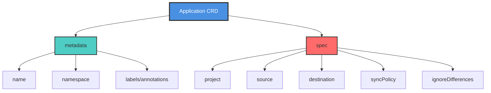
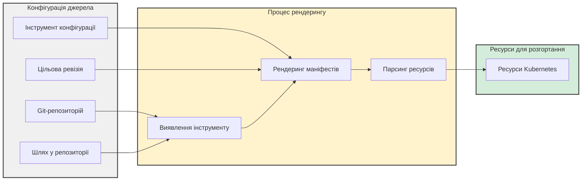
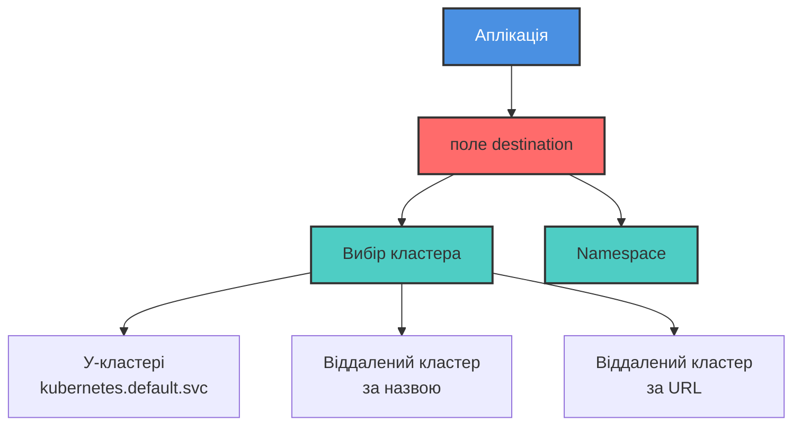
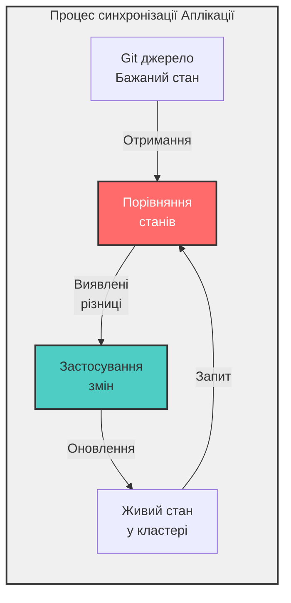
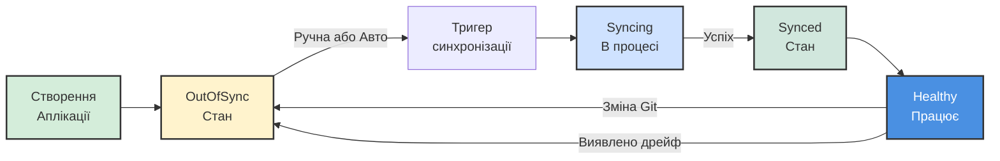

# Аплікація ArgoCD (CRD)

> **Примітка для користувачів VS Code:** Щоб переглядати діаграми Mermaid у цьому документі, встановіть розширення [Markdown Preview Enhanced](https://marketplace.visualstudio.com/items?itemName=shd101wyy.markdown-preview-enhanced) або [Markdown Preview Mermaid Support](https://marketplace.visualstudio.com/items?itemName=bierner.markdown-mermaid).

## Зміст
- [Вступ](#вступ)
- [Що таке Аплікація ArgoCD?](#що-таке-аплікація-argocd)
- [Структура CRD Аплікації](#структура-crd-аплікації)
- [Як Аплікації визначають ресурси для розгортання](#як-аплікації-визначають-ресурси-для-розгортання)
- [Як Аплікації знають куди розгортати](#як-аплікації-знають-куди-розгортати)
- [Розуміння синхронізації Аплікації](#розуміння-синхронізації-аплікації)
- [Політики синхронізації](#політики-синхронізації)
- [Життєвий цикл Аплікації](#життєвий-цикл-аплікації)
- [Найкращі практики](#найкращі-практики)
- [Поширені сценарії використання](#поширені-сценарії-використання)
- [Усунення несправностей](#усунення-несправностей)
- [Ключові висновки](#ключові-висновки)

---

## Вступ

**Application CRD (Custom Resource Definition)** — це ресурс, який фактично дає ArgoCD вказівки до дії. Він декларативно визначає:
- звідки брати маніфести
- як їх рендерити
- куди і коли розгортати ресурси
- як поводитися під час узгодження живого стану з бажаним
- і які операційні правила має враховувати ArgoCD

Коли ви розумієте цей ресурс, ArgoCD перестає виглядати як чорна скринька. Натомість з'являється чіткий зв'язок між вашим наміром у Git і поведінкою контролера в кластері.

---

## Що таке Аплікація ArgoCD?

**Аплікація ArgoCD** — це Kubernetes Custom Resource (CR), що представляє розгорнутий додаток у вашому кластері. Це основний спосіб управління додатками за допомогою ArgoCD.

### Ключові характеристики

- **Декларативне визначення**: Аплікації визначаються як YAML маніфести
- **Kubernetes-Native**: Використовує стандартні шаблони CR Kubernetes
- **Git-центричність**: Вказує на Git-репозиторії як джерело правди
- **Автономність**: Містить всю інформацію, необхідну для розгортання
- **Цикл узгодження**: Безперервно забезпечує відповідність бажаного стану живому стану

### Повний приклад Аплікації

Нижче наведено повний і функціональний приклад маніфесту Аплікації ArgoCD:

```yaml
apiVersion: argoproj.io/v1alpha1
kind: Application
metadata:
  name: guestbook
spec:
  project: default
  source:
    repoURL: https://github.com/argoproj/argocd-example-apps
    path: helm-guestbook/
    helm:
      valueFiles:
        - values-production.yaml
  destination:
    name: 'dev'
    namespace: 'guestbook'
  syncPolicy:
    syncOptions:
      - CreateNamespace=true
    automated:
      selfHeal: true
```

Ця Аплікація автоматично розгорне Helm chart зі шляху `helm-guestbook/` у репозиторії GitHub `argoproj/argocd-example-apps` з файлом значень `values-production.yaml` у namespace `guestbook` у кластері `dev`.

Політика синхронізації запускатиметься автоматично при внесенні змін у репозиторій, самовідновлюватиме ресурси, які відхиляються від бажаного стану, та створить namespace при потребі.

---

## Структура CRD Аплікації



### Основні поля

| Поле | Опис | Обов'язкове |
|------|------|-------------|
| `metadata.name` | Унікальна назва для Аплікації | Так |
| `spec.project` | Проект ArgoCD, до якого належить Аплікація | Так |
| `spec.source` | Визначає звідки брати маніфести | Так |
| `spec.destination` | Визначає куди розгортати ресурси | Так |
| `spec.syncPolicy` | Визначає як і коли синхронізувати | Ні |
| `spec.ignoreDifferences` | Поля для ігнорування під час синхронізації | Ні |

---

## Як Аплікації визначають ресурси для розгортання

Аплікації використовують **інструмент управління конфігурацією**, **репозиторій джерела та шлях**, а також **цільову ревізію** для рендерингу маніфестів та визначення різниці між бажаним і живим станами.



### Конфігурація джерела

У прикладі нижче джерелом є репозиторій GitHub `argoproj/argocd-example-apps` та його шлях `helm-guestbook`:

```yaml
source:
  repoURL: https://github.com/argoproj/argocd-example-apps
  path: helm-guestbook/
  helm:
    valueFiles:
      - values-production.yaml
```

Джерело також вказує використовувати файл `values-production.yaml` зі шляху як файл значень для Helm chart.

### Інструменти управління конфігурацією

ArgoCD має вбудовану підтримку поширених інструментів управління конфігурацією, а також підтримує звичайний YAML. Підтримувані інструменти включають:

- **Helm** - Менеджер пакетів для Kubernetes
- **Kustomize** - Налаштування без шаблонів
- **Jsonnet** - Мова шаблонування даних
- **Plain YAML/JSON** - Прямі маніфести Kubernetes
- **Custom Plugins (CMP)** - Плагіни управління конфігурацією для користувацьких інструментів

Крім цього, ви можете інтегрувати будь-який інструмент в ArgoCD, використовуючи плагін управління конфігурацією (CMP). Цей механізм забезпечує спосіб додавання додаткового інструментарію для використання Аплікаціями.

### Виявлення інструменту

Виявлення інструменту може відбуватися автоматично на основі файлів, знайдених у шляху репозиторію джерела:

| Файл/Директорія | Виявлений інструмент |
|-----------------|----------------------|
| `Chart.yaml` | Helm |
| `kustomization.yaml` | Kustomize |
| `*.jsonnet` | Jsonnet |
| `*.yaml` | Plain YAML |

### Типи джерел

Джерелом може бути:
- **Git-репозиторій**: Найпоширеніше, будь-який Git-репозиторій
- **Helm Chart Repository**: OCI або традиційні Helm-репозиторії

При використанні Git-репозиторію цільова ревізія може відстежувати:
- **Гілки**: наприклад, `main`, `develop`, `production`
- **Теги**: наприклад, `v1.0.0`, `release-2023`
- **Конкретні коміти**: Закріплено до конкретного SHA коміту

Для Helm-репозиторіїв цільовою ревізією буде версія chart (наприклад, `1.2.3`).

### Відстеження ресурсів

ArgoCD додає **labels або annotations** (залежно від використовуваного методу) до ресурсів, розгорнутих Аплікацією, щоб відстежувати їх. Це дозволяє ArgoCD:
- Моніторити статус здоров'я ресурсів
- Виявляти дрейф від бажаного стану
- Виконувати очищення при видаленні ресурсів з джерела
- Показувати взаємозв'язки в UI

---

## Як Аплікації знають куди розгортати

ArgoCD може розгортати ресурси в кластер, у якому він працює, або в підключені кластери. У маніфесті Аплікації бажане розташування представлено в полі `destination` з **назвою** або **URL сервера** кластера та **namespace** у ньому.



### Конфігурація призначення

У цьому прикладі ресурси будуть розгорнуті в namespace `guestbook` у підключеному кластері з назвою `dev`:

```yaml
destination:
  name: 'dev'
  namespace: 'guestbook'
```

### Ідентифікація кластера

Ви можете вказати цільовий кластер двома способами:

#### 1. За назвою кластера

```yaml
destination:
  name: 'production'
  namespace: 'my-app'
```

#### 2. За URL сервера

```yaml
destination:
  server: 'https://kubernetes.default.svc'
  namespace: 'my-app'
```

**Розгортання в кластері**: Використовуйте `https://kubernetes.default.svc` як URL сервера для розгортання в тому ж кластері, де працює ArgoCD.

### Управління namespace

Поле `namespace` вказує, куди будуть розгорнуті ресурси:
- Має існувати перед розгортанням (якщо не ввімкнено опцію синхронізації `CreateNamespace`)
- Може бути створено автоматично з опцією синхронізації `CreateNamespace=true`
- Ресурси з областю namespace будуть створені в цьому namespace
- Ресурси з областю кластера (як ClusterRoles) ігнорують це поле

---

## Розуміння синхронізації Аплікації

**Синхронізація Аплікації** узгодить живий стан кластера з бажаним станом, визначеним у джерелі. Кожна Аплікація має **політику синхронізації**, яка визначає, як обробляти узгодження.



### Що відбувається під час синхронізації?

1. **Отримання**: ArgoCD отримує бажаний стан з Git джерела
2. **Рендеринг**: Маніфести рендеряться за допомогою відповідного інструменту конфігурації
3. **Порівняння**: Бажаний стан порівнюється з живим станом кластера
4. **Різниця**: Визначаються різниці (додані, змінені, видалені ресурси)
5. **Застосування**: Зміни застосовуються до кластера для відповідності бажаному стану
6. **Відстеження**: Ресурси позначаються labels/annotations для відстеження

### Тригери синхронізації

Політика синхронізації визначає, чи повинна синхронізація тригеритися:

#### Ручна синхронізація
- **Натисканням кнопки** в UI ArgoCD
- **Використовуючи CLI**: `argocd app sync <app-name>`
- **Використовуючи API**: Виклик REST API для тригеру синхронізації
- **На вимогу**: Тільки при явному запиті

#### Автоматична синхронізація
- **При внесенні змін у джерело**: ArgoCD опитує Git-репозиторій
- **Безперервне узгодження**: Автоматично застосовує зміни
- **Без ручного втручання**: Безшовне розгортання

### Фази синхронізації

| Фаза | Опис |
|------|------|
| **PreSync** | Виконується перед операцією синхронізації (наприклад, резервне копіювання БД) |
| **Sync** | Застосування змін до кластера |
| **Skip** | Пропуск певних ресурсів під час синхронізації |
| **PostSync** | Виконується після успішної синхронізації (наприклад, сповіщення) |
| **SyncFail** | Виконується при невдалій синхронізації (наприклад, відкат, сповіщення) |

---

## Політики синхронізації

Поле `syncPolicy` налаштовує численні характеристики того, як Аплікація синхронізує ресурси.

### Автоматична синхронізація

Увімкнути автоматичну синхронізацію при виявленні змін у Git:

```yaml
syncPolicy:
  automated: {}
```

Це вмикає auto-sync зі стандартними налаштуваннями. Після ввімкнення ArgoCD автоматично розгортатиме зміни без ручного втручання.

### Самовідновлення

Автоматичне повернення ручних змін, внесених безпосередньо в кластер:

```yaml
syncPolicy:
  automated:
    selfHeal: true
```

Якщо ресурс у кластері відхиляється від бажаного стану (наприклад, хтось вручну редагує Deployment), ArgoCD автоматично відновить його відповідно до Git.

**Приклад сценарію**:
- Розробник вручну масштабує репліки Deployment з 3 до 5
- Самовідновлення виявляє дрейф
- ArgoCD автоматично масштабує назад до 3 (як визначено в Git)

### Видалення ресурсів

Автоматичне видалення ресурсів, які видалені з Git:

```yaml
syncPolicy:
  automated:
    prune: true
```

Коли ресурс видаляється з Git-репозиторію, ArgoCD також видалить його з кластера.

### Опції синхронізації

Додаткові опції для налаштування поведінки синхронізації:

```yaml
syncPolicy:
  syncOptions:
    - CreateNamespace=true      # Створити namespace, якщо він не існує
    - PrunePropagationPolicy=foreground  # Як видаляти ресурси
    - PruneLast=true             # Видаляти ресурси після всього іншого
    - Validate=false             # Пропустити валідацію kubectl
    - ApplyOutOfSyncOnly=true    # Синхронізувати тільки несинхронізовані ресурси
    - RespectIgnoreDifferences=true  # Враховувати конфігурацію ignoreDifferences
```

#### CreateNamespace

У цьому прикладі з нашої аплікації guestbook, вона автоматично **створить namespace** у цільовому кластері та **самовідновиться**, якщо ресурс у кластері відхиляється від бажаного стану:

```yaml
syncPolicy:
  syncOptions:
    - CreateNamespace=true
  automated:
    selfHeal: true
```

### Повний приклад політики синхронізації

```yaml
syncPolicy:
  automated:
    prune: true       # Автовидалення видалених ресурсів
    selfHeal: true    # Автовиправлення ручних змін
    allowEmpty: false # Запобігання видаленню всіх ресурсів
  syncOptions:
    - CreateNamespace=true
    - PrunePropagationPolicy=foreground
    - PruneLast=true
  retry:
    limit: 5
    backoff:
      duration: 5s
      factor: 2
      maxDuration: 3m
```

---

## Життєвий цикл Аплікації



### Стани Аплікації

#### Статус синхронізації
- **Synced**: Живий стан відповідає бажаному стану в Git
- **OutOfSync**: Живий стан відрізняється від Git
- **Unknown**: Неможливо визначити статус синхронізації

#### Статус здоров'я
- **Healthy**: Всі ресурси працюють правильно
- **Progressing**: Ресурси створюються/оновлюються
- **Degraded**: Деякі ресурси зазнають невдачі
- **Suspended**: Аплікація призупинена (наприклад, CronJob)
- **Missing**: Очікувані ресурси не знайдено
- **Unknown**: Неможливо визначити здоров'я

---

## Найкращі практики

### 1. Використовуйте проекти для мультитенантності

Організуйте Аплікації в Проекти для кращого контролю доступу:

```yaml
spec:
  project: production-apps
```

### 2. Закріплюйте важливі середовища

Використовуйте конкретні коміти або теги для production:

```yaml
source:
  targetRevision: v1.2.3  # Конкретний тег
  # або
  targetRevision: abc123def456  # Конкретний коміт
```

### 3. Увімкніть автоматичну синхронізацію для не-production

```yaml
# Середовище розробки
syncPolicy:
  automated:
    prune: true
    selfHeal: true
```

### 4. Використовуйте ручну синхронізацію для Production

```yaml
# Production середовище
syncPolicy:
  syncOptions:
    - CreateNamespace=true
  # Без поля automated = тільки ручна синхронізація
```

### 5. Впровадьте sync waves для впорядкованого розгортання

Використовуйте анотації для контролю порядку розгортання:

```yaml
metadata:
  annotations:
    argocd.argoproj.io/sync-wave: "1"  # Розгорнути в хвилі 1
```

### 6. Ігноруйте очікувані різниці

Деякі поля змінюються часто і не повинні тригерити синхронізацію:

```yaml
spec:
  ignoreDifferences:
    - group: apps
      kind: Deployment
      jsonPointers:
        - /spec/replicas  # Ігнорувати кількість реплік (наприклад, для HPA)
```

### 7. Використовуйте вікна синхронізації

Контролюйте, коли можуть відбуватися синхронізації:

```yaml
# У AppProject
spec:
  syncWindows:
    - kind: allow
      schedule: '0 9 * * 1-5'  # Пн-Пт, 9 ранку
      duration: 8h
      applications:
        - 'production-*'
```

### 8. Використовуйте resource hooks

Використовуйте hooks для операцій до/після синхронізації:

```yaml
metadata:
  annotations:
    argocd.argoproj.io/hook: PreSync
    argocd.argoproj.io/hook-delete-policy: BeforeHookCreation
```

---

## Поширені сценарії використання

### Сценарій 1: Просте розгортання додатку

```yaml
apiVersion: argoproj.io/v1alpha1
kind: Application
metadata:
  name: my-app
  namespace: argocd
spec:
  project: default
  source:
    repoURL: https://github.com/myorg/my-app
    path: k8s/
    targetRevision: main
  destination:
    server: https://kubernetes.default.svc
    namespace: my-app
  syncPolicy:
    automated:
      prune: true
      selfHeal: true
    syncOptions:
      - CreateNamespace=true
```

### Сценарій 2: Helm Chart з користувацькими значеннями

```yaml
apiVersion: argoproj.io/v1alpha1
kind: Application
metadata:
  name: nginx
spec:
  project: default
  source:
    repoURL: https://charts.bitnami.com/bitnami
    chart: nginx
    targetRevision: 13.2.23
    helm:
      values: |
        replicaCount: 3
        service:
          type: LoadBalancer
  destination:
    server: https://kubernetes.default.svc
    namespace: nginx
  syncPolicy:
    automated: {}
```

### Сценарій 3: Kustomize з overlays

```yaml
apiVersion: argoproj.io/v1alpha1
kind: Application
metadata:
  name: my-app-prod
spec:
  project: default
  source:
    repoURL: https://github.com/myorg/my-app
    path: k8s/overlays/production
    targetRevision: main
  destination:
    server: https://prod-cluster.example.com
    namespace: my-app
  syncPolicy:
    syncOptions:
      - CreateNamespace=true
```

### Сценарій 4: Аплікація з кількома джерелами

```yaml
apiVersion: argoproj.io/v1alpha1
kind: Application
metadata:
  name: multi-source-app
spec:
  project: default
  sources:
    - repoURL: https://github.com/myorg/app-manifests
      path: base/
      targetRevision: main
    - repoURL: https://github.com/myorg/app-config
      path: production/
      targetRevision: main
  destination:
    server: https://kubernetes.default.svc
    namespace: my-app
```

---

## Усунення несправностей

### Аплікація OutOfSync

**Симптоми**: Аплікація показує статус OutOfSync

**Можливі причини**:
1. Нещодавні зміни в Git-репозиторії
2. Ручні зміни, внесені безпосередньо в кластер
3. Синхронізація вимкнена або ручна

**Рішення**:
- Перегляньте різницю в UI ArgoCD
- Тригеруйте ручну синхронізацію, якщо auto-sync вимкнено
- Увімкніть `selfHeal` для автовиправлення дрейфу
- Перевірте `ignoreDifferences` для легітимних різниць

### Синхронізація зазнає невдачі

**Симптоми**: Операція синхронізації завершується з помилками

**Поширені проблеми**:

1. **Недійсні маніфести**
   - Перевірте синтаксис за допомогою `kubectl apply --dry-run=client`
   - Перегляньте помилки валідації в логах синхронізації

2. **Відсутні дозволи**
   - Перевірте, чи має service account ArgoCD необхідні RBAC
   - Перевірте, чи існує namespace

3. **Залежності ресурсів**
   - Використовуйте sync waves для впорядкування розгортань
   - Перевірте, чи встановлені CRD перед CR

4. **Проблеми рендерингу Helm**
   - Перевірте синтаксис файлу values
   - Тестуйте локально: `helm template`

### Ресурси не відстежуються

**Симптоми**: Ресурси існують, але не відображаються в ArgoCD

**Рішення**:
- Перевірте, чи ресурси мають labels/annotations ArgoCD
- Перевірте, чи ресурси в правильному namespace
- Переконайтеся, що шлях джерела правильний

### Самовідновлення не працює

**Симптоми**: Ручні зміни залишаються

**Перевірте**:
- Перевірте, чи встановлено `selfHeal: true`
- Перевірте, чи ресурс не в `ignoreDifferences`
- Переконайтеся, що ArgoCD має дозволи на зміну ресурсів
- Перегляньте логи синхронізації на помилки

---

## Ключові висновки

1. **Application CRD є центральним**: Ресурс Application є ядром ArgoCD, визначаючи все про ваше розгортання.

2. **Декларативна конфігурація**: Аплікації визначаються декларативно за допомогою YAML, слідуючи шаблонам Kubernetes.

3. **Гнучкість джерел**: Підтримка кількох інструментів управління конфігурацією (Helm, Kustomize, Jsonnet, plain YAML) та користувацьких плагінів.

4. **Контроль призначення**: Розгортання в локальний кластер або будь-який підключений віддалений кластер з вказівкою namespace.

5. **Політики синхронізації**: Детальний контроль над тим, коли і як відбувається синхронізація (ручна проти автоматичної).

6. **Самовідновлення**: Автоматичне виправлення дрейфу підтримує ваш кластер вирівняним з Git.

7. **Автовидалення**: Ресурси, видалені з Git, можуть бути автоматично видалені з кластера.

8. **Опції синхронізації**: Широке налаштування через опції синхронізації, такі як CreateNamespace, PruneLast тощо.

9. **Відстеження ресурсів**: ArgoCD відстежує всі розгорнуті ресурси через labels/annotations для моніторингу та управління.

10. **Управління життєвим циклом**: Повна видимість статусу синхронізації та статусу здоров'я аплікацій.

11. **Виявлення інструменту**: Автоматичне виявлення інструментів управління конфігурацією на основі вмісту репозиторію.

12. **Мультисередовище**: Легке управління одним і тим же додатком у кількох середовищах за допомогою гілок, тегів або overlays.

---

## Додаткові ресурси

- [Офіційна документація ArgoCD Application](https://argo-cd.readthedocs.io/en/stable/user-guide/application-specification/)
- [Приклади ArgoCD Application](https://github.com/argoproj/argocd-example-apps)
- [Довідник опцій синхронізації](https://argo-cd.readthedocs.io/en/stable/user-guide/sync-options/)
- [Фази та хвилі синхронізації](https://argo-cd.readthedocs.io/en/stable/user-guide/sync-waves/)
- [Документація Resource Hooks](https://argo-cd.readthedocs.io/en/stable/user-guide/resource_hooks/)

---

**Наступні кроки:**
- Пройдіть [Тест для оцінки знань](перевірка-знань.md), щоб перевірити своє розуміння
- Створіть свій перший Application CRD
- Поекспериментуйте з різними політиками синхронізації
- Спробуйте використовувати різні інструменти управління конфігурацією

Щасливого розгортання з Аплікаціями ArgoCD! 🚀

