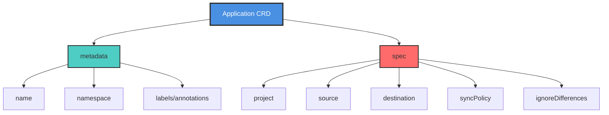
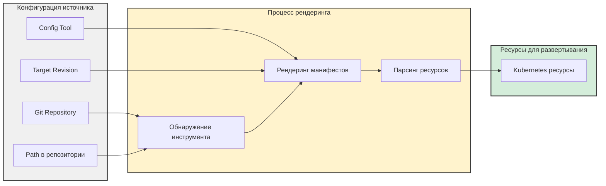
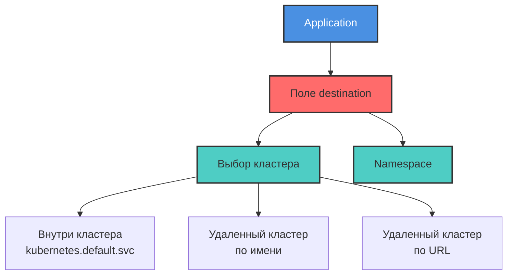
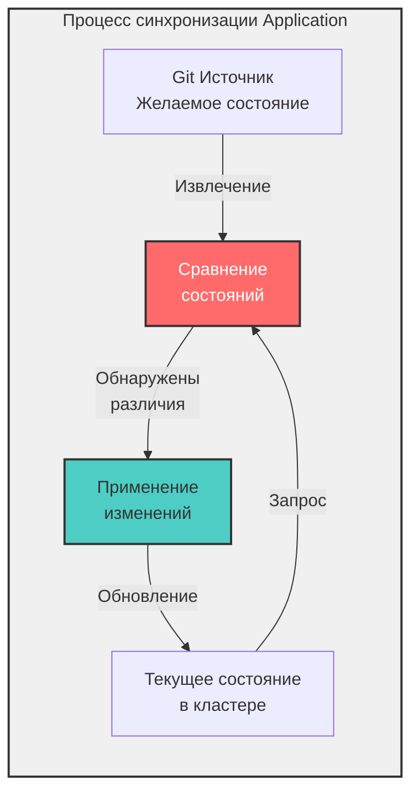
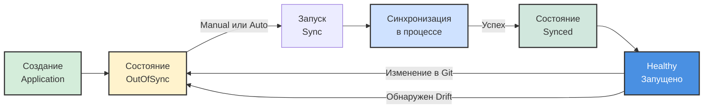

# ArgoCD Application CRD

> **Примечание для пользователей VS Code:** Чтобы просматривать диаграммы Mermaid в этом документе, установите расширение [Markdown Preview Enhanced](https://marketplace.visualstudio.com/items?itemName=shd101wyy.markdown-preview-enhanced) или [Markdown Preview Mermaid Support](https://marketplace.visualstudio.com/items?itemName=bierner.markdown-mermaid).

## Содержание
- [Введение](#введение)
- [Что такое ArgoCD Application?](#что-такое-argocd-application)
- [Структура Application CRD](#структура-application-crd)
- [Как Applications определяют, какие ресурсы развертывать](#как-applications-определяют-какие-ресурсы-развертывать)
- [Как Applications знают, куда развертывать](#как-applications-знают-куда-развертывать)
- [Понимание процесса Application Sync](#понимание-процесса-application-sync)
- [Sync Policies](#sync-policies)
- [Жизненный цикл Application](#жизненный-цикл-application)
- [Лучшие практики](#лучшие-практики)
- [Распространенные варианты использования](#распространенные-варианты-использования)
- [Устранение неполадок](#устранение-неполадок)
- [Ключевые выводы](#ключевые-выводы)

---

## Введение

**Application CRD (Custom Resource Definition)** — это самый значимый ресурс, представленный ArgoCD. Он декларативно определяет процесс развертывания манифестов в Kubernetes, включая:
- Откуда брать манифесты
- Как их рендерить
- Когда развертывать ресурсы
- Когда согласовывать (reconcile) текущее состояние с желаемым состоянием
- И многое другое

Этот документ представляет собой подробное руководство по пониманию и работе с ArgoCD Application CRD.

---

## Что такое ArgoCD Application?

**ArgoCD Application** — это Kubernetes Custom Resource (CR), который представляет собой развернутое приложение в вашем кластере. Это основной способ управления приложениями с помощью ArgoCD.

### Ключевые характеристики

- **Декларативное определение**: Applications определяются как YAML-манифесты
- **Kubernetes-Native**: Использует стандартные паттерны Kubernetes CR
- **Git-Centric**: Ссылается на Git-репозитории как на единственный источник истины
- **Самодостаточность**: Содержит всю информацию, необходимую для развертывания
- **Reconciliation Loop**: Непрерывно гарантирует соответствие желаемого состояния текущему

### Полный пример Application

Ниже приведен полный и функциональный пример манифеста ArgoCD Application:

```yaml
apiVersion: argoproj.io/v1alpha1
kind: Application
metadata:
  name: guestbook
spec:
  project: default
  source:
    repoURL: https://github.com/argoproj/argocd-example-apps
    path: helm-guestbook/
    helm:
      valueFiles:
        - values-production.yaml
  destination:
    name: 'dev'
    namespace: 'guestbook'
  syncPolicy:
    syncOptions:
      - CreateNamespace=true
    automated:
      selfHeal: true
```

Это Application будет автоматически развертывать Helm-чарт из пути `helm-guestbook/` в GitHub-репозитории `argoproj/argocd-example-apps` с использованием файла значений `values-production.yaml` в пространство имен `guestbook` в кластере `dev`.

Sync Policy будет запускаться автоматически при внесении изменений в репозиторий, автоматически исправлять (self-heal) ресурсы, которые отклоняются от желаемого состояния, и создавать пространство имен при необходимости.

---

## Структура Application CRD



### Основные поля

| Поле | Описание | Обязательно |
|-------|-------------|----------|
| `metadata.name` | Уникальное имя для Application | Да |
| `spec.project` | ArgoCD Project, к которому относится это Application | Да |
| `spec.source` | Определяет, откуда брать манифесты | Да |
| `spec.destination` | Определяет, куда развертывать ресурсы | Да |
| `spec.syncPolicy` | Определяет, как и когда выполнять синхронизацию | Нет |
| `spec.ignoreDifferences` | Поля, которые следует игнорировать при синхронизации | Нет |

---

## Как Applications определяют, какие ресурсы развертывать

Applications используют **config management tool**, **source repository** и **path**, а также **target revision**, чтобы отрендерить манифесты и определить разницу между желаемым и текущим состояниями.



### Конфигурация источника

В приведенном ниже примере источником является GitHub-репозиторий `argoproj/argocd-example-apps` и путь `helm-guestbook`:

```yaml
source:
  repoURL: https://github.com/argoproj/argocd-example-apps
  path: helm-guestbook/
  helm:
    valueFiles:
      - values-production.yaml
```

Источник также указывает на использование файла `values-production.yaml` в качестве файла значений для Helm-чарта.

### Config Management Tools

ArgoCD имеет встроенную поддержку популярных инструментов управления конфигурациями, а также поддерживает обычный YAML. Поддерживаемые инструменты включают:

- **Helm** — Пакетный менеджер для Kubernetes
- **Kustomize** — Кастомизация без шаблонов
- **Jsonnet** — Язык шаблонизации данных
- **Plain YAML/JSON** — Прямые манифесты Kubernetes
- **Custom Plugins (CMP)** — Config Management Plugins для сторонних инструментов

Кроме того, вы можете интегрировать любой инструмент в ArgoCD, используя Config Management Plugin (CMP). Этот механизм позволяет добавлять дополнительные инструменты для использования в Applications.

### Tool Detection

Обнаружение инструмента может происходить автоматически на основе файлов, найденных в пути репозитория:

| Файл/Директория | Обнаруженный инструмент |
|----------------|---------------|
| `Chart.yaml` | Helm |
| `kustomization.yaml` | Kustomize |
| `*.jsonnet` | Jsonnet |
| `*.yaml` | Plain YAML |

### Типы источников

Источником может быть:
- **Git Repository**: Самый распространенный, любой Git-репозиторий
- **Helm Chart Repository**: OCI или традиционные Helm-репозитории

При использовании Git-репозитория target revision может отслеживать:
- **Ветки**: например, `main`, `develop`, `production`
- **Теги**: например, `v1.0.0`, `release-2023`
- **Конкретные коммиты**: привязка к конкретному SHA коммита

Для Helm-репозиториев target revision будет версией чарта (например, `1.2.3`).

### Отслеживание ресурсов

ArgoCD добавляет **labels или annotations** (в зависимости от используемого метода) к ресурсам, развернутым с помощью Application, чтобы отслеживать их. Это позволяет ArgoCD:
- Мониторить статус здоровья ресурсов
- Обнаруживать отклонения (drift) от желаемого состояния
- Выполнять очистку при удалении ресурсов из источника
- Отображать связи в пользовательском интерфейсе

---

## Как Applications знают, куда развертывать

ArgoCD может развертывать ресурсы в кластер, в котором он запущен, или в подключенные удаленные кластеры. В манифесте Application целевое местоположение представлено в поле `destination` с использованием либо **имени**, либо **URL-адреса сервера** кластера, а также **пространства имен** (namespace) в нем.



### Конфигурация Destination

В этом примере ресурсы будут развернуты в пространство имен `guestbook` в подключенном кластере с именем `dev`:

```yaml
destination:
  name: 'dev'
  namespace: 'guestbook'
```

### Идентификация кластера

Вы можете указать целевой кластер двумя способами:

#### 1. По имени кластера

```yaml
destination:
  name: 'production'
  namespace: 'my-app'
```

#### 2. По URL-адресу сервера

```yaml
destination:
  server: 'https://kubernetes.default.svc'
  namespace: 'my-app'
```

**Развертывание внутри кластера (In-Cluster)**: Используйте `https://kubernetes.default.svc` в качестве URL сервера для развертывания в тот же кластер, где запущен ArgoCD.

### Управление Namespace

Поле `namespace` указывает, куда будут развернуты ресурсы:
- Должно существовать до развертывания (если не включена опция `CreateNamespace`)
- Может быть создано автоматически с помощью опции `CreateNamespace=true`
- Ресурсы уровня пространства имен (namespace-scoped) будут созданы в этом пространстве имен
- Ресурсы уровня кластера (cluster-scoped, например ClusterRoles) игнорируют это поле

---

## Понимание процесса Application Sync

**Синхронизация Application (Syncing)** согласовывает текущее состояние кластера с желаемым состоянием, определенным в источнике. Каждое Application имеет **sync policy**, которая определяет, как обрабатывать согласование.



### Что происходит во время Sync?

1. **Fetch**: ArgoCD получает желаемое состояние из Git-источника
2. **Render**: Манифесты рендерятся с использованием соответствующего инструмента конфигурации
3. **Compare**: Желаемое состояние сравнивается с текущим состоянием кластера
4. **Diff**: Выявляются различия (добавленные, измененные, удаленные ресурсы)
5. **Apply**: Изменения применяются к кластеру для соответствия желаемому состоянию
6. **Track**: Ресурсы помечаются labels/annotations для отслеживания

### Sync Triggers

Sync Policy определяет, как запускается синхронизация:

#### Manual Sync
- **Нажатием кнопки** в интерфейсе ArgoCD
- **Через CLI**: `argocd app sync <app-name>`
- **Через API**: вызов REST API для запуска синхронизации
- **По требованию (On-Demand)**: только по явному запросу

#### Automatic Sync
- **При внесении изменений в источник**: ArgoCD опрашивает Git-репозиторий
- **Continuous Reconciliation**: Автоматически применяет изменения
- **Не требует ручного вмешательства**: Бесшовное развертывание

### Фазы синхронизации (Sync Phases)

| Фаза | Описание |
|-------|-------------|
| **PreSync** | Выполняется перед операцией синхронизации (например, резервное копирование БД) |
| **Sync** | Применение изменений к кластеру |
| **Skip** | Пропуск определенных ресурсов во время синхронизации |
| **PostSync** | Выполняется после успешной синхронизации (например, уведомления) |
| **SyncFail** | Выполняется, если синхронизация не удалась (например, откат, алерты) |

---

## Sync Policies

Поле `syncPolicy` настраивает многочисленные характеристики того, как Application синхронизирует ресурсы.

### Automated Sync

Включите автоматическую синхронизацию при обнаружении изменений в Git:

```yaml
syncPolicy:
  automated: {}
```

Это включает автосинхронизацию с настройками по умолчанию. После включения ArgoCD будет автоматически развертывать изменения без ручного вмешательства.

### Self-Heal

Автоматически откатывать ручные изменения, внесенные напрямую в кластер:

```yaml
syncPolicy:
  automated:
    selfHeal: true
```

Если ресурс в кластере отклоняется от желаемого состояния (например, кто-то вручную отредактировал Deployment), ArgoCD автоматически восстановит его в соответствии с Git.

**Пример сценария**:
- Разработчик вручную масштабирует Deployment replicas с 3 до 5
- Self-heal обнаруживает отклонение (drift)
- ArgoCD автоматически масштабирует обратно до 3 (как определено в Git)

### Prune Resources

Автоматически удалять ресурсы, которые были удалены из Git:

```yaml
syncPolicy:
  automated:
    prune: true
```

Когда ресурс удаляется из Git-репозитория, ArgoCD также удалит его из кластера.

### Sync Options

Дополнительные опции для настройки поведения синхронизации:

```yaml
syncPolicy:
  syncOptions:
    - CreateNamespace=true      # Создать namespace, если он не существует
    - PrunePropagationPolicy=foreground  # Как удалять ресурсы
    - PruneLast=true             # Удалять ресурсы после всего остального
    - Validate=false             # Пропустить валидацию kubectl
    - ApplyOutOfSyncOnly=true    # Синхронизировать только рассинхронизированные ресурсы
    - RespectIgnoreDifferences=true  # Учитывать конфиг ignoreDifferences
```

#### CreateNamespace

В этом примере из нашего приложения guestbook оно будет автоматически **создавать пространство имен** в целевом кластере и **самовосстанавливаться** (self-heal), если ресурс в кластере отклонится от желаемого состояния:

```yaml
syncPolicy:
  syncOptions:
    - CreateNamespace=true
  automated:
    selfHeal: true
```

### Полный пример Sync Policy

```yaml
syncPolicy:
  automated:
    prune: true       # Автоудаление удаленных ресурсов
    selfHeal: true    # Автоисправление ручных изменений
    allowEmpty: false # Запрет на удаление всех ресурсов
  syncOptions:
    - CreateNamespace=true
    - PrunePropagationPolicy=foreground
    - PruneLast=true
  retry:
    limit: 5
    backoff:
      duration: 5s
      factor: 2
      maxDuration: 3m
```

---

## Жизненный цикл Application



### Состояния Application

#### Sync Status
- **Synced**: Текущее состояние соответствует желаемому в Git
- **OutOfSync**: Текущее состояние отличается от Git
- **Unknown**: Невозможно определить статус синхронизации

#### Health Status
- **Healthy**: Все ресурсы запущены и работают правильно
- **Progressing**: Ресурсы создаются или обновляются
- **Degraded**: Некоторые ресурсы работают со сбоями
- **Suspended**: Приложение приостановлено (например, CronJob)
- **Missing**: Ожидаемые ресурсы не найдены
- **Unknown**: Невозможно определить состояние здоровья

---

## Лучшие практики

### 1. Используйте Projects для Multi-Tenancy

Организуйте Applications в Projects для лучшего управления доступом:

```yaml
spec:
  project: production-apps
```

### 2. Фиксируйте важные среды (Pinning)

Используйте конкретные коммиты или теги для продакшена:

```yaml
source:
  targetRevision: v1.2.3  # Конкретный тег
  # или
  targetRevision: abc123def456  # Конкретный коммит
```

### 3. Включайте Automated Sync для Non-Production сред

```yaml
# Среда разработки
syncPolicy:
  automated:
    prune: true
    selfHeal: true
```

### 4. Используйте Manual Sync для продакшена

```yaml
# Промышленная среда
syncPolicy:
  syncOptions:
    - CreateNamespace=true
  # Поле automated отсутствует = только ручная синхронизация
```

### 5. Используйте Sync Waves для упорядоченного развертывания

Используйте аннотации для управления порядком развертывания:

```yaml
metadata:
  annotations:
    argocd.argoproj.io/sync-wave: "1"  # Развернуть в первой волне
```

### 6. Игнорируйте ожидаемые различия

Некоторые поля меняются часто и не должны запускать синхронизацию:

```yaml
spec:
  ignoreDifferences:
    - group: apps
      kind: Deployment
      jsonPointers:
        - /spec/replicas  # Игнорировать количество реплик (например, при использовании HPA)
```

### 7. Используйте Sync Windows

Контролируйте, когда могут происходить синхронизации:

```yaml
# В AppProject
spec:
  syncWindows:
    - kind: allow
      schedule: '0 9 * * 1-5'  # Пн-Пт, 9:00
      duration: 8h
      applications:
        - 'production-*'
```

### 8. Используйте Resource Hooks

Используйте хуки для операций до/после синхронизации:

```yaml
metadata:
  annotations:
    argocd.argoproj.io/hook: PreSync
    argocd.argoproj.io/hook-delete-policy: BeforeHookCreation
```

---

## Распространенные варианты использования

### Вариант 1: Простое развертывание приложения

```yaml
apiVersion: argoproj.io/v1alpha1
kind: Application
metadata:
  name: my-app
  namespace: argocd
spec:
  project: default
  source:
    repoURL: https://github.com/myorg/my-app
    path: k8s/
    targetRevision: main
  destination:
    server: https://kubernetes.default.svc
    namespace: my-app
  syncPolicy:
    automated:
      prune: true
      selfHeal: true
    syncOptions:
      - CreateNamespace=true
```

### Вариант 2: Helm Chart с кастомными значениями

```yaml
apiVersion: argoproj.io/v1alpha1
kind: Application
metadata:
  name: nginx
spec:
  project: default
  source:
    repoURL: https://charts.bitnami.com/bitnami
    chart: nginx
    targetRevision: 13.2.23
    helm:
      values: |
        replicaCount: 3
        service:
          type: LoadBalancer
  destination:
    server: https://kubernetes.default.svc
    namespace: nginx
  syncPolicy:
    automated: {}
```

### Вариант 3: Kustomize с Overlays

```yaml
apiVersion: argoproj.io/v1alpha1
kind: Application
metadata:
  name: my-app-prod
spec:
  project: default
  source:
    repoURL: https://github.com/myorg/my-app
    path: k8s/overlays/production
    targetRevision: main
  destination:
    server: https://prod-cluster.example.com
    namespace: my-app
  syncPolicy:
    syncOptions:
      - CreateNamespace=true
```

### Вариант 4: Application с несколькими источниками (Multi-Source)

```yaml
apiVersion: argoproj.io/v1alpha1
kind: Application
metadata:
  name: multi-source-app
spec:
  project: default
  sources:
    - repoURL: https://github.com/myorg/app-manifests
      path: base/
      targetRevision: main
    - repoURL: https://github.com/myorg/app-config
      path: production/
      targetRevision: main
  destination:
    server: https://kubernetes.default.svc
    namespace: my-app
```

---

## Устранение неполадок

### Application в статусе OutOfSync

**Симптомы**: Приложение показывает статус OutOfSync.

**Возможные причины**:
1. Недавние изменения в Git-репозитории.
2. Ручные изменения, внесенные напрямую в кластер.
3. Синхронизация отключена или настроена на ручной режим.

**Решения**:
- Просмотрите diff в интерфейсе ArgoCD.
- Запустите ручную синхронизацию, если автосинхронизация отключена.
- Включите `selfHeal` для автоматического исправления отклонений (drift).
- Проверьте `ignoreDifferences` для легитимных различий.

### Сбой синхронизации (Sync Fails)

**Симптомы**: Операция синхронизации завершается ошибкой.

**Распространенные проблемы**:

1. **Некорректные манифесты**
   - Проверьте синтаксис с помощью `kubectl apply --dry-run=client`.
   - Просмотрите ошибки валидации в логах синхронизации.

2. **Отсутствие прав доступа**
   - Убедитесь, что у сервисного аккаунта ArgoCD есть необходимые RBAC.
   - Проверьте, существует ли пространство имен.

3. **Зависимости ресурсов**
   - Используйте sync waves для упорядочивания развертываний.
   - Проверьте, установлены ли CRDs перед созданием самих CR.

4. **Проблемы рендеринга Helm**
   - Проверьте синтаксис файла значений.
   - Протестируйте локально: `helm template`.

### Ресурсы не отслеживаются

**Симптомы**: Ресурсы существуют, но не отображаются в ArgoCD.

**Решения**:
- Убедитесь, что ресурсы имеют labels/annotations ArgoCD.
- Проверьте, находятся ли ресурсы в правильном пространстве имен.
- Убедитесь, что путь к источнику указан верно.

### Self-Heal не работает

**Симптомы**: Ручные изменения сохраняются.

**Что проверить**:
- Убедитесь, что установлено `selfHeal: true`.
- Проверьте, не находится ли ресурс в `ignoreDifferences`.
- Убедитесь, что у ArgoCD есть права на изменение ресурсов.
- Просмотрите логи синхронизации на наличие ошибок.

---

## Ключевые выводы

1. **Application CRD — это центр всего**: Ресурс Application является ядром ArgoCD, определяющим всё о вашем развертывании.

2. **Декларативная конфигурация**: Applications определяются декларативно с помощью YAML, следуя паттернам Kubernetes.

3. **Гибкость источников**: Поддержка множества инструментов управления конфигурациями (Helm, Kustomize, Jsonnet, plain YAML) и пользовательских плагинов.

4. **Управление назначением**: Развертывание в локальный кластер или в любой подключенный удаленный кластер с указанием пространства имен.

5. **Sync Policies**: Тонкий контроль над тем, когда и как происходит синхронизация (вручную или автоматически).

6. **Self-Healing**: Автоматическое исправление отклонений (drift) поддерживает соответствие вашего кластера репозиторию Git.

7. **Auto-Pruning**: Ресурсы, удаленные из Git, могут быть автоматически удалены из кластера.

8. **Sync Options**: Широкие возможности настройки через опции синхронизации, такие как CreateNamespace, PruneLast и др.

9. **Отслеживание ресурсов**: ArgoCD отслеживает все развернутые ресурсы через labels/annotations для мониторинга и управления.

10. **Управление жизненным циклом**: Полная видимость статуса синхронизации и здоровья приложений.

11. **Tool Detection**: Автоматическое обнаружение инструментов управления конфигурациями на основе содержимого репозитория.

12. **Multi-Environment**: Легкое управление одним и тем же приложением в нескольких средах с использованием веток, тегов или оверлеев.

---

## Дополнительные ресурсы

- [Официальная документация ArgoCD Application](https://argo-cd.readthedocs.io/en/stable/user-guide/application-specification/)
- [Примеры ArgoCD Applications](https://github.com/argoproj/argocd-example-apps)
- [Справочник по Sync Options](https://argo-cd.readthedocs.io/en/stable/user-guide/sync-options/)
- [Sync Phases и Waves](https://argo-cd.readthedocs.io/en/stable/user-guide/sync-waves/)
- [Документация по Resource Hooks](https://argo-cd.readthedocs.io/en/stable/user-guide/resource_hooks/)

---

**Следующие шаги:**
- Пройдите [Тест на проверку знаний](quiz.md)
- Создайте свой первый Application CRD
- Поэкспериментируйте с различными sync policies
- Попробуйте использовать разные инструменты управления конфигурациями

Удачного развертывания с ArgoCD Applications! 🚀
