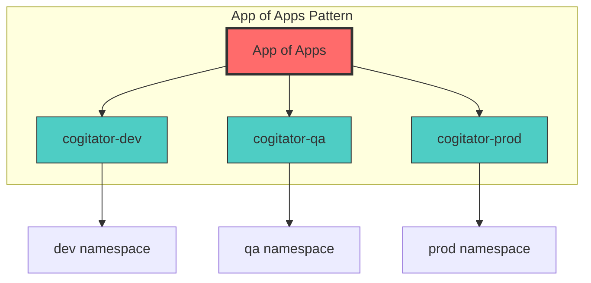
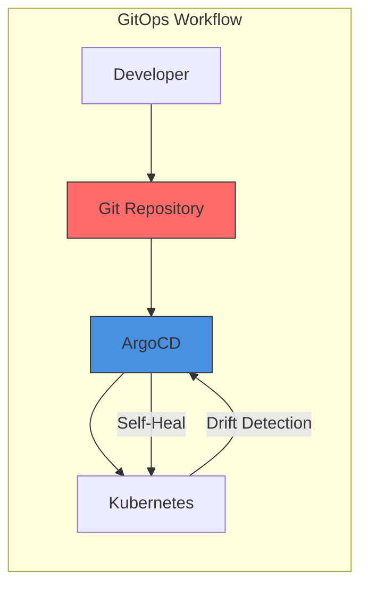

# ArgoCD Practice Lab: Deploying Applications with GitOps

> **Note for VS Code Users:** To view Mermaid diagrams, install the [Markdown Preview Enhanced](https://marketplace.visualstudio.com/items?itemName=shd101wyy.markdown-preview-enhanced) extension.

## 🎯 Lab Overview

In this lab scenario, you are an application developer at **Forge World Sigma-VII** working on a new **cogitator** service. Your task is to deploy this service to Kubernetes using ArgoCD and GitOps practices.

```
╔═══════════════════════════════════════════════════════════════╗
║                                                               ║
║     ⚙️  FORGE WORLD SIGMA-VII                                  ║
║         Adeptus Mechanicus - Mars Sector                      ║
║                                                               ║
║     "The Omnissiah Protects. The Machine Spirit Provides."    ║
║                                                               ║
╚═══════════════════════════════════════════════════════════════╝
```

### Background Story

The Platform team at Forge World Sigma-VII has recently started constructing a Kubernetes environment for hosting the organization's services. Since the cogitator service is new, your team has the exciting opportunity to trial the Kubernetes environment.

The challenge is that you must abandon your old service deployment methods because, in the transition to Kubernetes, the organization is adopting **GitOps practices using ArgoCD**.

**Before ArgoCD**, you would:
1. Send a ticket to the Platform team with the version tag when a new release was ready
2. Wait for them to acknowledge the ticket and schedule it in the next release window
3. Join the release meeting and see your change deployed into production

**With ArgoCD**, you will:
1. Have the power to do production releases yourself
2. Simply change a file in a Git repository
3. Initiate a sync (or let auto-sync handle it)

### What You'll Learn

- Creating ArgoCD Applications from YAML manifests
- Deploying Helm charts via ArgoCD
- Understanding sync status and application health
- Viewing and understanding application diffs
- Implementing the App of Apps pattern
- Enabling auto-sync for automated deployments
- Managing multiple environments (dev, qa, prod)
- Fixing production issues using GitOps

---

## 📁 Repository Structure

Your Platform team has created a Helm chart in the environment configuration repository to deploy the cogitator service to Kubernetes.

```
gitops-config-repo/
├── apps/                           # ArgoCD Application manifests
│   ├── cogitator-dev.yaml       # Dev environment Application
│   ├── cogitator-qa.yaml        # QA environment Application
│   └── cogitator-prod.yaml      # Production environment Application
├── charts/                         # Helm charts
│   └── cogitator/               # Notification service chart
│       ├── Chart.yaml              # Chart metadata
│       ├── templates/              # Kubernetes manifests templates
│       │   ├── deployment.yaml
│       │   ├── service.yaml
│       │   ├── _helpers.tpl
│       │   └── NOTES.txt
│       ├── values.yaml             # Default values
│       ├── values-dev.yaml         # Dev environment overrides
│       ├── values-qa.yaml          # QA environment overrides
│       └── values-prod.yaml        # Production environment overrides
├── app-of-apps.yaml                # App of Apps manifest
└── README.md
```

### Understanding the Structure

The `charts/` folder contains the Helm chart for deploying the **cogitator** service to Kubernetes. It contains a Helm values file (i.e., `values-<env>.yaml`) for each environment with any overrides of the default chart values.

The **cogitator** Application manifests for ArgoCD are stored in the `apps/` folder. The Application manifests use the values file from the `charts/cogitator/` folder corresponding to the same environment (e.g., `apps/cogitator-dev.yaml` references the `charts/cogitator/values-dev.yaml` file).

---

## 🔧 Prerequisites

Before starting the lab, ensure you have:

1. **Kubernetes Cluster** - A running Kubernetes cluster (minikube, kind, or cloud-based)
2. **ArgoCD Installed** - ArgoCD deployed in your cluster
3. **kubectl** - Kubernetes CLI configured to access your cluster
4. **Git Repository** - Access to the GitOps configuration repository
5. **ArgoCD CLI** (optional) - For command-line operations

> **Need help installing these tools?** See the detailed [Prerequisites Installation Guide](../PrerequisitesInstallation.md) with step-by-step instructions for macOS, Linux, and Windows.

### ArgoCD Access Credentials

For this lab, use the following credentials to access ArgoCD UI:

| Field | Value |
|-------|-------|
| **URL** | `https://argocd.your-cluster.local` |
| **Username** | `admin` |
| **Password** | `<retrieve from cluster secret>` |

To retrieve the admin password:
```bash
kubectl -n argocd get secret argocd-initial-admin-secret -o jsonpath="{.data.password}" | base64 -d
```

---

## 🧪 Lab Round 1: Deploying the Dev Application

**Objective:** Create and deploy the `cogitator-dev` Application to deploy the cogitator Helm Chart to the dev environment.

### Step 1.1: Access ArgoCD UI

1. Open the ArgoCD tab/URL in your browser
2. Log in with the credentials provided above

### Step 1.2: Create New Application

1. Click **NEW APP** button in the top left
2. In the top right, click **EDIT AS YAML**
3. Replace the pre-filled manifest with the contents below:

```yaml
apiVersion: argoproj.io/v1alpha1
kind: Application
metadata:
  name: 'cogitator-dev'
spec:
  destination:
    name: 'in-cluster'
    namespace: 'dev'
  source:
    path: 'charts/cogitator'
    repoURL: 'https://github.com/your-org/gitops-config-repo'
    targetRevision: HEAD
    helm:
      valueFiles:
        - values-dev.yaml
  project: 'default'
  syncPolicy:
    syncOptions:
      - CreateNamespace=true
```

### Step 1.3: Understanding the Application Manifest

This manifest describes an Application with:

| Field | Value | Description |
|-------|-------|-------------|
| `metadata.name` | `cogitator-dev` | Unique name of the Application |
| `spec.source.repoURL` | Your GitOps repo | Source is your GitOps repo |
| `spec.source.path` | `charts/cogitator` | Points to the cogitator Helm chart |
| `spec.source.helm.valueFiles` | `values-dev.yaml` | Uses dev values file |
| `spec.destination.name` | `in-cluster` | Deploys to the local cluster |
| `spec.destination.namespace` | `dev` | Target namespace |
| `spec.syncPolicy.syncOptions` | `CreateNamespace=true` | Auto-creates the namespace |

### Step 1.4: Save and Create

1. Click **SAVE** - The UI will translate the manifest into the wizard fields
2. In the top left, click **CREATE**

### Step 1.5: Verify the Application

The new app pane will close and show the card for your Application:

- **Sync Status**: `OutOfSync` (initially)
- **Health Status**: `Missing`

This is expected because we haven't synced yet!

### Step 1.6: Sync the Application

1. Click on the Application card to open details
2. Click **SYNC** button in the top menu
3. In the sync options panel, click **SYNCHRONIZE**
4. Wait for the sync to complete

### Step 1.7: Verify Deployment

After sync completes, verify:
- **Sync Status**: `Synced` ✅
- **Health Status**: `Healthy` ✅

You can also verify using kubectl:
```bash
kubectl get pods -n dev
kubectl get svc -n dev
```

**✅ Checkpoint:** You have successfully deployed your first Application using ArgoCD!

---

## 🔄 Lab Round 2: Updating the Application Image

**Objective:** Learn how to update an application by modifying the Helm values and syncing the changes.

### Scenario

The development team has released a new version of the cogitator service (v1.2.0). You need to update the dev environment to use this new image tag.

### Step 2.1: Update Values File

Open `charts/cogitator/values-dev.yaml` and update the image tag:

```yaml
# Before
image:
  repository: nginx
  tag: "1.24"

# After
image:
  repository: nginx
  tag: "1.25"
```

### Step 2.2: Commit the Change

```bash
git add charts/cogitator/values-dev.yaml
git commit -m "chore: bump cogitator-dev image to 1.25"
git push origin main
```

### Step 2.3: Observe OutOfSync Status

Return to the ArgoCD UI:
1. The Application will show **OutOfSync** status
2. This indicates the desired state (Git) differs from live state (cluster)

### Step 2.4: Sync the Update

1. Click **SYNC** button
2. Click **SYNCHRONIZE**
3. Wait for completion

### Step 2.5: Verify the Update

The deployment should now be running with the new image tag.

**✅ Checkpoint:** You've successfully updated an application through GitOps!

---

## 🔍 Lab Round 3: Viewing the Application Diff

**Objective:** Learn how to view differences between desired and live state.

### Understanding Diffs

Since the Application was previously synced, any differences between the desired state and the live state indicate what will change when you sync.

### Step 3.1: View the Diff

1. Click on the Application card
2. Click **APP DIFF** in the top menu
3. Use **Compact diff** and **Inline diff** options to narrow down to the differences

### Step 3.2: Understanding the Resource Tree

The resource tree shows:
- **Green circles**: Resources that are synced
- **Yellow circles with arrows**: Resources that are out of sync
- **Red circles**: Resources with errors

When a Deployment is out of sync, the Application status also shows **OutOfSync**.

**✅ Checkpoint:** You now understand how to view and interpret application diffs!

---

## 📦 Lab Round 4: App of Apps Pattern

**Objective:** Implement the App of Apps pattern for declarative management of multiple Applications.

### Why App of Apps?

When creating the `cogitator-dev` Application, you manually clicked through the UI and pasted the Application manifest. While this is great for getting started, **Applications should be managed declaratively through GitOps** just like any other Kubernetes resource.

This is where **the App of Apps pattern** comes in.



### Step 4.1: Review the App of Apps Manifest

```yaml
apiVersion: argoproj.io/v1alpha1
kind: Application
metadata:
  name: 'app-of-apps'
spec:
  destination:
    name: 'in-cluster'
    namespace: 'argocd'
  source:
    path: 'apps'
    repoURL: 'https://github.com/your-org/gitops-config-repo'
    targetRevision: HEAD
  project: 'default'
```

This Application:
- Points to the `apps/` folder in your repository
- Will create/manage all Applications defined in that folder
- Deploys to the `argocd` namespace (where ArgoCD runs)

### Step 4.2: Create the App of Apps

1. In ArgoCD UI, click **NEW APP**
2. Click **EDIT AS YAML**
3. Paste the App of Apps manifest
4. Click **SAVE**, then **CREATE**

### Step 4.3: Sync the App of Apps

1. Click **SYNC**
2. Click **SYNCHRONIZE**

After syncing, ArgoCD will automatically create the Applications defined in the `apps/` folder!

### Step 4.4: Verify Applications Created

You should now see multiple Application cards:
- `app-of-apps`
- `cogitator-dev`
- `cogitator-qa`

**✅ Checkpoint:** You've implemented the App of Apps pattern!

---

## ⚡ Lab Round 5: Enable Auto-Sync

**Objective:** Enable automatic synchronization for hands-off deployments.

### Benefits of Auto-Sync

With auto-sync enabled:
- ArgoCD automatically deploys changes when Git repository changes
- No manual sync button clicking required
- True continuous deployment!

### Step 5.1: Enable Auto-Sync for App of Apps

1. Click on the `app-of-apps` Application
2. Click **APP DETAILS** in the top menu
3. Find **SYNC POLICY** section
4. Click **ENABLE AUTO-SYNC**
5. Confirm when prompted

### Step 5.2: Modify App of Apps Manifest (Optional)

Alternatively, you can add auto-sync to the YAML:

```yaml
apiVersion: argoproj.io/v1alpha1
kind: Application
metadata:
  name: 'app-of-apps'
spec:
  destination:
    name: 'in-cluster'
    namespace: 'argocd'
  source:
    path: 'apps'
    repoURL: 'https://github.com/your-org/gitops-config-repo'
    targetRevision: HEAD
  project: 'default'
  syncPolicy:
    automated:
      prune: true
      selfHeal: true
```

### Step 5.3: Test Auto-Sync

Now when you add new Application manifests to the `apps/` folder and push to Git, they will be automatically created and synced!

**✅ Checkpoint:** Auto-sync is now enabled for hands-off deployments!

---

## 🏭 Lab Round 6: Creating the Production Application

**Objective:** Create a production environment Application using GitOps.

### Scenario

The `dev` and `qa` instances of the cogitator Application are synced, healthy, and managed declaratively using the App of Apps. Now it's time to create the `prod` Application based on the `qa` version using GitOps.

### Step 6.1: Create Production Application Manifest

Create a new file `apps/cogitator-prod.yaml`:

```yaml
apiVersion: argoproj.io/v1alpha1
kind: Application
metadata:
  name: 'cogitator-prod'
spec:
  destination:
    name: 'in-cluster'
    namespace: 'prod'
  source:
    path: 'charts/cogitator'
    repoURL: 'https://github.com/your-org/gitops-config-repo'
    targetRevision: HEAD
    helm:
      valueFiles:
        - values-prod.yaml
  project: 'default'
  syncPolicy:
    automated:
      selfHeal: true
    syncOptions:
      - CreateNamespace=true
```

### Step 6.2: Create Production Values File

Create `charts/cogitator/values-prod.yaml`:

```yaml
replicaCount: 3

image:
  repository: nginx
  tag: "1.24-alpine"
  pullPolicy: IfNotPresent

service:
  type: ClusterIP
  port: 80

resources:
  limits:
    cpu: 200m
    memory: 256Mi
  requests:
    cpu: 100m
    memory: 128Mi

environment: production
```

### Step 6.3: Commit and Push

```bash
git add apps/cogitator-prod.yaml
git add charts/cogitator/values-prod.yaml
git commit -m "feat: add cogitator-prod Application"
git push origin main
```

### Step 6.4: Verify Auto-Creation

If auto-sync is enabled on `app-of-apps`:
- The new `cogitator-prod` Application will be automatically created
- It will then automatically sync to deploy the production instance

If auto-sync is not enabled, manually sync the `app-of-apps`.

### Step 6.5: Verify Production Deployment

```bash
kubectl get pods -n prod
kubectl get svc -n prod
```

**✅ Checkpoint:** Production environment is now deployed using GitOps!

---

## 🔧 Lab Round 7: Fixing Production Issues (Hotfix)

**Objective:** Learn how to apply hotfixes through GitOps.

### Scenario

Oh no! The production deployment is failing because the image tag in `values-prod.yaml` has a typo. The tag was set to `v1.24-alpine` but the correct tag should be `1.24-alpine` (without the `v` prefix).

### Step 7.1: Identify the Issue

In ArgoCD UI, the `cogitator-prod` Application shows:
- **Sync Status**: `Synced` (manifest applied correctly)
- **Health Status**: `Degraded` (pods are failing)

Check the pod logs:
```bash
kubectl logs -n prod -l app=cogitator
kubectl describe pod -n prod -l app=cogitator
```

You'll see the image pull is failing due to invalid tag.

### Step 7.2: Fix the Image Tag

Open `charts/cogitator/values-prod.yaml` and fix the tag:

```yaml
# Before (incorrect)
image:
  tag: "v1.24-alpine"

# After (correct)
image:
  tag: "1.24-alpine"
```

### Step 7.3: Commit the Hotfix

```bash
git add charts/cogitator/values-prod.yaml
git commit -m "fix: correct image tag for cogitator-prod"
git push origin main
```

### Step 7.4: Wait for Sync (or Trigger Manually)

- If auto-sync is enabled with `selfHeal: true`, ArgoCD will automatically apply the fix
- If not, manually trigger a sync

### Step 7.5: Verify the Fix

After sync:
- **Sync Status**: `Synced` ✅
- **Health Status**: `Healthy` ✅

```bash
kubectl get pods -n prod
# All pods should be Running
```

**✅ Checkpoint:** You've successfully applied a hotfix using GitOps!

---

## 📊 Lab Summary

Congratulations! You've completed the ArgoCD Practice Lab! 🎉

### What You Accomplished

| Round | Task | Skills Learned |
|-------|------|----------------|
| 1 | Deploying Dev Application | Creating Applications, syncing |
| 2 | Updating Image | GitOps workflow for updates |
| 3 | Viewing Diffs | Understanding state differences |
| 4 | App of Apps | Declarative Application management |
| 5 | Auto-Sync | Automated deployments |
| 6 | Production Deployment | Multi-environment GitOps |
| 7 | Hotfix | Emergency fixes through GitOps |

### Key Concepts Reinforced



1. **Declarative Configuration**: Everything is defined in Git
2. **Git as Source of Truth**: The repository defines the desired state
3. **Automated Synchronization**: ArgoCD keeps clusters in sync with Git
4. **Self-Healing**: Automatic correction of configuration drift
5. **Multi-Environment Management**: Same workflow for all environments

---

## 🎓 Knowledge Check

Test your understanding with these questions:

### Question 1
What is the primary benefit of using the App of Apps pattern?

<details>
<summary>Click to reveal answer</summary>

**Answer:** The App of Apps pattern allows you to manage Application resources declaratively through GitOps, just like any other Kubernetes resource. Instead of manually creating Applications through the UI, you define them as YAML files in Git, and a parent Application manages them all.
</details>

### Question 2
What happens when `selfHeal: true` is enabled in the sync policy?

<details>
<summary>Click to reveal answer</summary>

**Answer:** When `selfHeal: true` is enabled, ArgoCD will automatically revert any manual changes made directly to the cluster to match the desired state in Git. This prevents configuration drift.
</details>

### Question 3
Why might an Application show "Synced" but "Degraded" health status?

<details>
<summary>Click to reveal answer</summary>

**Answer:** The Application is "Synced" because the manifests from Git were successfully applied to the cluster. However, it's "Degraded" because the resources themselves are failing (e.g., pods can't start due to invalid image tag, resource limits, or configuration errors).
</details>

### Question 4
What was the issue in Lab Round 7 and how did GitOps help fix it?

<details>
<summary>Click to reveal answer</summary>

**Answer:** The issue was an incorrect image tag with a `v` prefix that doesn't exist in the registry. GitOps helped fix it by allowing the developer to simply commit a fix to Git, and ArgoCD automatically applied the fix to the cluster without any manual intervention on the Kubernetes side.
</details>

---

## 🚀 Next Steps

Now that you've completed the basics, try these advanced exercises:

1. **Implement Sync Waves**: Order deployments by adding `argocd.argoproj.io/sync-wave` annotations
2. **Add Resource Hooks**: Create PreSync and PostSync hooks for database migrations
3. **Configure Notifications**: Set up ArgoCD cogitators to Slack/Teams
4. **Implement RBAC**: Create Projects and restrict access per team
5. **Multi-Cluster Deployment**: Add a remote cluster and deploy across clusters

---

## 📚 Additional Resources

- [ArgoCD Official Documentation](https://argo-cd.readthedocs.io/)
- [App of Apps Pattern](https://argo-cd.readthedocs.io/en/stable/operator-manual/cluster-bootstrapping/)
- [Sync Phases and Waves](https://argo-cd.readthedocs.io/en/stable/user-guide/sync-waves/)
- [ArgoCD Best Practices](https://argo-cd.readthedocs.io/en/stable/user-guide/best_practices/)

---

**Happy GitOps-ing!** 🎯

