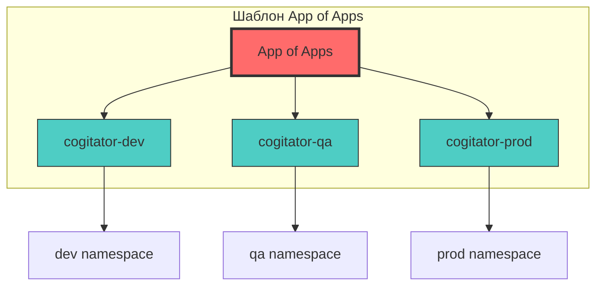
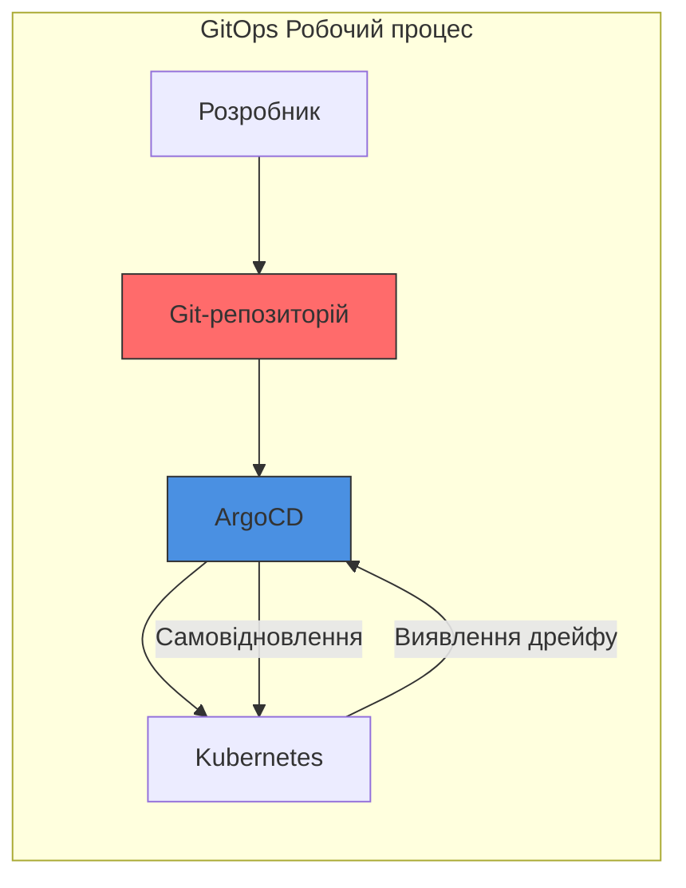

# Практична робота ArgoCD: Розгортання додатків з GitOps

> **Примітка для користувачів VS Code:** Для перегляду діаграм Mermaid встановіть розширення [Markdown Preview Enhanced](https://marketplace.visualstudio.com/items?itemName=shd101wyy.markdown-preview-enhanced).

## 🎯 Огляд лабораторної роботи

У цьому сценарії ви є розробником додатків у **Forge World Sigma-VII**, що працює над новим сервісом **cogitator** (обчислювальний пристрій Адептус Механікус). Ваше завдання — розгорнути цей сервіс у Kubernetes, використовуючи ArgoCD та практики GitOps.

```
╔═══════════════════════════════════════════════════════════════╗
║                                                               ║
║     ⚙️  FORGE WORLD SIGMA-VII                                  ║
║         Adeptus Mechanicus - Сектор Марсу                     ║
║                                                               ║
║     "Омніссія Захищає. Машинний Дух Забезпечує."              ║
║                                                               ║
╚═══════════════════════════════════════════════════════════════╝
```

### Передісторія

Платформна команда Forge World Sigma-VII нещодавно розпочала побудову Kubernetes-середовища для хостингу сервісів організації. Оскільки сервіс cogitator є новим, ваша команда має чудову можливість випробувати Kubernetes-середовище.

Виклик полягає в тому, що ви маєте відмовитися від старих методів розгортання сервісів, оскільки при переході на Kubernetes організація впроваджує **практики GitOps з використанням ArgoCD**.

**До ArgoCD** ви б:
1. Надсилали тікет Платформній команді з тегом версії, коли новий реліз був готовий
2. Чекали, поки вони підтвердять тікет і запланують його в наступному вікні релізів
3. Приєднувалися до релізної зустрічі і спостерігали за розгортанням змін у production

**З ArgoCD** ви:
1. Маєте змогу самостійно виконувати production релізи
2. Просто змінюєте файл у Git-репозиторії
3. Ініціюєте синхронізацію (або дозволяєте auto-sync обробити це)

### Що ви вивчите

- Створення ArgoCD Applications з YAML-маніфестів
- Розгортання Helm charts через ArgoCD
- Розуміння статусу синхронізації та здоров'я додатку
- Перегляд та розуміння різниць (diff) додатків
- Впровадження шаблону App of Apps
- Увімкнення auto-sync для автоматизованих розгортань
- Управління кількома середовищами (dev, qa, prod)
- Виправлення production-проблем за допомогою GitOps

---

## 📁 Структура репозиторію

Ваша Платформна команда створила Helm chart у репозиторії конфігурації середовища для розгортання сервісу cogitator у Kubernetes.

```
gitops-config-repo/
├── apps/                           # Маніфести ArgoCD Application
│   ├── cogitator-dev.yaml       # Application для Dev середовища
│   ├── cogitator-qa.yaml        # Application для QA середовища
│   └── cogitator-prod.yaml      # Application для Production середовища
├── charts/                         # Helm charts
│   └── cogitator/               # Chart сервісу cogitator
│       ├── Chart.yaml              # Метадані chart
│       ├── templates/              # Шаблони Kubernetes маніфестів
│       │   ├── deployment.yaml
│       │   ├── service.yaml
│       │   ├── _helpers.tpl
│       │   └── NOTES.txt
│       ├── values.yaml             # Значення за замовчуванням
│       ├── values-dev.yaml         # Перевизначення для Dev
│       ├── values-qa.yaml          # Перевизначення для QA
│       └── values-prod.yaml        # Перевизначення для Production
├── app-of-apps.yaml                # Маніфест App of Apps
└── README.md
```

### Розуміння структури

Папка `charts/` містить Helm chart для розгортання сервісу **cogitator** у Kubernetes. Вона містить файл значень Helm (тобто `values-<env>.yaml`) для кожного середовища з перевизначеннями значень chart за замовчуванням.

Маніфести **cogitator** Application для ArgoCD зберігаються в папці `apps/`. Маніфести Application використовують файл значень з папки `charts/cogitator/`, що відповідає тому ж середовищу (наприклад, `apps/cogitator-dev.yaml` посилається на файл `charts/cogitator/values-dev.yaml`).

---

## 🔧 Передумови

Перед початком лабораторної роботи переконайтеся, що у вас є:

1. **Kubernetes Cluster** - Працюючий Kubernetes кластер (minikube, kind або хмарний)
2. **ArgoCD встановлений** - ArgoCD розгорнутий у вашому кластері
3. **kubectl** - Kubernetes CLI, налаштований для доступу до вашого кластера
4. **Git-репозиторій** - Доступ до репозиторію конфігурації GitOps
5. **ArgoCD CLI** (опціонально) - Для операцій з командного рядка

### Облікові дані доступу до ArgoCD

Для цієї лабораторної роботи використовуйте наступні облікові дані для доступу до UI ArgoCD:

| Поле | Значення |
|------|----------|
| **URL** | `https://argocd.your-cluster.local` |
| **Ім'я користувача** | `admin` |
| **Пароль** | `<отримати з секрету кластера>` |

Для отримання пароля адміністратора:
```bash
kubectl -n argocd get secret argocd-initial-admin-secret -o jsonpath="{.data.password}" | base64 -d
```

---

## 🧪 Раунд 1: Розгортання Dev Application

**Мета:** Створити та розгорнути `cogitator-dev` Application для розгортання cogitator Helm Chart у dev-середовищі.

### Крок 1.1: Доступ до UI ArgoCD

1. Відкрийте вкладку/URL ArgoCD у вашому браузері
2. Увійдіть з обліковими даними, наведеними вище

### Крок 1.2: Створення нової Application

1. Натисніть кнопку **NEW APP** у верхньому лівому куті
2. У верхньому правому куті натисніть **EDIT AS YAML**
3. Замініть попередньо заповнений маніфест вмістом нижче:

```yaml
apiVersion: argoproj.io/v1alpha1
kind: Application
metadata:
  name: 'cogitator-dev'
spec:
  destination:
    name: 'in-cluster'
    namespace: 'dev'
  source:
    path: 'charts/cogitator'
    repoURL: 'https://github.com/your-org/gitops-config-repo'
    targetRevision: HEAD
    helm:
      valueFiles:
        - values-dev.yaml
  project: 'default'
  syncPolicy:
    syncOptions:
      - CreateNamespace=true
```

### Крок 1.3: Розуміння маніфесту Application

Цей маніфест описує Application з:

| Поле | Значення | Опис |
|------|----------|------|
| `metadata.name` | `cogitator-dev` | Унікальна назва Application |
| `spec.source.repoURL` | Ваш GitOps репо | Джерело — ваш GitOps репозиторій |
| `spec.source.path` | `charts/cogitator` | Вказує на cogitator Helm chart |
| `spec.source.helm.valueFiles` | `values-dev.yaml` | Використовує файл значень dev |
| `spec.destination.name` | `in-cluster` | Розгортається в локальний кластер |
| `spec.destination.namespace` | `dev` | Цільовий namespace |
| `spec.syncPolicy.syncOptions` | `CreateNamespace=true` | Автоматично створює namespace |

### Крок 1.4: Збереження та створення

1. Натисніть **SAVE** — UI переведе маніфест у поля майстра
2. У верхньому лівому куті натисніть **CREATE**

### Крок 1.5: Перевірка Application

Панель нового додатку закриється і покаже картку вашої Application:

- **Статус синхронізації**: `OutOfSync` (спочатку)
- **Статус здоров'я**: `Missing`

Це очікувано, оскільки ми ще не синхронізували!

### Крок 1.6: Синхронізація Application

1. Натисніть на картку Application, щоб відкрити деталі
2. Натисніть кнопку **SYNC** у верхньому меню
3. У панелі опцій синхронізації натисніть **SYNCHRONIZE**
4. Зачекайте завершення синхронізації

### Крок 1.7: Перевірка розгортання

Після завершення синхронізації перевірте:
- **Статус синхронізації**: `Synced` ✅
- **Статус здоров'я**: `Healthy` ✅

Ви також можете перевірити за допомогою kubectl:
```bash
kubectl get pods -n dev
kubectl get svc -n dev
```

**✅ Контрольна точка:** Ви успішно розгорнули свою першу Application за допомогою ArgoCD!

---

## 🔄 Раунд 2: Оновлення образу Application

**Мета:** Навчитися оновлювати додаток, змінюючи значення Helm та синхронізуючи зміни.

### Сценарій

Команда розробки випустила нову версію сервісу cogitator (v1.2.0). Вам потрібно оновити dev-середовище для використання цього нового тегу образу.

### Крок 2.1: Оновлення файлу Values

Відкрийте `charts/cogitator/values-dev.yaml` та оновіть тег образу:

```yaml
# До
image:
  repository: nginx
  tag: "1.24"

# Після
image:
  repository: nginx
  tag: "1.25"
```

### Крок 2.2: Фіксація зміни

```bash
git add charts/cogitator/values-dev.yaml
git commit -m "chore: оновлення образу cogitator-dev до 1.25"
git push origin main
```

### Крок 2.3: Спостереження статусу OutOfSync

Поверніться до UI ArgoCD:
1. Application покаже статус **OutOfSync**
2. Це вказує, що бажаний стан (Git) відрізняється від живого стану (кластер)

### Крок 2.4: Синхронізація оновлення

1. Натисніть кнопку **SYNC**
2. Натисніть **SYNCHRONIZE**
3. Зачекайте завершення

### Крок 2.5: Перевірка оновлення

Deployment тепер має працювати з новим тегом образу.

**✅ Контрольна точка:** Ви успішно оновили додаток через GitOps!

---

## 🔍 Раунд 3: Перегляд різниць Application

**Мета:** Навчитися переглядати різниці між бажаним та живим станом.

### Розуміння різниць (Diffs)

Оскільки Application було раніше синхронізовано, будь-які різниці між бажаним станом та живим станом вказують на те, що зміниться при синхронізації.

### Крок 3.1: Перегляд різниць

1. Натисніть на картку Application
2. Натисніть **APP DIFF** у верхньому меню
3. Використовуйте опції **Compact diff** та **Inline diff** для звуження до різниць

### Крок 3.2: Розуміння дерева ресурсів

Дерево ресурсів показує:
- **Зелені кола**: Ресурси, що синхронізовані
- **Жовті кола зі стрілками**: Ресурси, що не синхронізовані
- **Червоні кола**: Ресурси з помилками

Коли Deployment не синхронізований, статус Application також показує **OutOfSync**.

**✅ Контрольна точка:** Тепер ви розумієте, як переглядати та інтерпретувати різниці додатків!

---

## 📦 Раунд 4: Шаблон App of Apps

**Мета:** Впровадити шаблон App of Apps для декларативного управління кількома Applications.

### Навіщо App of Apps?

При створенні `cogitator-dev` Application ви вручну клікали через UI та вставляли маніфест Application. Хоча це чудово для початку, **Applications мають управлятися декларативно через GitOps**, як і будь-який інший ресурс Kubernetes.

Ось де **шаблон App of Apps** стає в нагоді.



### Крок 4.1: Огляд маніфесту App of Apps

```yaml
apiVersion: argoproj.io/v1alpha1
kind: Application
metadata:
  name: 'app-of-apps'
spec:
  destination:
    name: 'in-cluster'
    namespace: 'argocd'
  source:
    path: 'apps'
    repoURL: 'https://github.com/your-org/gitops-config-repo'
    targetRevision: HEAD
  project: 'default'
```

Ця Application:
- Вказує на папку `apps/` у вашому репозиторії
- Буде створювати/управляти всіма Applications, визначеними в цій папці
- Розгортається в namespace `argocd` (де працює ArgoCD)

### Крок 4.2: Створення App of Apps

1. В UI ArgoCD натисніть **NEW APP**
2. Натисніть **EDIT AS YAML**
3. Вставте маніфест App of Apps
4. Натисніть **SAVE**, потім **CREATE**

### Крок 4.3: Синхронізація App of Apps

1. Натисніть **SYNC**
2. Натисніть **SYNCHRONIZE**

Після синхронізації ArgoCD автоматично створить Applications, визначені в папці `apps/`!

### Крок 4.4: Перевірка створених Applications

Тепер ви повинні бачити кілька карток Application:
- `app-of-apps`
- `cogitator-dev`
- `cogitator-qa`

**✅ Контрольна точка:** Ви впровадили шаблон App of Apps!

---

## ⚡ Раунд 5: Увімкнення Auto-Sync

**Мета:** Увімкнути автоматичну синхронізацію для розгортань без втручання.

### Переваги Auto-Sync

З увімкненим auto-sync:
- ArgoCD автоматично розгортає зміни при змінах Git-репозиторію
- Не потрібно вручну натискати кнопку синхронізації
- Справжнє безперервне розгортання!

### Крок 5.1: Увімкнення Auto-Sync для App of Apps

1. Натисніть на Application `app-of-apps`
2. Натисніть **APP DETAILS** у верхньому меню
3. Знайдіть секцію **SYNC POLICY**
4. Натисніть **ENABLE AUTO-SYNC**
5. Підтвердіть, коли запитають

### Крок 5.2: Модифікація маніфесту App of Apps (Опціонально)

Альтернативно, ви можете додати auto-sync до YAML:

```yaml
apiVersion: argoproj.io/v1alpha1
kind: Application
metadata:
  name: 'app-of-apps'
spec:
  destination:
    name: 'in-cluster'
    namespace: 'argocd'
  source:
    path: 'apps'
    repoURL: 'https://github.com/your-org/gitops-config-repo'
    targetRevision: HEAD
  project: 'default'
  syncPolicy:
    automated:
      prune: true
      selfHeal: true
```

### Крок 5.3: Тестування Auto-Sync

Тепер, коли ви додаєте нові маніфести Application до папки `apps/` та пушите в Git, вони будуть автоматично створені та синхронізовані!

**✅ Контрольна точка:** Auto-sync тепер увімкнено для розгортань без втручання!

---

## 🏭 Раунд 6: Створення Production Application

**Мета:** Створити Application для production-середовища, використовуючи GitOps.

### Сценарій

Екземпляри `dev` та `qa` cogitator Application синхронізовані, здорові та управляються декларативно за допомогою App of Apps. Тепер час створити `prod` Application на основі версії `qa`, використовуючи GitOps.

### Крок 6.1: Створення маніфесту Production Application

Створіть новий файл `apps/cogitator-prod.yaml`:

```yaml
apiVersion: argoproj.io/v1alpha1
kind: Application
metadata:
  name: 'cogitator-prod'
spec:
  destination:
    name: 'in-cluster'
    namespace: 'prod'
  source:
    path: 'charts/cogitator'
    repoURL: 'https://github.com/your-org/gitops-config-repo'
    targetRevision: HEAD
    helm:
      valueFiles:
        - values-prod.yaml
  project: 'default'
  syncPolicy:
    automated:
      selfHeal: true
    syncOptions:
      - CreateNamespace=true
```

### Крок 6.2: Створення файлу Production Values

Створіть `charts/cogitator/values-prod.yaml`:

```yaml
replicaCount: 3

image:
  repository: nginx
  tag: "1.24-alpine"
  pullPolicy: IfNotPresent

service:
  type: ClusterIP
  port: 80

resources:
  limits:
    cpu: 200m
    memory: 256Mi
  requests:
    cpu: 100m
    memory: 128Mi

environment: production
```

### Крок 6.3: Фіксація та Push

```bash
git add apps/cogitator-prod.yaml
git add charts/cogitator/values-prod.yaml
git commit -m "feat: додано cogitator-prod Application"
git push origin main
```

### Крок 6.4: Перевірка автоматичного створення

Якщо auto-sync увімкнено на `app-of-apps`:
- Нова `cogitator-prod` Application буде автоматично створена
- Потім вона автоматично синхронізується для розгортання production-екземпляру

Якщо auto-sync не увімкнено, вручну синхронізуйте `app-of-apps`.

### Крок 6.5: Перевірка Production-розгортання

```bash
kubectl get pods -n prod
kubectl get svc -n prod
```

**✅ Контрольна точка:** Production-середовище тепер розгорнуто за допомогою GitOps!

---

## 🔧 Раунд 7: Виправлення Production-проблем (Hotfix)

**Мета:** Навчитися застосовувати hotfixes через GitOps.

### Сценарій

О ні! Production-розгортання не вдається, оскільки тег образу в `values-prod.yaml` має помилку. Тег був встановлений як `v1.24-alpine`, але правильний тег має бути `1.24-alpine` (без префікса `v`).

### Крок 7.1: Ідентифікація проблеми

В UI ArgoCD, `cogitator-prod` Application показує:
- **Статус синхронізації**: `Synced` (маніфест застосовано правильно)
- **Статус здоров'я**: `Degraded` (pods не вдалося)

Перевірте логи pod:
```bash
kubectl logs -n prod -l app=cogitator
kubectl describe pod -n prod -l app=cogitator
```

Ви побачите, що завантаження образу не вдалося через недійсний тег.

### Крок 7.2: Виправлення тегу образу

Відкрийте `charts/cogitator/values-prod.yaml` та виправте тег:

```yaml
# До (неправильно)
image:
  tag: "v1.24-alpine"

# Після (правильно)
image:
  tag: "1.24-alpine"
```

### Крок 7.3: Фіксація Hotfix

```bash
git add charts/cogitator/values-prod.yaml
git commit -m "fix: виправлено тег образу для cogitator-prod"
git push origin main
```

### Крок 7.4: Очікування синхронізації (або ручний тригер)

- Якщо auto-sync увімкнено з `selfHeal: true`, ArgoCD автоматично застосує виправлення
- Якщо ні, вручну запустіть синхронізацію

### Крок 7.5: Перевірка виправлення

Після синхронізації:
- **Статус синхронізації**: `Synced` ✅
- **Статус здоров'я**: `Healthy` ✅

```bash
kubectl get pods -n prod
# Всі pods мають бути Running
```

**✅ Контрольна точка:** Ви успішно застосували hotfix за допомогою GitOps!

---

## 📊 Підсумок лабораторної роботи

Вітаємо! Ви завершили практичну роботу ArgoCD! 🎉

### Що ви виконали

| Раунд | Завдання | Отримані навички |
|-------|----------|------------------|
| 1 | Розгортання Dev Application | Створення Applications, синхронізація |
| 2 | Оновлення образу | GitOps-процес для оновлень |
| 3 | Перегляд різниць | Розуміння різниць стану |
| 4 | App of Apps | Декларативне управління Application |
| 5 | Auto-Sync | Автоматизовані розгортання |
| 6 | Production-розгортання | Мультисередовищний GitOps |
| 7 | Hotfix | Екстрені виправлення через GitOps |

### Ключові концепції, які закріплено



1. **Декларативна конфігурація**: Все визначено в Git
2. **Git як джерело правди**: Репозиторій визначає бажаний стан
3. **Автоматизована синхронізація**: ArgoCD підтримує кластери синхронізованими з Git
4. **Самовідновлення**: Автоматичне виправлення дрейфу конфігурації
5. **Мультисередовищне управління**: Однаковий робочий процес для всіх середовищ

---

## 🎓 Перевірка знань

Перевірте своє розуміння цими питаннями:

### Питання 1
Яка основна перевага використання шаблону App of Apps?

<details>
<summary>Натисніть, щоб побачити відповідь</summary>

**Відповідь:** Шаблон App of Apps дозволяє управляти ресурсами Application декларативно через GitOps, як і будь-яким іншим ресурсом Kubernetes. Замість ручного створення Applications через UI, ви визначаєте їх як YAML-файли в Git, і батьківська Application управляє ними всіма.
</details>

### Питання 2
Що відбувається, коли `selfHeal: true` увімкнено в політиці синхронізації?

<details>
<summary>Натисніть, щоб побачити відповідь</summary>

**Відповідь:** Коли увімкнено `selfHeal: true`, ArgoCD автоматично повертає будь-які ручні зміни, внесені безпосередньо в кластер, до відповідності бажаному стану в Git. Це запобігає дрейфу конфігурації.
</details>

### Питання 3
Чому Application може показувати "Synced", але статус здоров'я "Degraded"?

<details>
<summary>Натисніть, щоб побачити відповідь</summary>

**Відповідь:** Application є "Synced", оскільки маніфести з Git були успішно застосовані до кластера. Однак вона "Degraded", оскільки самі ресурси зазнають невдачі (наприклад, pods не можуть стартувати через недійсний тег образу, обмеження ресурсів або помилки конфігурації).
</details>

### Питання 4
Яка проблема була в Раунді 7 і як GitOps допоміг її виправити?

<details>
<summary>Натисніть, щоб побачити відповідь</summary>

**Відповідь:** Проблема полягала в неправильному тегу образу з префіксом `v`, якого не існує в реєстрі. GitOps допоміг виправити це, дозволивши розробнику просто зафіксувати виправлення в Git, і ArgoCD автоматично застосував виправлення до кластера без будь-якого ручного втручання на стороні Kubernetes.
</details>

---

## 🚀 Наступні кроки

Тепер, коли ви завершили основи, спробуйте ці просунуті вправи:

1. **Впровадьте Sync Waves**: Впорядкуйте розгортання, додавши анотації `argocd.argoproj.io/sync-wave`
2. **Додайте Resource Hooks**: Створіть хуки PreSync та PostSync для міграцій баз даних
3. **Налаштуйте сповіщення**: Налаштуйте сповіщення ArgoCD в Slack/Teams
4. **Впровадьте RBAC**: Створіть проекти та обмежте доступ за командами
5. **Мультикластерне розгортання**: Додайте віддалений кластер та розгортайте між кластерами

---

## 📚 Додаткові ресурси

- [Офіційна документація ArgoCD](https://argo-cd.readthedocs.io/)
- [Шаблон App of Apps](https://argo-cd.readthedocs.io/en/stable/operator-manual/cluster-bootstrapping/)
- [Фази та хвилі синхронізації](https://argo-cd.readthedocs.io/en/stable/user-guide/sync-waves/)
- [Найкращі практики ArgoCD](https://argo-cd.readthedocs.io/en/stable/user-guide/best_practices/)

---

**Щасливого GitOps-ування!** 🎯

