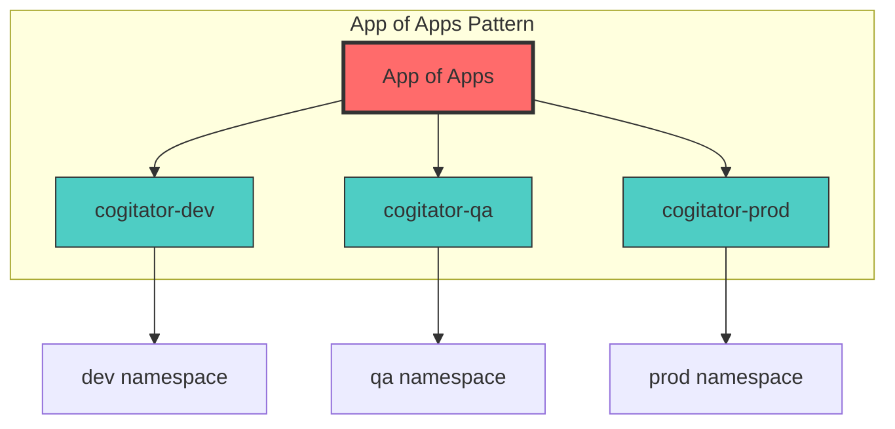
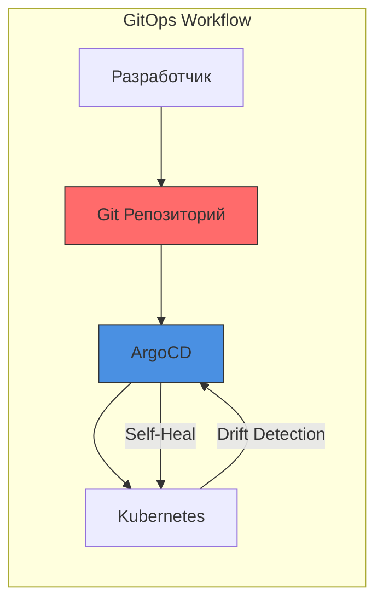

# Практическая работа ArgoCD: Развертывание приложений с помощью GitOps

> **Примечание для пользователей VS Code:** Чтобы просматривать диаграммы Mermaid, установите расширение [Markdown Preview Enhanced](https://marketplace.visualstudio.com/items?itemName=shd101wyy.markdown-preview-enhanced).

## 🎯 Обзор лабораторной работы

В этой лабораторной вы примеряете на себя роль разработчика в **Forge World Sigma-VII**. Ваша задача — взять новый сервис **cogitator** и развернуть его в Kubernetes, используя ArgoCD и практики GitOps.

```
╔═══════════════════════════════════════════════════════════════╗
║                                                               ║
║     ⚙️  FORGE WORLD SIGMA-VII                                  ║
║         Adeptus Mechanicus - Mars Sector                      ║
║                                                               ║
║     "The Omnissiah Protects. The Machine Spirit Provides."    ║
║                                                               ║
╚═══════════════════════════════════════════════════════════════╝
```

### Предыстория

Интерес этой практики не только в самом развертывании. Команда платформы в Forge World Sigma-VII построила новую Kubernetes-среду, и именно команда cogitator получает возможность одной из первых поработать в ней.

А вместе с этим меняется и сама модель релизов. Вместо тикетов, ожидания окна релиза и отдельных релизных встреч организация переходит на **GitOps-подход с ArgoCD**.

**До ArgoCD** процесс выглядел так:
1. Отправили тикет команде платформы с тегом версии, когда новый релиз готов.
2. Ждали, пока они подтвердят тикет и запланируют его в следующем окне релиза.
3. Присоединились к встрече по релизу и увидели, как ваши изменения развертываются в продакшн.

**С ArgoCD** рабочий процесс становится таким:
1. Иметь возможность самостоятельно выполнять релизы в продакшн.
2. Просто изменять файл в Git-репозитории.
3. Запускать синхронизацию (или позволять автосинхронизации сделать это за вас).

### Чему вы научитесь

- Созданию ArgoCD Applications из YAML-манифестов.
- Развертыванию Helm-чартов через ArgoCD.
- Пониманию статуса синхронизации и здоровья приложения (health status).
- Просмотру и пониманию диффов (diffs) приложения.
- Реализации паттерна App of Apps.
- Включению Auto-Sync для автоматизированных развертываний.
- Управлению несколькими средами (dev, qa, prod).
- Исправлению проблем в продакшене с помощью GitOps.

---

## 📁 Структура репозитория

Ваша команда платформы создала Helm-чарт в репозитории конфигурации среды для развертывания сервиса cogitator в Kubernetes.

```
gitops-config-repo/
├── apps/                           # Манифесты ArgoCD Application
│   ├── cogitator-dev.yaml       # Application для среды Dev
│   ├── cogitator-qa.yaml        # Application для среды QA
│   └── cogitator-prod.yaml      # Application для среды Production
├── charts/                         # Helm-чарты
│   └── cogitator/               # Чарт сервиса cogitator
│       ├── Chart.yaml              # Метаданные чарта
│       ├── templates/              # Шаблоны манифестов Kubernetes
│       │   ├── deployment.yaml
│       │   ├── service.yaml
│       │   ├── _helpers.tpl
│       │   └── NOTES.txt
│       ├── values.yaml             # Значения по умолчанию
│       ├── values-dev.yaml         # Переопределения для среды Dev
│       ├── values-qa.yaml          # Переопределения для среды QA
│       └── values-prod.yaml        # Переопределения для среды Production
├── app-of-apps.yaml                # Манифест App of Apps
└── README.md
```

### Понимание структуры

Папка `charts/` содержит Helm-чарт для развертывания сервиса **cogitator** в Kubernetes. Она содержит файл значений Helm (т.е. `values-<env>.yaml`) для каждой среды с любыми переопределениями стандартных значений чарта.

Манифесты **cogitator** Application для ArgoCD хранятся в папке `apps/`. Манифесты Application используют файл значений из папки `charts/cogitator/`, соответствующий той же среде (например, `apps/cogitator-dev.yaml` ссылается на файл `charts/cogitator/values-dev.yaml`).

---

## 🔧 Предварительные условия

Перед началом лабораторной работы убедитесь, что у вас есть:

1. **Kubernetes Cluster** — работающий кластер Kubernetes (minikube, kind или облачный).
2. **ArgoCD Installed** — ArgoCD, развернутый в вашем кластере.
3. **kubectl** — CLI Kubernetes, настроенный для доступа к вашему кластеру.
4. **Git Repository** — доступ к репозиторию конфигурации GitOps.
5. **ArgoCD CLI** (опционально) — для работы через командную строку.

> **Нужна помощь в установке этих инструментов?** См. подробное [Руководство по установке предварительных условий](PrerequisitesInstallation.md) с пошаговыми инструкциями для macOS, Linux и Windows.

### Учетные данные для доступа к ArgoCD

Для этой лабораторной работы используйте следующие учетные данные для доступа к интерфейсу ArgoCD:

| Поле | Значение |
|-------|-------|
| **URL** | `https://argocd.your-cluster.local` |
| **Username** | `admin` |
| **Password** | `<получить из секрета кластера>` |

Чтобы получить пароль администратора:
```bash
kubectl -n argocd get secret argocd-initial-admin-secret -o jsonpath="{.data.password}" | base64 -d
```

---

## 🧪 Лабораторный раунд 1: Развертывание приложения Dev

**Цель:** Создать и развернуть Application `cogitator-dev` для развертывания Helm-чарта cogitator в среду dev.

### Шаг 1.1: Доступ к UI ArgoCD

1. Откройте вкладку/URL ArgoCD в вашем браузере.
2. Войдите в систему с учетными данными, указанными выше.

### Шаг 1.2: Создание нового приложения

1. Нажмите кнопку **NEW APP** в левом верхнем углу.
2. В правом верхнем углу нажмите **EDIT AS YAML**.
3. Замените предварительно заполненный манифест следующим содержимым:

```yaml
apiVersion: argoproj.io/v1alpha1
kind: Application
metadata:
  name: 'cogitator-dev'
spec:
  destination:
    name: 'in-cluster'
    namespace: 'dev'
  source:
    path: 'charts/cogitator'
    repoURL: 'https://github.com/your-org/gitops-config-repo'
    targetRevision: HEAD
    helm:
      valueFiles:
        - values-dev.yaml
  project: 'default'
  syncPolicy:
    syncOptions:
      - CreateNamespace=true
```

### Шаг 1.3: Понимание манифеста Application

Этот манифест описывает Application со следующими параметрами:

| Поле | Значение | Описание |
|-------|-------|-------------|
| `metadata.name` | `cogitator-dev` | Уникальное имя Application |
| `spec.source.repoURL` | Ваш GitOps репозиторий | Источником является ваш GitOps репозиторий |
| `spec.source.path` | `charts/cogitator` | Указывает на Helm-чарт cogitator |
| `spec.source.helm.valueFiles` | `values-dev.yaml` | Использует файл значений для dev |
| `spec.destination.name` | `in-cluster` | Развертывает в локальный кластер |
| `spec.destination.namespace` | `dev` | Целевое пространство имен |
| `spec.syncPolicy.syncOptions` | `CreateNamespace=true` | Автоматически создает пространство имен |

### Шаг 1.4: Сохранение и создание

1. Нажмите **SAVE** — UI переведет манифест в поля мастера настройки.
2. В левом верхнем углу нажмите **CREATE**.

### Шаг 1.5: Проверка приложения

Панель создания нового приложения закроется, и вы увидите карточку вашего Application:

- **Sync Status**: `OutOfSync` (изначально)
- **Health Status**: `Missing`

Это ожидаемо, так как мы еще не выполнили синхронизацию!

### Шаг 1.6: Синхронизация приложения

1. Нажмите на карточку Application, чтобы открыть детали.
2. Нажмите кнопку **SYNC** в верхнем меню.
3. В панели опций синхронизации нажмите **SYNCHRONIZE**.
4. Дождитесь завершения синхронизации.

### Шаг 1.7: Проверка развертывания

После завершения синхронизации проверьте:
- **Sync Status**: `Synced` ✅
- **Health Status**: `Healthy` ✅

Вы также можете проверить развертывание с помощью kubectl:
```bash
kubectl get pods -n dev
kubectl get svc -n dev
```

**✅ Контрольная точка:** Вы успешно развернули свое первое Application с помощью ArgoCD!

---

## 🔄 Лабораторный раунд 2: Обновление образа приложения

**Цель:** Узнать, как обновить приложение, изменив значения Helm и синхронизировав изменения.

### Сценарий

Команда разработки выпустила новую версию сервиса cogitator (v1.2.0). Вам нужно обновить среду dev, чтобы использовать этот новый тег образа.

### Шаг 2.1: Обновление файла значений

Откройте `charts/cogitator/values-dev.yaml` и обновите тег образа:

```yaml
# До
image:
  repository: nginx
  tag: "1.24"

# После
image:
  repository: nginx
  tag: "1.25"
```

### Шаг 2.2: Фиксация изменений (Commit)

```bash
git add charts/cogitator/values-dev.yaml
git commit -m "chore: bump cogitator-dev image to 1.25"
git push origin main
```

### Шаг 2.3: Наблюдение за статусом OutOfSync

Вернитесь в UI ArgoCD:
1. Application покажет статус **OutOfSync**.
2. Это указывает на то, что желаемое состояние (Git) отличается от текущего состояния (кластер).

### Шаг 2.4: Синхронизация обновления

1. Нажмите кнопку **SYNC**.
2. Нажмите **SYNCHRONIZE**.
3. Дождитесь завершения.

### Шаг 2.5: Проверка обновления

Развертывание теперь должно работать с новым тегом образа.

**✅ Контрольная точка:** Вы успешно обновили приложение через GitOps!

---

## 🔍 Лабораторный раунд 3: Просмотр диффа приложения

**Цель:** Научиться просматривать различия между желаемым и текущим состояниями.

### Понимание диффов (Diffs)

Поскольку Application было ранее синхронизировано, любые различия между желаемым состоянием и текущим состоянием указывают на то, что изменится при синхронизации.

### Шаг 3.1: Просмотр диффа

1. Нажмите на карточку Application.
2. Нажмите **APP DIFF** в верхнем меню.
3. Используйте опции **Compact diff** и **Inline diff**, чтобы сосредоточиться на различиях.

### Шаг 3.2: Понимание дерева ресурсов

Дерево ресурсов показывает:
- **Зеленые круги**: ресурсы, которые синхронизированы.
- **Желтые круги со стрелками**: ресурсы, которые не синхронизированы (out of sync).
- **Красные круги**: ресурсы с ошибками.

Когда Deployment не синхронизирован, статус Application также показывает **OutOfSync**.

**✅ Контрольная точка:** Теперь вы понимаете, как просматривать и интерпретировать диффы приложения!

---

## 📦 Лабораторный раунд 4: Паттерн App of Apps

**Цель:** Внедрить паттерн App of Apps для декларативного управления несколькими Applications.

### Зачем нужен App of Apps?

При создании Application `cogitator-dev` вы вручную нажимали кнопки в UI и вставляли манифест Application. Хотя это отлично подходит для начала, **Applications должны управляться декларативно через GitOps**, как и любой другой ресурс Kubernetes.

Здесь на помощь приходит **паттерн App of Apps**.



### Шаг 4.1: Изучение манифеста App of Apps

```yaml
apiVersion: argoproj.io/v1alpha1
kind: Application
metadata:
  name: 'app-of-apps'
spec:
  destination:
    name: 'in-cluster'
    namespace: 'argocd'
  source:
    path: 'apps'
    repoURL: 'https://github.com/your-org/gitops-config-repo'
    targetRevision: HEAD
  project: 'default'
```

Это Application:
- Указывает на папку `apps/` в вашем репозитории.
- Будет создавать/управлять всеми Applications, определенными в этой папке.
- Развертывается в пространство имен `argocd` (где запущен ArgoCD).

### Шаг 4.2: Создание App of Apps

1. В UI ArgoCD нажмите **NEW APP**.
2. Нажмите **EDIT AS YAML**.
3. Вставьте манифест App of Apps.
4. Нажмите **SAVE**, затем **CREATE**.

### Шаг 4.3: Синхронизация App of Apps

1. Нажмите **SYNC**.
2. Нажмите **SYNCHRONIZE**.

После синхронизации ArgoCD автоматически создаст Applications, определенные в папке `apps/`!

### Шаг 4.4: Проверка созданных приложений

Теперь вы должны увидеть несколько карточек Application:
- `app-of-apps`
- `cogitator-dev`
- `cogitator-qa`

**✅ Контрольная точка:** Вы внедрили паттерн App of Apps!

---

## ⚡ Лабораторный раунд 5: Включение Auto-Sync

**Цель:** Включить автоматическую синхронизацию для развертывания без участия человека.

### Преимущества Auto-Sync

При включенном Auto-Sync:
- ArgoCD автоматически развертывает изменения при изменении Git-репозитория.
- Не нужно нажимать кнопку ручной синхронизации.
- Настоящий Continuous Deployment!

### Шаг 5.1: Включение Auto-Sync для App of Apps

1. Нажмите на Application `app-of-apps`.
2. Нажмите **APP DETAILS** в верхнем меню.
3. Найдите раздел **SYNC POLICY**.
4. Нажмите **ENABLE AUTO-SYNC**.
5. Подтвердите действие.

### Шаг 5.2: Изменение манифеста App of Apps (опционально)

Альтернативно вы можете добавить auto-sync в YAML:

```yaml
apiVersion: argoproj.io/v1alpha1
kind: Application
metadata:
  name: 'app-of-apps'
spec:
  destination:
    name: 'in-cluster'
    namespace: 'argocd'
  source:
    path: 'apps'
    repoURL: 'https://github.com/your-org/gitops-config-repo'
    targetRevision: HEAD
  project: 'default'
  syncPolicy:
    automated:
      prune: true
      selfHeal: true
```

### Шаг 5.3: Тестирование Auto-Sync

Теперь, когда вы добавляете новые манифесты Application в папку `apps/` и отправляете их в Git, они будут автоматически создаваться и синхронизироваться!

**✅ Контрольная точка:** Автосинхронизация включена для автоматизированных развертываний!

---

## 🏭 Лабораторный раунд 6: Создание приложения Production

**Цель:** Создать Application для среды Production, используя GitOps.

### Сценарий

Инстансы `dev` и `qa` приложения cogitator синхронизированы, здоровы и управляются декларативно с помощью App of Apps. Пришло время создать Application `prod` на основе версии `qa`, используя GitOps.

### Шаг 6.1: Создание манифеста Production Application

Создайте новый файл `apps/cogitator-prod.yaml`:

```yaml
apiVersion: argoproj.io/v1alpha1
kind: Application
metadata:
  name: 'cogitator-prod'
spec:
  destination:
    name: 'in-cluster'
    namespace: 'prod'
  source:
    path: 'charts/cogitator'
    repoURL: 'https://github.com/your-org/gitops-config-repo'
    targetRevision: HEAD
    helm:
      valueFiles:
        - values-prod.yaml
  project: 'default'
  syncPolicy:
    automated:
      selfHeal: true
    syncOptions:
      - CreateNamespace=true
```

### Шаг 6.2: Создание файла значений для Production

Создайте `charts/cogitator/values-prod.yaml`:

```yaml
replicaCount: 3

image:
  repository: nginx
  tag: "1.24-alpine"
  pullPolicy: IfNotPresent

service:
  type: ClusterIP
  port: 80

resources:
  limits:
    cpu: 200m
    memory: 256Mi
  requests:
    cpu: 100m
    memory: 128Mi

environment: production
```

### Шаг 6.3: Commit и Push

```bash
git add apps/cogitator-prod.yaml
git add charts/cogitator/values-prod.yaml
git commit -m "feat: add cogitator-prod Application"
git push origin main
```

### Шаг 6.4: Проверка автосоздания

Если на `app-of-apps` включен auto-sync:
- Новое Application `cogitator-prod` будет создано автоматически.
- Затем оно автоматически синхронизируется для развертывания инстанса продакшена.

Если auto-sync не включен, синхронизируйте `app-of-apps` вручную.

### Шаг 6.5: Проверка развертывания Production

```bash
kubectl get pods -n prod
kubectl get svc -n prod
```

**✅ Контрольная точка:** Среда Production теперь развернута с помощью GitOps!

---

## 🔧 Лабораторный раунд 7: Исправление проблем в продакшене (Hotfix)

**Цель:** Узнать, как применять горячие исправления (hotfixes) через GitOps.

### Сценарий

О нет! Развертывание в продакшене завершается неудачей, потому что в теге образа в `values-prod.yaml` допущена опечатка. Тег был установлен как `v1.24-alpine`, но правильный тег должен быть `1.24-alpine` (без префикса `v`).

### Шаг 7.1: Идентификация проблемы

В UI ArgoCD Application `cogitator-prod` показывает:
- **Sync Status**: `Synced` (манифест применен правильно).
- **Health Status**: `Degraded` (поды падают).

Проверьте логи подов:
```bash
kubectl logs -n prod -l app=cogitator
kubectl describe pod -n prod -l app=cogitator
```

Вы увидите, что загрузка образа не удается из-за недопустимого тега.

### Шаг 7.2: Исправление тега образа

Откройте `charts/cogitator/values-prod.yaml` и исправьте тег:

```yaml
# До (неправильно)
image:
  tag: "v1.24-alpine"

# После (правильно)
image:
  tag: "1.24-alpine"
```

### Шаг 7.3: Фиксация исправления (Commit)

```bash
git add charts/cogitator/values-prod.yaml
git commit -m "fix: correct image tag for cogitator-prod"
git push origin main
```

### Шаг 7.4: Дождитесь синхронизации (или запустите вручную)

- Если включен auto-sync с `selfHeal: true`, ArgoCD автоматически применит исправление.
- Если нет, запустите синхронизацию вручную.

### Шаг 7.5: Проверка исправления

После синхронизации:
- **Sync Status**: `Synced` ✅
- **Health Status**: `Healthy` ✅

```bash
kubectl get pods -n prod
# Все поды должны быть в состоянии Running
```

**✅ Контрольная точка:** Вы успешно применили hotfix, используя GitOps!

---

## 📊 Итоги лабораторной работы

Поздравляем! Вы завершили практическую работу по ArgoCD! 🎉

### Чего вы достигли

| Раунд | Задача | Изученные навыки |
|-------|------|----------------|
| 1 | Развертывание Dev приложения | Создание Applications, синхронизация |
| 2 | Обновление образа | Рабочий процесс GitOps для обновлений |
| 3 | Просмотр диффов | Понимание различий состояний |
| 4 | App of Apps | Декларативное управление Application |
| 5 | Auto-Sync | Автоматизированные развертывания |
| 6 | Развертывание в Production | GitOps для нескольких сред |
| 7 | Hotfix | Экстренные исправления через GitOps |

### Закрепленные ключевые концепции



1. **Декларативная конфигурация**: Всё определено в Git.
2. **Git как источник истины**: Репозиторий определяет желаемое состояние.
3. **Автоматизированная синхронизация**: ArgoCD поддерживает кластеры в синхронизации с Git.
4. **Self-Healing**: Автоматическое исправление отклонений конфигурации.
5. **Управление несколькими средами**: Один и тот же рабочий процесс для всех сред.

---

## 🎓 Проверка знаний

Используйте эти вопросы как короткую самопроверку:

### Вопрос 1
В чем основное преимущество использования паттерна App of Apps?

<details>
<summary>Показать ответ</summary>

**Ответ:** Паттерн App of Apps позволяет управлять ресурсами Application декларативно через GitOps, так же как и любым другим ресурсом Kubernetes. Вместо ручного создания Applications через UI, вы определяете их как YAML-файлы в Git, и родительское Application управляет ими всеми.
</details>

### Вопрос 2
Что происходит, когда в sync policy включено `selfHeal: true`?

<details>
<summary>Показать ответ</summary>

**Ответ:** Когда включено `selfHeal: true`, ArgoCD будет автоматически откатывать любые ручные изменения, внесенные напрямую в кластер, чтобы они соответствовали желаемому состоянию в Git. Это предотвращает отклонение конфигурации (drift).
</details>

### Вопрос 3
Почему Application может показывать статус здоровья "Synced", но "Degraded"?

<details>
<summary>Показать ответ</summary>

**Ответ:** Application имеет статус "Synced", потому что манифесты из Git были успешно применены к кластеру. Однако оно "Degraded", потому что сами ресурсы работают со сбоями (например, поды не могут запуститься из-за неверного тега образа, ограничений ресурсов или ошибок конфигурации).
</details>

### Вопрос 4
В чем заключалась проблема в 7-м раунде и как GitOps помог ее исправить?

<details>
<summary>Показать ответ</summary>

**Ответ:** Проблема заключалась в неверном теге образа с префиксом `v`, который отсутствует в реестре. GitOps помог исправить это, позволив разработчику просто закоммитить исправление в Git, после чего ArgoCD автоматически применил исправление к кластеру без ручного вмешательства на стороне Kubernetes.
</details>

---

## 🚀 Следующие шаги

Теперь, когда вы освоили основы, попробуйте эти продвинутые упражнения:

1. **Внедрите Sync Waves**: Упорядочьте развертывания, добавив аннотации `argocd.argoproj.io/sync-wave`.
2. **Добавьте Resource Hooks**: Создайте PreSync и PostSync хуки для миграций базы данных.
3. **Настройте уведомления**: Настройте уведомления ArgoCD в Slack/Teams.
4. **Внедрите RBAC**: Создайте Projects и ограничьте доступ для каждой команды.
5. **Multi-Cluster Deployment**: Добавьте удаленный кластер и разверните приложение в нескольких кластерах.

---

## 📚 Дополнительные ресурсы

- [Официальная документация ArgoCD](https://argo-cd.readthedocs.io/)
- [Паттерн App of Apps](https://argo-cd.readthedocs.io/en/stable/operator-manual/cluster-bootstrapping/)
- [Sync Phases и Waves](https://argo-cd.readthedocs.io/en/stable/user-guide/sync-waves/)
- [Лучшие практики ArgoCD](https://argo-cd.readthedocs.io/en/stable/user-guide/best_practices/)

---

**Удачного погружения в GitOps!** 🎯
