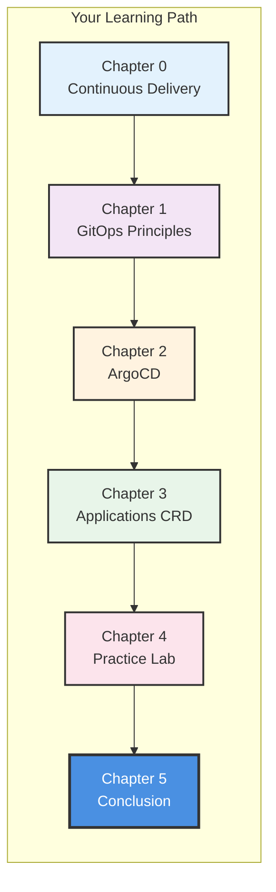
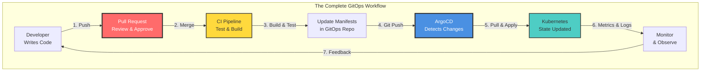
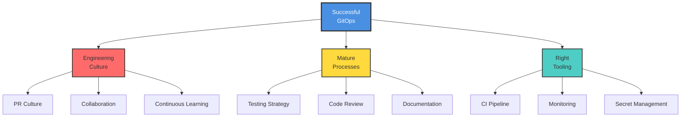
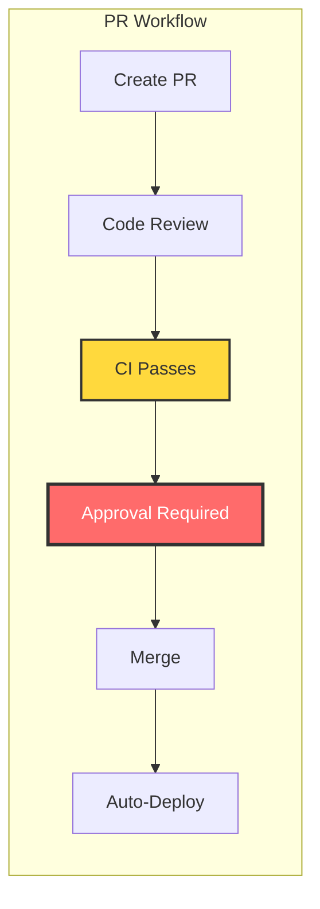
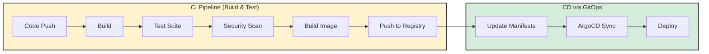
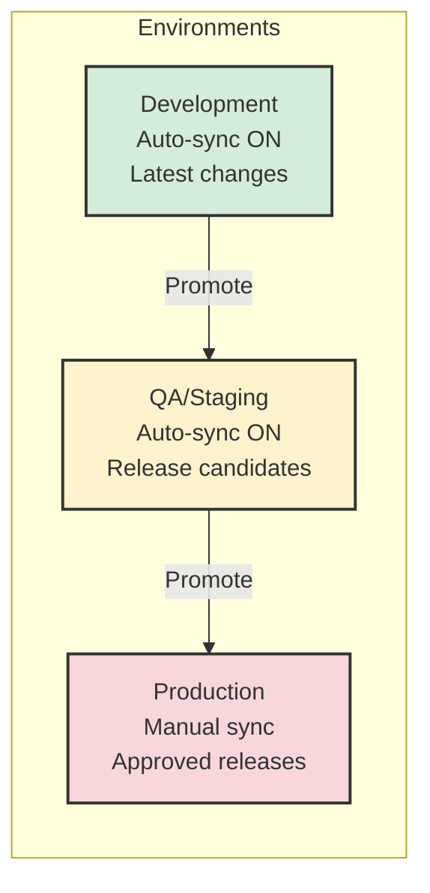
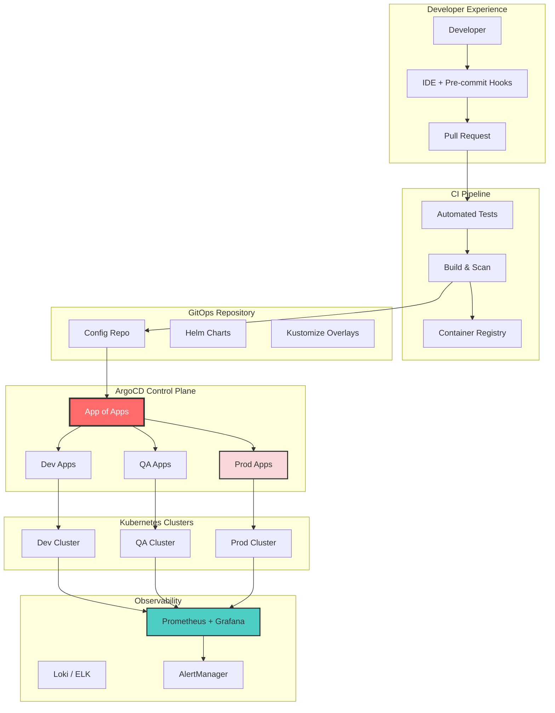

# Course Conclusion: Mastering GitOps with ArgoCD

> **Note for VS Code Users:** To view Mermaid diagrams in this document, install the [Markdown Preview Enhanced](https://marketplace.visualstudio.com/items?itemName=shd101wyy.markdown-preview-enhanced) extension.

## Table of Contents

- [Course Summary](#course-summary)
- [The GitOps Journey Recap](#the-gitops-journey-recap)
- [Critical Prerequisites for GitOps Success](#critical-prerequisites-for-gitops-success)
- [The Golden GitOps Setup](#the-golden-gitops-setup)
- [Getting Started Roadmap](#getting-started-roadmap)
- [Common Pitfalls to Avoid](#common-pitfalls-to-avoid)
- [Final Recommendations](#final-recommendations)
- [Your Next Steps](#your-next-steps)

---

## Course Summary

You have reached the end of the course, and more importantly, you now have a connected mental model of how GitOps works in practice. What began with release fundamentals ended with ArgoCD, Application CRDs, and a real deployment workflow. Let's look back at that path as one coherent system of ideas.



### Chapter 0: Continuous Delivery

You learned that **Continuous Delivery (CD)** is both a technological and cultural transformation. It's what separates teams that ship with confidence from teams that dread release day:
- Automate error-prone manual release processes
- Codify deployment knowledge for consistency and resilience
- Accelerate time-to-market through automation
- Scale without proportional headcount increases

**Key Insight**: CD is not about eliminating people — it's about freeing engineers from toil so they can focus on delivering value.

### Chapter 1: GitOps Principles

You discovered the **four foundational principles of GitOps**:

1. **Declarative**: Express desired state, not imperative commands
2. **Versioned and Immutable**: Store state in Git with complete history
3. **Pulled Automatically**: Agents pull changes from Git
4. **Continuously Reconciled**: Agents maintain desired state automatically

**Key Insight**: GitOps transforms CD by using Git as the single source of truth and implementing a pull-based deployment model. This is the foundation that top-performing engineering teams rely on.

### Chapter 2: ArgoCD

You explored **ArgoCD** — the most widely adopted GitOps operator in the Kubernetes ecosystem:
- Continuously monitors Git repositories
- Automatically detects and corrects drift
- Provides a powerful UI for visualization
- Manages multi-cluster deployments
- Integrates seamlessly with Kubernetes

**Key Insight**: ArgoCD is the software agent that makes GitOps principles actionable in Kubernetes environments. It's the industry standard for a reason.

### Chapter 3: ArgoCD Application CRD

You mastered the **Application Custom Resource Definition**:
- Source configuration (Git repos, Helm charts)
- Destination configuration (clusters, namespaces)
- Sync policies (manual, automatic, self-heal)
- Config management tools (Helm, Kustomize, plain YAML)

**Key Insight**: The Application CRD is the declarative contract between your desired state and the running infrastructure.

### Chapter 4: Practice Lab

You gained hands-on experience with:
- Creating and deploying Applications
- The App of Apps pattern for declarative management
- Enabling auto-sync for continuous deployment
- Fixing production issues through GitOps
- Managing multiple environments

**Key Insight**: GitOps simplifies operations — changes in Git automatically propagate to your infrastructure. You've experienced this firsthand, and that experience is invaluable.

---

## The GitOps Journey Recap



---

## Critical Prerequisites for GitOps Success

> **IMPORTANT**: GitOps is not just a tool you install — it requires specific organizational practices and culture. The good news? If you build these foundations right, GitOps becomes a force multiplier for your entire engineering organization. Without them, you'll struggle to see real results.

### The Foundation Triangle



---

### 1. Automated Testing Strategy

| Priority | Critical |
|----------|----------|
| Without this | Broken code reaches production automatically |

**Why It Matters**: GitOps automates deployment. If your tests don't catch bugs, those bugs deploy automatically too. There's no human safety net in a fully automated pipeline.

**What You Need**:

```
Testing Pyramid
                    ┌─────────────────┐
                    │    E2E Tests    │  ← Few, slow, expensive
                    │   (Critical     │
                    │    Paths)       │
                    ├─────────────────┤
                    │  Integration    │  ← More, moderate speed
                    │    Tests        │
                    ├─────────────────┤
                    │   Unit Tests    │  ← Many, fast, cheap
                    │ (Comprehensive) │
                    └─────────────────┘
```

**Minimum Requirements**:
- **Unit Tests**: Cover business logic, aim for >80% coverage on critical paths
- **Integration Tests**: Verify components work together
- **E2E Tests**: Validate critical user journeys
- **Static Analysis**: Linting, security scanning, dependency checking
- **Manifest Validation**: Validate Kubernetes manifests before merge

```yaml
# Example: GitHub Actions CI for GitOps
name: CI Pipeline
on: [pull_request]
jobs:
  test:
    runs-on: ubuntu-latest
    steps:
      - uses: actions/checkout@v4
      - name: Run Unit Tests
        run: npm test -- --coverage
      - name: Run Integration Tests
        run: npm run test:integration
      - name: Lint Code
        run: npm run lint
      - name: Security Scan
        run: npm audit
      - name: Validate Manifests
        run: kubectl apply --dry-run=client -f k8s/
```

---

### 2. Pull Request Culture

| Priority | Critical |
|----------|----------|
| Without this | Unreviewed changes reach production |

**Why It Matters**: In GitOps, merging to main = deploying to production. If anyone can push directly to main without review, you lose all quality gates.

**What You Need**:



**Minimum Requirements**:
- **Branch Protection Rules**: No direct pushes to main/master
- **Required Reviews**: At least 1-2 reviewers for infrastructure changes
- **CI Must Pass**: All tests must pass before merge
- **No Force Push**: Prevent rewriting history on protected branches
- **Signed Commits**: (Optional but recommended) Verify commit authenticity

```yaml
# Example: GitHub Branch Protection (as reference)
Branch Protection Rules for 'main':
  ✓ Require a pull request before merging
    ✓ Require approvals: 2
    ✓ Dismiss stale pull request approvals when new commits are pushed
  ✓ Require status checks to pass before merging
    ✓ Require branches to be up to date before merging
    Required checks: [test, lint, security-scan, manifest-validation]
  ✓ Require conversation resolution before merging
  ✓ Do not allow bypassing the above settings
```

---

### 3. CI/CD Pipeline

| Priority | Critical |
|----------|----------|
| Without this | GitOps has nothing to deploy |

**Why It Matters**: GitOps handles deployment, but you still need CI to build, test, and prepare your artifacts. The CI pipeline produces what ArgoCD deploys.

**What You Need**:



**Minimum Requirements**:
- **Automated Builds**: Triggered on every commit/PR
- **Test Automation**: All tests run in CI
- **Container Image Building**: Consistent, reproducible builds
- **Image Scanning**: Check for vulnerabilities before deployment
- **Manifest Updates**: Automated updates to GitOps repo

---

### 4. Secret Management

| Priority | Critical |
|----------|----------|
| Without this | Secrets exposed in Git = security breach |

**Why It Matters**: NEVER store plain-text secrets in Git. Even in private repositories, this is a security risk. GitOps requires a proper secret management strategy.

**What You Need**:

| Solution | Description | Complexity |
|----------|-------------|------------|
| **Sealed Secrets** | Encrypt secrets that only the cluster can decrypt | Low |
| **External Secrets Operator** | Sync secrets from external vaults | Medium |
| **HashiCorp Vault** | Full-featured secret management | High |
| **SOPS** | Encrypt files with various KMS backends | Medium |
| **Cloud KMS** | AWS/GCP/Azure native secret managers | Medium |

```yaml
# Example: External Secrets Operator
apiVersion: external-secrets.io/v1
kind: ExternalSecret
metadata:
  name: database-credentials
spec:
  secretStoreRef:
    name: vault-backend
    kind: ClusterSecretStore
  target:
    name: db-secret
  data:
    - secretKey: password
      remoteRef:
        key: production/database
        property: password
```

**Minimum Requirements**:
- **No plain secrets in Git**: Ever. Period.
- **Encryption at rest**: Secrets encrypted before storage
- **Access controls**: Who can decrypt/access secrets
- **Rotation capability**: Ability to rotate secrets without redeployment
- **Audit logging**: Track who accessed what secrets

---

### 5. Monitoring and Observability

| Priority | High |
|----------|------|
| Without this | You won't know when things break |

**Why It Matters**: With automated deployments, you need automated detection of problems. If you can't observe your system, you can't know if your GitOps deployment succeeded or caused issues.

**What You Need**:

```
Observability Pillars
┌─────────────────────────────────────────────────────────┐
│                                                         │
│   📊 METRICS          📝 LOGS           🔍 TRACES      │
│   ─────────          ─────────         ─────────       │
│   - CPU/Memory       - Application     - Request flow  │
│   - Request rates    - Error logs      - Latency       │
│   - Error rates      - Audit logs      - Dependencies  │
│   - Custom metrics   - Access logs     - Bottlenecks   │
│                                                         │
└─────────────────────────────────────────────────────────┘
                           │
                           ▼
┌─────────────────────────────────────────────────────────┐
│                     🚨 ALERTING                         │
│   - PagerDuty / Opsgenie for critical issues           │
│   - Slack / Teams for warnings                         │
│   - Deployment notifications                           │
└─────────────────────────────────────────────────────────┘
```

**Minimum Requirements**:
- **Health Checks**: Every service must expose health endpoints
- **Metrics Collection**: Prometheus or equivalent
- **Log Aggregation**: Centralized logging (Loki, ELK, etc.)
- **Alerting**: Automated alerts for anomalies
- **Dashboards**: Visibility into system state (Grafana)
- **ArgoCD Notifications**: Alert on sync failures and health changes

---

### 6. Environment Strategy

| Priority | High |
|----------|------|
| Without this | No safe place to test changes |

**Why It Matters**: You need environments to test changes before they reach production. GitOps makes this easier but requires planning.

**What You Need**:



**Minimum Requirements**:
- **At least 2 environments**: Non-production and Production
- **Production-like staging**: Catch issues before production
- **Clear promotion path**: How changes move between environments
- **Environment parity**: Minimize differences between environments

---

### 7. Documentation Culture

| Priority | High |
|----------|------|
| Without this | Knowledge silos and onboarding difficulties |

**Why It Matters**: GitOps codifies your infrastructure, but humans still need to understand how it works. Good documentation enables team scalability.

**What You Need**:
- **Architecture Decision Records (ADRs)**: Document why decisions were made
- **Runbooks**: Step-by-step guides for common operations
- **README files**: Every repository should have clear documentation
- **Onboarding guides**: Help new team members get started
- **Incident post-mortems**: Learn from failures

---

### 8. Rollback Strategy

| Priority | High |
|----------|------|
| Without this | No quick recovery from failures |

**Why It Matters**: Even with testing, things can go wrong. You need the ability to quickly revert to a known-good state.

**What You Need**:

```bash
# GitOps makes rollback simple
git revert HEAD
git push origin main
# ArgoCD automatically syncs the reverted state
```

**Minimum Requirements**:
- **Immutable deployments**: Never modify running containers
- **Version tagging**: Every deployment has a clear version
- **Quick rollback procedure**: Documented and tested
- **Database migration strategy**: How to handle schema changes
- **Feature flags**: Decouple deployment from release

---

## The Golden GitOps Setup

This is the **ideal setup** that top-performing organizations aim for. You don't need to implement everything on day one — but having this target in mind gives you a clear direction. Each component you add brings measurable improvements to your delivery pipeline.



### Golden Setup Components

#### 1. Repository Structure

```
organization/
├── app-source-repo/           # Application source code
│   ├── src/
│   ├── tests/
│   ├── Dockerfile
│   └── .github/workflows/     # CI pipelines
│
├── gitops-config-repo/        # Infrastructure configuration
│   ├── apps/                  # ArgoCD Application manifests
│   │   ├── app-of-apps.yaml
│   │   ├── dev/
│   │   ├── qa/
│   │   └── prod/
│   ├── charts/                # Helm charts
│   │   └── my-app/
│   │       ├── Chart.yaml
│   │       ├── values.yaml
│   │       ├── values-dev.yaml
│   │       ├── values-qa.yaml
│   │       └── values-prod.yaml
│   └── infrastructure/        # Cluster infrastructure
│       ├── monitoring/
│       ├── ingress/
│       └── secrets/
│
└── platform-repo/             # Platform team configurations
    ├── argocd/
    ├── cert-manager/
    └── external-secrets/
```

#### 2. CI/CD Flow

```yaml
# Golden CI Pipeline Example
name: CI Pipeline
on:
  push:
    branches: [main]
  pull_request:
    branches: [main]

jobs:
  test:
    runs-on: ubuntu-latest
    steps:
      - uses: actions/checkout@v4
      
      - name: Unit Tests
        run: npm test -- --coverage --threshold=80
        
      - name: Integration Tests
        run: npm run test:integration
        
      - name: E2E Tests
        run: npm run test:e2e
        
      - name: Security Scan
        uses: aquasecurity/trivy-action@0.28.0
        
      - name: Lint
        run: npm run lint
  
  build:
    needs: test
    runs-on: ubuntu-latest
    if: github.ref == 'refs/heads/main'
    steps:
      - uses: actions/checkout@v4
      
      - name: Build Image
        run: docker build -t myapp:${{ github.sha }} .
        
      - name: Scan Image
        uses: aquasecurity/trivy-action@0.28.0
        with:
          image-ref: myapp:${{ github.sha }}
          
      - name: Push Image
        run: |
          docker tag myapp:${{ github.sha }} registry/myapp:${{ github.sha }}
          docker push registry/myapp:${{ github.sha }}
  
  update-manifests:
    needs: build
    runs-on: ubuntu-latest
    steps:
      - name: Checkout GitOps Repo
        uses: actions/checkout@v4
        with:
          repository: org/gitops-config-repo
          token: ${{ secrets.GITOPS_TOKEN }}
          
      - name: Update Image Tag
        run: |
          yq e '.image.tag = "${{ github.sha }}"' -i charts/myapp/values-dev.yaml
          
      - name: Commit and Push
        run: |
          git config user.name "CI Bot"
          git config user.email "ci@example.com"
          git add .
          git commit -m "chore: update myapp to ${{ github.sha }}"
          git push
```

#### 3. ArgoCD Application Configuration

```yaml
# App of Apps - Root Application
apiVersion: argoproj.io/v1alpha1
kind: Application
metadata:
  name: applications
  namespace: argocd
spec:
  project: default
  source:
    repoURL: https://github.com/org/gitops-config-repo
    path: apps
    targetRevision: HEAD
  destination:
    server: https://kubernetes.default.svc
    namespace: argocd
  syncPolicy:
    automated:
      prune: true
      selfHeal: true
```

```yaml
# Production Application with Safety Controls
apiVersion: argoproj.io/v1alpha1
kind: Application
metadata:
  name: myapp-prod
  namespace: argocd
spec:
  project: production
  source:
    repoURL: https://github.com/org/gitops-config-repo
    path: charts/myapp
    targetRevision: HEAD  # Or pin to specific tag
    helm:
      valueFiles:
        - values-prod.yaml
  destination:
    server: https://prod-cluster.example.com
    namespace: myapp
  syncPolicy:
    # Manual sync for production
    syncOptions:
      - CreateNamespace=true
      - PrunePropagationPolicy=foreground
  # No automated sync - requires manual approval
```

#### 4. Monitoring Setup

```yaml
# ArgoCD Notifications for Slack
apiVersion: v1
kind: ConfigMap
metadata:
  name: argocd-notifications-cm
  namespace: argocd
data:
  service.slack: |
    token: $slack-token
  template.app-deployed: |
    message: |
      Application {{.app.metadata.name}} is now {{.app.status.sync.status}}.
      Health: {{.app.status.health.status}}
  trigger.on-deployed: |
    - when: app.status.sync.status == 'Synced'
      send: [app-deployed]
```

---

## Getting Started Roadmap

If you're starting fresh, don't try to do everything at once. Here's a proven order of implementation that keeps you moving forward with quick wins at every phase:

### Phase 1: Foundation (Week 1-2)

```
┌─────────────────────────────────────────────────────────┐
│ □ Set up Git repository with branch protection         │
│ □ Implement basic CI pipeline (build, test, lint)      │
│ □ Create container registry (DockerHub, ECR, GCR)      │
│ □ Set up a development Kubernetes cluster              │
│ □ Install ArgoCD in the cluster                        │
└─────────────────────────────────────────────────────────┘
```

### Phase 2: Basic GitOps (Week 3-4)

```
┌─────────────────────────────────────────────────────────┐
│ □ Create GitOps configuration repository               │
│ □ Create first ArgoCD Application                      │
│ □ Set up dev environment with auto-sync                │
│ □ Implement App of Apps pattern                        │
│ □ Add basic health checks to applications              │
└─────────────────────────────────────────────────────────┘
```

### Phase 3: Production Ready (Week 5-8)

```
┌─────────────────────────────────────────────────────────┐
│ □ Set up staging/QA environment                        │
│ □ Configure production with manual sync                │
│ □ Implement secret management solution                 │
│ □ Set up monitoring and alerting                       │
│ □ Create rollback procedures and test them             │
│ □ Document everything in runbooks                      │
└─────────────────────────────────────────────────────────┘
```

### Phase 4: Advanced (Ongoing)

```
┌─────────────────────────────────────────────────────────┐
│ □ Implement progressive delivery (canary, blue-green)  │
│ □ Add policy enforcement (OPA Gatekeeper, Kyverno)     │
│ □ Set up multi-cluster management                      │
│ □ Implement GitOps for infrastructure (Crossplane)     │
│ □ Continuous improvement of testing and monitoring     │
└─────────────────────────────────────────────────────────┘
```

---

## Common Pitfalls to Avoid

We've seen teams stumble on the same mistakes again and again. Knowing these upfront will save you time, stress, and potentially a production incident.

### 1. Starting with Production

**Problem**: Implementing GitOps directly in production without experience.

**Solution**: Start with development/sandbox environment. Learn the workflow before applying it to critical systems.

### 2. Ignoring Testing

**Problem**: Enabling auto-sync without comprehensive tests.

**Solution**: Build confidence through testing BEFORE enabling automation. Auto-sync is only as safe as your test suite.

### 3. Secrets in Git

**Problem**: Storing plain-text secrets in Git repositories.

**Solution**: ALWAYS use a secret management solution. This is non-negotiable for security.

### 4. Skipping Code Review

**Problem**: Allowing direct pushes to main branch.

**Solution**: Enforce branch protection. Every change should be reviewed, especially infrastructure changes.

### 5. No Rollback Plan

**Problem**: Not knowing how to quickly recover from a bad deployment.

**Solution**: Document and regularly test your rollback procedures. Practice recovery drills.

### 6. Insufficient Monitoring

**Problem**: Not knowing when deployments cause problems.

**Solution**: Implement comprehensive monitoring BEFORE enabling auto-sync. You need to detect problems automatically.

### 7. Over-Engineering Initially

**Problem**: Trying to implement everything at once.

**Solution**: Start simple. Add complexity gradually as you gain experience and identify needs.

---

## Final Recommendations

Whether you're learning on your own, leading a team, or driving organizational change, here's how to make the most of what you've learned.

### For Individual Learners

1. **Practice in a Safe Environment**
   - Use minikube or kind for local learning
   - Create personal projects to experiment
   - Break things intentionally to learn recovery — this builds real confidence

2. **Build Incrementally**
   - Start with manual sync
   - Add auto-sync for dev only
   - Gradually increase automation as confidence grows

3. **Learn the Ecosystem**
   - Understand Kubernetes fundamentals
   - Learn Helm and/or Kustomize
   - Explore the CNCF landscape

### For Teams

1. **Invest in Culture First**
   - Train the team on GitOps principles
   - Establish PR review practices
   - Create documentation habits

2. **Start with a Pilot Project**
   - Choose a non-critical application
   - Learn lessons before broader adoption
   - Document everything for organizational learning

3. **Measure Success** (DORA metrics are your friend here)
   - Track deployment frequency
   - Measure lead time for changes
   - Monitor change failure rate
   - Track mean time to recovery

### For Organizations

1. **Executive Sponsorship**
   - GitOps is a transformation, not just a tool
   - Requires investment in training and tooling
   - Cultural change needs leadership support

2. **Platform Team**
   - Consider a dedicated team for GitOps infrastructure
   - Create golden paths for development teams
   - Provide self-service capabilities

3. **Gradual Adoption**
   - Don't mandate organization-wide adoption immediately
   - Let success stories drive adoption
   - Support teams at their own pace

---

## Your Next Steps

The knowledge you've gained puts you ahead of most engineers when it comes to modern deployment practices. Now it's time to put it to work.

### Immediate Actions

1. **Review the Prerequisites Checklist**
   - Identify gaps in your current setup
   - Prioritize what to implement first — even one improvement makes a difference

2. **Set Up Your First GitOps Environment**
   - Follow the [Prerequisites Installation Guide](../../4-Practice/EN/PrerequisitesInstallation.md)
   - Complete the [Practice Lab](../../4-Practice/EN/PracticeLab.md) if you haven't already

3. **Join the Community**
   - [ArgoCD Slack](https://argoproj.github.io/community/join-slack)
   - [CNCF Slack #gitops channel](https://slack.cncf.io/)
   - [OpenGitOps Community](https://opengitops.dev/)

### Continue Learning

| Resource | Description |
|----------|-------------|
| [ArgoCD Documentation](https://argo-cd.readthedocs.io/) | Official ArgoCD docs |
| [OpenGitOps](https://opengitops.dev/) | GitOps standards and best practices |
| [CNCF GitOps Working Group](https://github.com/cncf/tag-app-delivery/tree/main/gitops-wg) | Industry standards |
| [Progressive Delivery](https://argo-rollouts.readthedocs.io/) | Argo Rollouts for canary/blue-green |

---

## Closing Thoughts

GitOps is more than just a deployment methodology — it's a **paradigm shift** in how we think about infrastructure management. By treating infrastructure as code, storing it in Git, and using automated reconciliation, you gain:

- **Reliability**: Consistent, repeatable deployments
- **Security**: Auditable changes, reduced attack surface
- **Velocity**: Faster, more frequent releases
- **Resilience**: Easy rollbacks, quick recovery

These aren't abstract benefits. They directly translate to fewer late-night incidents, faster onboarding for new team members, and the kind of confidence that lets you deploy on a Friday afternoon without breaking a sweat.

But remember: **tools alone don't make GitOps successful**. Success requires:

- Strong testing practices
- Healthy PR culture
- Comprehensive monitoring
- Continuous learning and improvement

The journey to GitOps maturity is iterative. Start where you are, implement improvements incrementally, and celebrate progress along the way. Every step forward makes your team more resilient and your delivery faster.

---

## Thank You

Thank you for investing your time in this course. You now have a solid foundation in GitOps principles and practical experience with ArgoCD — skills that are highly valued across the industry.

If this course helped you, consider sharing it with a colleague who's still doing manual deployments. They'll thank you later.

> **"The goal is not perfect GitOps from day one. The goal is continuous improvement towards better, safer, faster software delivery."**

Now go ship something great.

---

## Course Materials Reference

| Chapter | Topic | Link |
|---------|-------|------|
| 0 | Introduction to Continuous Delivery | [View](../../0-Introduction-CD/EN/IntroductionToCD.md) |
| 1 | Introduction to GitOps | [View](../../1-Intrduction-GitOps/EN/IntroductionToGitOps.md) |
| 2 | Introduction to ArgoCD | [View](../../2-Introduction-to-ArgoCD/EN/IntroductionToArgoCD.md) |
| 3 | ArgoCD Application CRD | [View](../../3-CRD-ArgoCD/EN/IntroductionToArgoApplications.md) |
| 4 | Practice Lab | [View](../../4-Practice/EN/PracticeLab.md) |
| - | Prerequisites Installation | [View](../../4-Practice/EN/PrerequisitesInstallation.md) |
