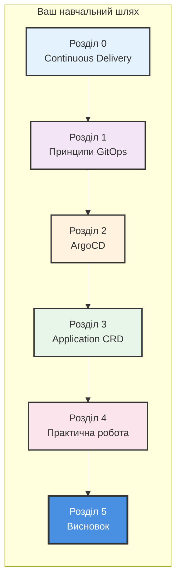
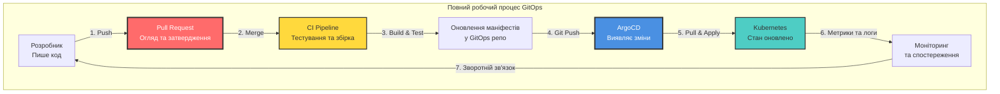
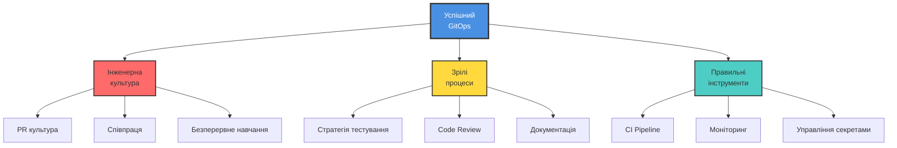
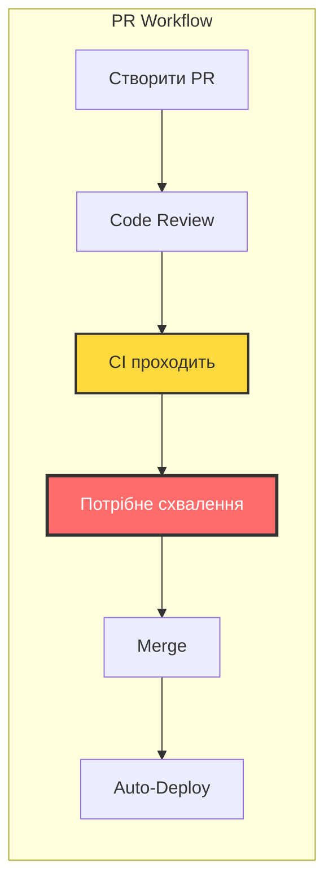
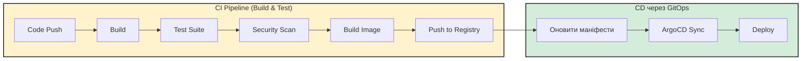
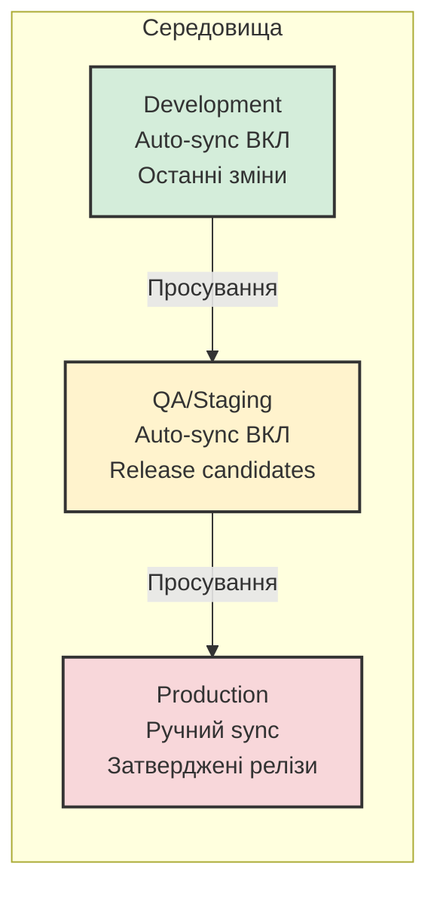
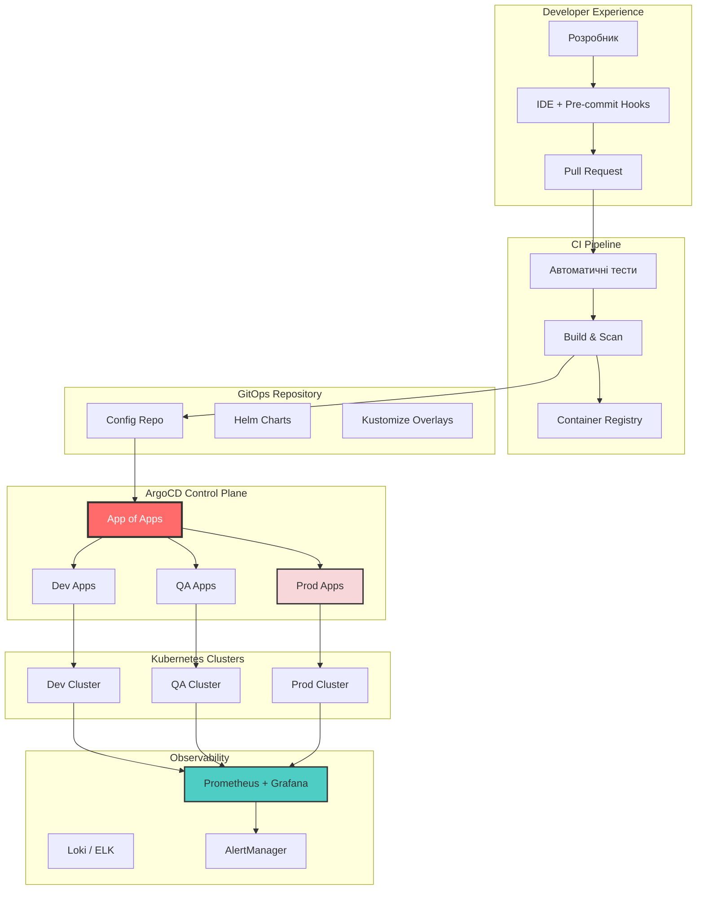

# Завершення курсу: Опанування GitOps з ArgoCD

> **Примітка для користувачів VS Code:** Для перегляду діаграм Mermaid встановіть розширення [Markdown Preview Enhanced](https://marketplace.visualstudio.com/items?itemName=shd101wyy.markdown-preview-enhanced).

## Зміст

- [Підсумок курсу](#підсумок-курсу)
- [Огляд шляху GitOps](#огляд-шляху-gitops)
- [Критичні передумови успіху GitOps](#критичні-передумови-успіху-gitops)
- [Золотий стандарт налаштування GitOps](#золотий-стандарт-налаштування-gitops)
- [Дорожня карта для початку](#дорожня-карта-для-початку)
- [Типові помилки, яких слід уникати](#типові-помилки-яких-слід-уникати)
- [Фінальні рекомендації](#фінальні-рекомендації)
- [Ваші наступні кроки](#ваші-наступні-кроки)

---

## Підсумок курсу

Ви дійшли до завершення курсу, а головне — тепер маєте цілісну ментальну модель того, як GitOps працює на практиці. Те, що починалося з основ релізного процесу, привело вас до ArgoCD, Application CRD і реального сценарію розгортання. Тепер подивімося на цей шлях як на єдину послідовну систему ідей.



### Розділ 0: Continuous Delivery

Ви дізналися, що **Continuous Delivery (CD)** — це і технологічна, і культурна трансформація. Саме це відрізняє команди, які деплоять з впевненістю, від команд, які бояться дня релізу:
- Автоматизувати схильні до помилок ручні процеси релізу
- Кодифікувати знання про розгортання для узгодженості та стійкості
- Прискорити вихід на ринок через автоматизацію
- Масштабуватися без пропорційного збільшення персоналу

**Ключовий висновок**: CD — це не про скорочення людей, а про звільнення інженерів від рутини, щоб вони могли зосередитися на створенні цінності. Це фундамент, без якого далі рухатися неможливо.

### Розділ 1: Принципи GitOps

Ви відкрили **чотири фундаментальні принципи GitOps**:

1. **Декларативний**: Описувати бажаний стан, а не імперативні команди
2. **Версіонований та незмінний**: Зберігати стан у Git з повною історією
3. **Автоматично витягується**: Агенти витягують зміни з Git
4. **Безперервно узгоджується**: Агенти автоматично підтримують бажаний стан

**Ключовий висновок**: GitOps трансформує CD, використовуючи Git як єдине джерело істини та впроваджуючи модель розгортання на основі "витягування" (pull). Це основа, на яку покладаються найкращі інженерні команди.

### Розділ 2: ArgoCD

Ви дослідили **ArgoCD** — найпоширеніший GitOps-оператор в екосистемі Kubernetes:
- Безперервно моніторить Git-репозиторії
- Автоматично виявляє та виправляє відхилення (drift)
- Надає потужний UI для візуалізації
- Керує розгортаннями на кількох кластерах
- Бездоганно інтегрується з Kubernetes

**Ключовий висновок**: ArgoCD — це програмний агент, який робить принципи GitOps дієвими в середовищах Kubernetes. Він став індустріальним стандартом не просто так.

### Розділ 3: ArgoCD Application CRD

Ви опанували **Application Custom Resource Definition**:
- Конфігурація джерела (Git-репозиторії, Helm-чарти)
- Конфігурація призначення (кластери, неймспейси)
- Політики синхронізації (ручна, автоматична, самовідновлення)
- Інструменти управління конфігурацією (Helm, Kustomize, звичайний YAML)

**Ключовий висновок**: Application CRD — це декларативний контракт між вашим бажаним станом та працюючою інфраструктурою.

### Розділ 4: Практична робота

Ви отримали практичний досвід з:
- Створення та розгортання Applications
- Шаблон App of Apps для декларативного управління
- Увімкнення auto-sync для безперервного розгортання
- Виправлення production-проблем через GitOps
- Управління кількома середовищами

**Ключовий висновок**: GitOps спрощує операції — зміни в Git автоматично поширюються на вашу інфраструктуру. Ви відчули це на власному досвіді, і цей досвід безцінний.

---

## Огляд шляху GitOps



---

## Критичні передумови успіху GitOps

> **ВАЖЛИВО**: GitOps — це не просто інструмент, який ви встановлюєте. Він вимагає певних організаційних практик та культури. Хороша новина? Якщо ви побудуєте ці основи правильно, GitOps стане мультиплікатором сили для всієї вашої інженерної організації. Без них — отримати реальні результати буде складно.

### Трикутник фундаменту



---

### 1. Стратегія автоматизованого тестування

| Пріоритет | Критичний |
|-----------|-----------|
| Без цього | Зламаний код автоматично потрапляє в production |

**Чому це важливо**: GitOps автоматизує розгортання. Якщо ваші тести не виловлюють баги, ці баги розгортаються автоматично теж. У повністю автоматизованому конвеєрі немає людського запобіжника.

**Що вам потрібно**:

```
Піраміда тестування
                    ┌─────────────────┐
                    │   E2E тести     │  ← Мало, повільні, дорогі
                    │   (Критичні     │
                    │    шляхи)       │
                    ├─────────────────┤
                    │  Інтеграційні   │  ← Більше, помірна швидкість
                    │    тести        │
                    ├─────────────────┤
                    │   Unit тести    │  ← Багато, швидкі, дешеві
                    │  (Комплексні)   │
                    └─────────────────┘
```

**Мінімальні вимоги**:
- **Unit тести**: Покривають бізнес-логіку, прагніть до >80% покриття критичних шляхів
- **Інтеграційні тести**: Перевіряють, що компоненти працюють разом
- **E2E тести**: Валідують критичні користувацькі сценарії
- **Статичний аналіз**: Лінтинг, сканування безпеки, перевірка залежностей
- **Валідація маніфестів**: Перевірка Kubernetes-маніфестів перед merge

---

### 2. Культура Pull Request

| Пріоритет | Критичний |
|-----------|-----------|
| Без цього | Неперевірені зміни потрапляють у production |

**Чому це важливо**: У GitOps злиття в main = розгортання в production. Якщо хтось може напряму пушити в main без перевірки, ви втрачаєте всі якісні затвори.

**Що вам потрібно**:



**Мінімальні вимоги**:
- **Правила захисту гілок**: Заборона прямих пушів у main/master
- **Обов'язкові рев'ю**: Мінімум 1-2 рев'юери для інфраструктурних змін
- **CI повинен пройти**: Всі тести мають пройти перед merge
- **Без force push**: Запобігання перезапису історії на захищених гілках
- **Підписані коміти**: (Опціонально, але рекомендовано) Верифікація автентичності комітів

---

### 3. CI/CD Pipeline

| Пріоритет | Критичний |
|-----------|-----------|
| Без цього | GitOps нема що розгортати |

**Чому це важливо**: GitOps обробляє розгортання, але вам все одно потрібен CI для збірки, тестування та підготовки артефактів. CI-конвеєр виробляє те, що ArgoCD розгортає.

**Що вам потрібно**:



---

### 4. Управління секретами

| Пріоритет | Критичний |
|-----------|-----------|
| Без цього | Секрети у Git = порушення безпеки |

**Чому це важливо**: НІКОЛИ не зберігайте відкриті секрети в Git. Навіть у приватних репозиторіях це ризик безпеки. GitOps вимагає належної стратегії управління секретами.

**Що вам потрібно**:

| Рішення | Опис | Складність |
|---------|------|------------|
| **Sealed Secrets** | Шифрує секрети, які може розшифрувати лише кластер | Низька |
| **External Secrets Operator** | Синхронізує секрети з зовнішніх сховищ | Середня |
| **HashiCorp Vault** | Повнофункціональне управління секретами | Висока |
| **SOPS** | Шифрує файли з різними KMS-бекендами | Середня |
| **Cloud KMS** | Нативні менеджери секретів AWS/GCP/Azure | Середня |

**Мінімальні вимоги**:
- **Жодних відкритих секретів у Git**: Ніколи. Крапка.
- **Шифрування в спокої**: Секрети зашифровані перед зберіганням
- **Контроль доступу**: Хто може розшифровувати/отримувати доступ до секретів
- **Можливість ротації**: Здатність ротувати секрети без перерозгортання
- **Журналювання аудиту**: Відстеження, хто до яких секретів отримав доступ

---

### 5. Моніторинг та спостережуваність

| Пріоритет | Високий |
|-----------|---------|
| Без цього | Ви не дізнаєтесь, коли щось зламається |

**Чому це важливо**: З автоматизованими розгортаннями вам потрібне автоматичне виявлення проблем. Якщо ви не можете спостерігати за системою, ви не дізнаєтесь, чи ваше GitOps-розгортання було успішним чи викликало проблеми.

**Що вам потрібно**:

```
Стовпи спостережуваності
┌─────────────────────────────────────────────────────────┐
│                                                         │
│   📊 МЕТРИКИ         📝 ЛОГИ           🔍 ТРЕЙСИ       │
│   ─────────          ─────────         ─────────       │
│   - CPU/Memory       - Додатку         - Потік запитів │
│   - Частота запитів  - Помилки         - Затримки      │
│   - Частота помилок  - Аудит           - Залежності    │
│   - Custom метрики   - Доступ          - Вузькі місця  │
│                                                         │
└─────────────────────────────────────────────────────────┘
                           │
                           ▼
┌─────────────────────────────────────────────────────────┐
│                     🚨 АЛЕРТИ                           │
│   - PagerDuty / Opsgenie для критичних проблем         │
│   - Slack / Teams для попереджень                      │
│   - Сповіщення про розгортання                         │
└─────────────────────────────────────────────────────────┘
```

**Мінімальні вимоги**:
- **Health Checks**: Кожен сервіс має виставляти health-ендпоінти
- **Збір метрик**: Prometheus або еквівалент
- **Агрегація логів**: Централізоване логування (Loki, ELK тощо)
- **Алертинг**: Автоматичні алерти про аномалії
- **Дашборди**: Видимість стану системи (Grafana)
- **ArgoCD Notifications**: Алерти про невдалі синхронізації та зміни здоров'я

---

### 6. Стратегія середовищ

| Пріоритет | Високий |
|-----------|---------|
| Без цього | Немає безпечного місця для тестування змін |

**Чому це важливо**: Вам потрібні середовища для тестування змін перед тим, як вони потраплять у production. GitOps це спрощує, але вимагає планування.

**Що вам потрібно**:



**Мінімальні вимоги**:
- **Мінімум 2 середовища**: Non-production та Production
- **Production-подібний staging**: Ловіть проблеми до production
- **Чіткий шлях просування**: Як зміни переміщуються між середовищами
- **Паритет середовищ**: Мінімізуйте відмінності між середовищами

---

### 7. Культура документації

| Пріоритет | Високий |
|-----------|---------|
| Без цього | Знаннєві силоси та труднощі з онбордингом |

**Чому це важливо**: GitOps кодифікує вашу інфраструктуру, але людям все одно потрібно розуміти, як вона працює. Хороша документація забезпечує масштабованість команди.

**Що вам потрібно**:
- **Architecture Decision Records (ADRs)**: Документуйте, чому рішення були прийняті
- **Runbooks**: Покрокові інструкції для типових операцій
- **README файли**: Кожен репозиторій має мати зрозумілу документацію
- **Онбординг-гайди**: Допоможіть новим членам команди почати
- **Пост-мортеми інцидентів**: Вчіться на помилках

---

### 8. Стратегія відкату

| Пріоритет | Високий |
|-----------|---------|
| Без цього | Немає швидкого відновлення після збоїв |

**Чому це важливо**: Навіть з тестуванням щось може піти не так. Вам потрібна можливість швидко повернутися до відомого робочого стану.

**Що вам потрібно**:

```bash
# GitOps робить відкат простим
git revert HEAD
git push origin main
# ArgoCD автоматично синхронізує відкачений стан
```

**Мінімальні вимоги**:
- **Незмінні розгортання**: Ніколи не модифікуйте працюючі контейнери
- **Версіонування тегами**: Кожне розгортання має чітку версію
- **Швидка процедура відкату**: Задокументована та протестована
- **Стратегія міграції БД**: Як обробляти зміни схеми
- **Feature flags**: Відокремте розгортання від релізу

---

## Золотий стандарт налаштування GitOps

Це **ідеальне налаштування**, до якого прагнуть найуспішніші організації. Не обов'язково впроваджувати все з першого дня — але маючи цю ціль перед очима, ви матимете чіткий напрямок. Кожен доданий компонент приносить вимірювані покращення у ваш конвеєр доставки.



### Компоненти золотого стандарту

#### 1. Структура репозиторіїв

```
organization/
├── app-source-repo/           # Код додатку
│   ├── src/
│   ├── tests/
│   ├── Dockerfile
│   └── .github/workflows/     # CI pipelines
│
├── gitops-config-repo/        # Конфігурація інфраструктури
│   ├── apps/                  # ArgoCD Application маніфести
│   │   ├── app-of-apps.yaml
│   │   ├── dev/
│   │   ├── qa/
│   │   └── prod/
│   ├── charts/                # Helm charts
│   │   └── my-app/
│   │       ├── Chart.yaml
│   │       ├── values.yaml
│   │       ├── values-dev.yaml
│   │       ├── values-qa.yaml
│   │       └── values-prod.yaml
│   └── infrastructure/        # Інфраструктура кластера
│       ├── monitoring/
│       ├── ingress/
│       └── secrets/
│
└── platform-repo/             # Конфігурації платформної команди
    ├── argocd/
    ├── cert-manager/
    └── external-secrets/
```

---

## Дорожня карта для початку

Якщо ви починаєте з нуля, не намагайтесь зробити все одразу. Ось перевірений порядок впровадження, який дає швидкі перемоги на кожному етапі:

### Фаза 1: Фундамент (Тиждень 1-2)

```
┌─────────────────────────────────────────────────────────┐
│ □ Налаштувати Git-репозиторій із захистом гілок        │
│ □ Впровадити базовий CI pipeline (build, test, lint)   │
│ □ Створити container registry (DockerHub, ECR, GCR)    │
│ □ Налаштувати development Kubernetes кластер           │
│ □ Встановити ArgoCD у кластер                          │
└─────────────────────────────────────────────────────────┘
```

### Фаза 2: Базовий GitOps (Тиждень 3-4)

```
┌─────────────────────────────────────────────────────────┐
│ □ Створити GitOps конфігураційний репозиторій          │
│ □ Створити першу ArgoCD Application                    │
│ □ Налаштувати dev середовище з auto-sync               │
│ □ Впровадити шаблон App of Apps                        │
│ □ Додати базові health checks до додатків              │
└─────────────────────────────────────────────────────────┘
```

### Фаза 3: Production Ready (Тиждень 5-8)

```
┌─────────────────────────────────────────────────────────┐
│ □ Налаштувати staging/QA середовище                    │
│ □ Налаштувати production з ручним sync                 │
│ □ Впровадити рішення для управління секретами          │
│ □ Налаштувати моніторинг та алертинг                   │
│ □ Створити процедури відкату та протестувати їх        │
│ □ Задокументувати все в runbooks                       │
└─────────────────────────────────────────────────────────┘
```

### Фаза 4: Просунутий рівень (Постійно)

```
┌─────────────────────────────────────────────────────────┐
│ □ Впровадити progressive delivery (canary, blue-green) │
│ □ Додати policy enforcement (OPA Gatekeeper, Kyverno)  │
│ □ Налаштувати multi-cluster management                 │
│ □ Впровадити GitOps для інфраструктури (Crossplane)    │
│ □ Безперервне покращення тестування та моніторингу     │
└─────────────────────────────────────────────────────────┘
```

---

## Типові помилки, яких слід уникати

Ми бачили, як команди спотикаються на одних і тих самих помилках знову і знову. Знаючи їх заздалегідь, ви збережете час, нерви та, можливо, уникнете інциденту в production.

### 1. Починати з Production

**Проблема**: Впровадження GitOps одразу в production без досвіду.

**Рішення**: Почніть з development/sandbox середовища. Вивчіть робочий процес перед застосуванням до критичних систем.

### 2. Ігнорувати тестування

**Проблема**: Увімкнення auto-sync без комплексних тестів.

**Рішення**: Побудуйте впевненість через тестування ПЕРЕД увімкненням автоматизації. Auto-sync настільки ж безпечний, наскільки безпечний ваш набір тестів.

### 3. Секрети в Git

**Проблема**: Зберігання відкритих секретів у Git-репозиторіях.

**Рішення**: ЗАВЖДИ використовуйте рішення для управління секретами. Це безкомпромісно для безпеки.

### 4. Пропускати Code Review

**Проблема**: Дозвіл прямих пушів у main гілку.

**Рішення**: Впровадьте захист гілок. Кожна зміна має бути переглянута, особливо інфраструктурні зміни.

### 5. Відсутність плану відкату

**Проблема**: Незнання, як швидко відновитися після поганого розгортання.

**Рішення**: Задокументуйте та регулярно тестуйте процедури відкату. Практикуйте навчання з відновлення.

### 6. Недостатній моніторинг

**Проблема**: Незнання, коли розгортання викликають проблеми.

**Рішення**: Впровадьте комплексний моніторинг ПЕРЕД увімкненням auto-sync. Вам потрібно виявляти проблеми автоматично.

### 7. Надмірна інженерія на початку

**Проблема**: Спроба впровадити все одразу.

**Рішення**: Почніть просто. Додавайте складність поступово, коли набуваєте досвіду та визначаєте потреби.

---

## Фінальні рекомендації

Незалежно від того, чи ви навчаєтесь самостійно, керуєте командою чи впроваджуєте зміни на рівні організації — ось як витягти максимум з того, що ви дізнались.

### Для індивідуальних учнів

1. **Практикуйте в безпечному середовищі**
   - Використовуйте minikube або kind для локального навчання
   - Створюйте особисті проекти для експериментів
   - Ламайте речі навмисно, щоб навчитися відновлення — саме це будує справжню впевненість

2. **Будуйте поступово**
   - Почніть з ручної синхронізації
   - Додайте auto-sync лише для dev
   - Поступово збільшуйте автоматизацію зі зростанням впевненості

3. **Вивчайте екосистему**
   - Розумійте основи Kubernetes
   - Вивчіть Helm та/або Kustomize
   - Досліджуйте ландшафт CNCF

### Для команд

1. **Спочатку інвестуйте в культуру**
   - Навчіть команду принципам GitOps
   - Встановіть практики PR-огляду
   - Створіть звички документування

2. **Почніть з пілотного проекту**
   - Оберіть некритичний додаток
   - Засвойте уроки перед ширшим впровадженням
   - Задокументуйте все для організаційного навчання

3. **Вимірюйте успіх** (DORA-метрики — ваш найкращий друг)
   - Відстежуйте частоту розгортань
   - Вимірюйте lead time для змін
   - Моніторте частоту невдалих змін
   - Відстежуйте mean time to recovery

### Для організацій

1. **Підтримка керівництва**
   - GitOps — це трансформація, не просто інструмент
   - Вимагає інвестицій у навчання та інструменти
   - Культурні зміни потребують підтримки лідерства

2. **Платформна команда**
   - Розгляньте виділену команду для GitOps-інфраструктури
   - Створіть golden paths для команд розробки
   - Надайте можливості self-service

3. **Поступове впровадження**
   - Не нав'язуйте організаційне впровадження одразу
   - Дозвольте історіям успіху стимулювати впровадження
   - Підтримуйте команди в їхньому темпі

---

## Ваші наступні кроки

Знання, які ви отримали, ставлять вас попереду більшості інженерів у сфері сучасних практик розгортання. Тепер час застосувати їх на практиці.

### Негайні дії

1. **Перегляньте чек-лист передумов**
   - Визначте прогалини у вашому поточному налаштуванні
   - Пріоритизуйте, що впроваджувати спочатку — навіть одне покращення має значення

2. **Налаштуйте своє перше GitOps-середовище**
   - Слідуйте [Посібнику з встановлення передумов](../../4-Practice/UA/ПередумовиВстановлення.md)
   - Завершіть [Практичну роботу](../../4-Practice/UA/ПрактичнаРобота.md), якщо ще не зробили цього

3. **Приєднайтесь до спільноти**
   - [ArgoCD Slack](https://argoproj.github.io/community/join-slack)
   - [CNCF Slack #gitops канал](https://slack.cncf.io/)
   - [OpenGitOps Community](https://opengitops.dev/)

### Продовжуйте навчання

| Ресурс | Опис |
|--------|------|
| [Документація ArgoCD](https://argo-cd.readthedocs.io/) | Офіційна документація ArgoCD |
| [OpenGitOps](https://opengitops.dev/) | Стандарти та найкращі практики GitOps |
| [CNCF GitOps Working Group](https://github.com/cncf/tag-app-delivery/tree/main/gitops-wg) | Галузеві стандарти |
| [Progressive Delivery](https://argo-rollouts.readthedocs.io/) | Argo Rollouts для canary/blue-green |

---

## Заключні думки

GitOps — це більше, ніж просто методологія розгортання — це **зміна парадигми** в тому, як ми думаємо про управління інфраструктурою. Трактуючи інфраструктуру як код, зберігаючи її в Git та використовуючи автоматичне узгодження, ви отримуєте:

- **Надійність**: Узгоджені, повторювані розгортання
- **Безпеку**: Аудитовані зміни, зменшена поверхня атаки
- **Швидкість**: Швидші, частіші релізи
- **Стійкість**: Легкі відкати, швидке відновлення

Це не абстрактні переваги. Вони напряму означають менше нічних інцидентів, швидший онбординг нових членів команди та ту впевненість, яка дозволяє деплоїти в п'ятницю ввечері без зайвих хвилювань.

Але пам'ятайте: **самі інструменти не роблять GitOps успішним**. Успіх вимагає:

- Сильних практик тестування
- Здорової PR-культури
- Комплексного моніторингу
- Безперервного навчання та покращення

Шлях до зрілості GitOps — ітеративний. Почніть там, де ви є, впроваджуйте покращення поступово та святкуйте прогрес на цьому шляху. Кожен крок вперед робить вашу команду стійкішою, а доставку — швидшою.

---

## Дякуємо

Дякуємо, що інвестували свій час у цей курс. Тепер у вас є міцна основа в принципах GitOps та практичний досвід роботи з ArgoCD — навички, які високо цінуються в індустрії.

Якщо цей курс був для вас корисним, поділіться ним з колегою, який досі деплоїть вручну. Він подякує вам пізніше.

> **"Мета — не ідеальний GitOps з першого дня. Мета — безперервне покращення до кращої, безпечнішої, швидшої доставки програмного забезпечення."**

А тепер — вперед, деплоїти щось чудове.

---

## Довідник матеріалів курсу

| Розділ | Тема | Посилання |
|--------|------|-----------|
| 0 | Вступ до Continuous Delivery | [Переглянути](../../0-Introduction-CD/UA/ВступДоCD.md) |
| 1 | Вступ до GitOps | [Переглянути](../../1-Intrduction-GitOps/UA/ВступДоGitOps.md) |
| 2 | Вступ до ArgoCD | [Переглянути](../../2-Introduction-to-ArgoCD/UA/ВступДоArgoCD.md) |
| 3 | ArgoCD Application CRD | [Переглянути](../../3-CRD-ArgoCD/UA/АплікаціяArgoCD.md) |
| 4 | Практична робота | [Переглянути](../../4-Practice/UA/ПрактичнаРобота.md) |
| - | Встановлення передумов | [Переглянути](../../4-Practice/UA/ПередумовиВстановлення.md) |
