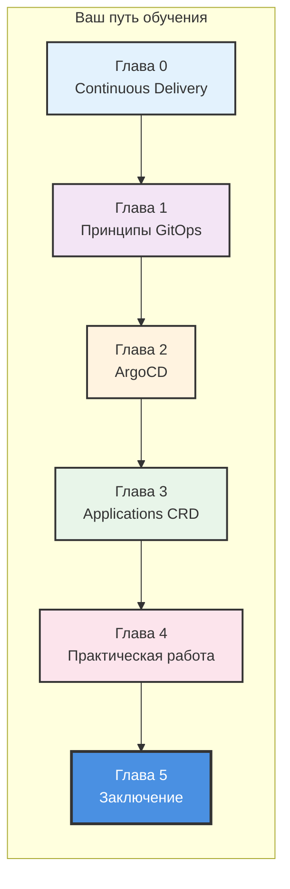
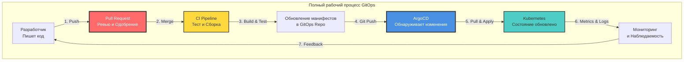
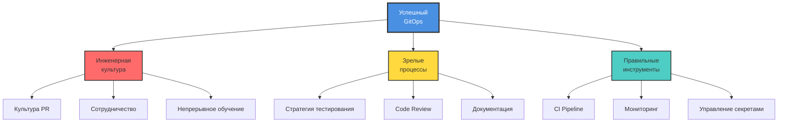
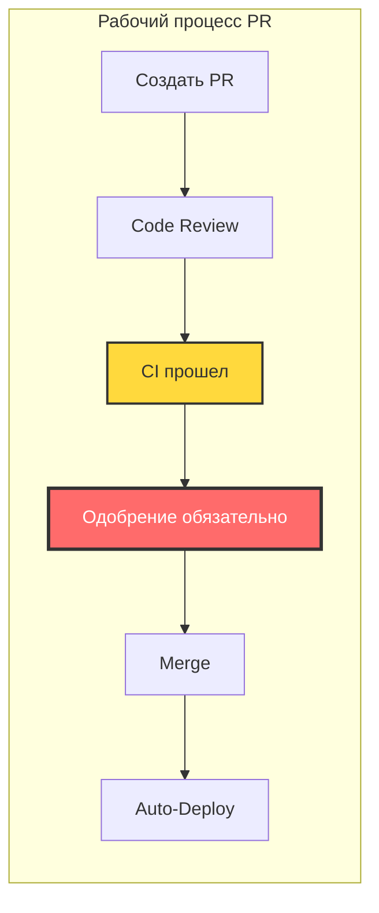
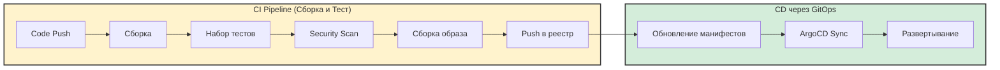
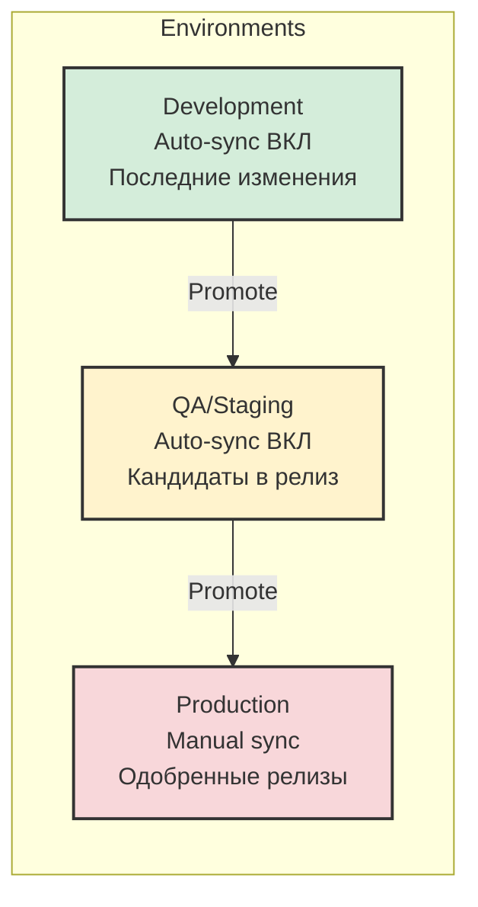
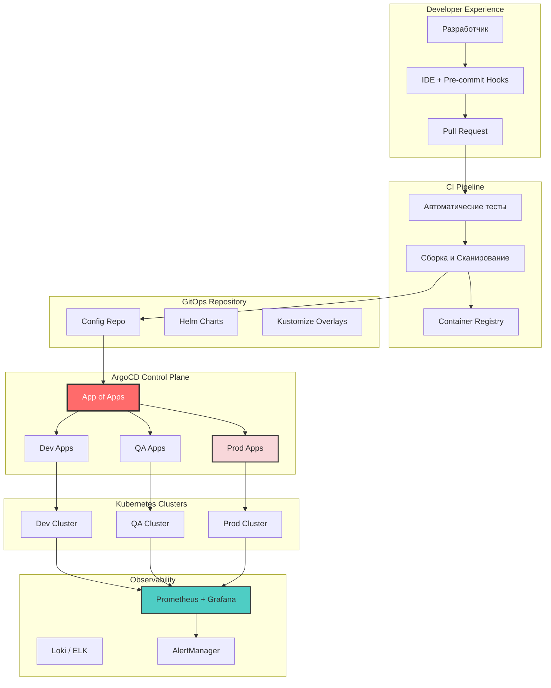

# Заключение курса: Освоение GitOps с ArgoCD

> **Примечание для пользователей VS Code:** Чтобы просматривать диаграммы Mermaid в этом документе, установите расширение [Markdown Preview Enhanced](https://marketplace.visualstudio.com/items?itemName=shd101wyy.markdown-preview-enhanced).

## Содержание

- [Краткий обзор курса](#краткий-обзор-курса)
- [Обзор пути GitOps](#обзор-пути-gitops)
- [Критические условия для успеха GitOps](#критические-условия-для-успеха-gitops)
- [Эталонная схема GitOps](#эталонная-схема-gitops)
- [Дорожная карта для начала работы](#дорожная-карта-для-начала-работы)
- [Типичные ошибки, которых стоит избегать](#типичные-ошибки-которых-стоит-избегать)
- [Финальные рекомендации](#финальные-рекомендации)
- [Ваши следующие шаги](#ваши-следующие-шаги)

---

## Краткий обзор курса

Вы дошли до финала курса, а главное — собрали цельную ментальную модель того, как GitOps работает на практике. Всё, что начиналось с основ релизного процесса, привело вас к ArgoCD, Application CRD и реальному сценарию развертывания. Теперь давайте посмотрим на этот путь как на одну связанную систему идей.



### Глава 0: Continuous Delivery

Вы узнали, что **Continuous Delivery (CD)** — это как технологическая, так и культурная трансформация. Именно это отличает команды, которые деплоят с уверенностью, от команд, которые боятся дня релиза:
- Автоматизировать подверженные ошибкам ручные процессы релизов.
- Кодифицировать знания о развертывании для обеспечения согласованности и устойчивости.
- Ускорять Time-to-Market за счет автоматизации.
- Масштабироваться без пропорционального увеличения штата.

**Ключевой инсайт**: CD — это не про увольнение людей, а про освобождение инженеров от рутины, чтобы они могли сосредоточиться на создании ценности. Это фундамент, без которого двигаться дальше невозможно.

### Глава 1: Принципы GitOps

Вы открыли для себя **четыре основополагающих принципа GitOps**:

1. **Declarative**: Выражение желаемого состояния, а не императивных команд.
2. **Versioned and Immutable**: Хранение состояния в Git с полной историей.
3. **Pulled Automatically**: Агенты затягивают изменения из Git.
4. **Continuously Reconciled**: Агенты автоматически поддерживают желаемое состояние.

**Ключевой инсайт**: GitOps трансформирует CD, используя Git как единственный источник истины и внедряя модель развертывания на основе Pull. Это основа, на которую опираются лучшие инженерные команды.

### Глава 2: ArgoCD

Вы изучили **ArgoCD** — самый распространенный GitOps-оператор в экосистеме Kubernetes:
- Непрерывно отслеживает репозитории Git.
- Автоматически обнаруживает и исправляет отклонения (drift).
- Предоставляет мощный UI для визуализации.
- Управляет развертываниями в нескольких кластерах (Multi-cluster).
- Бесшовно интегрируется с Kubernetes.

**Ключевой инсайт**: ArgoCD — это программный агент, который делает принципы GitOps практически применимыми в средах Kubernetes. Он стал индустриальным стандартом не просто так.

### Глава 3: ArgoCD Application CRD

Вы освоили **Application Custom Resource Definition (CRD)**:
- Конфигурация источника (Git-репозитории, Helm-чарты).
- Конфигурация назначения (кластеры, пространства имен).
- Политики синхронизации (Sync Policies: ручная, автоматическая, Self-heal).
- Инструменты управления конфигурацией (Helm, Kustomize, обычный YAML).

**Ключевой инсайт**: Application CRD — это декларативный контракт между вашим желаемым состоянием и работающей инфраструктурой.

### Глава 4: Практическая работа

Вы получили практический опыт в следующих областях:
- Создание и развертывание Applications.
- Паттерн App of Apps для декларативного управления.
- Включение Auto-sync для непрерывного развертывания (Continuous Deployment).
- Исправление проблем в продакшене через GitOps.
- Управление несколькими средами.

**Ключевой инсайт**: GitOps упрощает эксплуатацию — изменения в Git автоматически распространяются на вашу инфраструктуру. Вы ощутили это на собственном опыте, и этот опыт бесценен.

---

## Обзор пути GitOps



---

## Критические условия для успеха GitOps

> **ВАЖНО**: GitOps — это не просто инструмент, который вы устанавливаете. Он требует определенных организационных практик и культуры. Хорошая новость? Если вы выстроите эти основы правильно, GitOps станет мультипликатором силы для всей вашей инженерной организации. Без них — получить реальные результаты будет сложно.

### Треугольник фундамента



---

### 1. Стратегия автоматизированного тестирования

| Приоритет | Критический |
|----------|----------|
| Без этого | Сломанный код попадает в продакшн автоматически |

**Почему это важно**: GitOps автоматизирует развертывание. Если ваши тесты не ловят баги, эти баги также развертываются автоматически. В полностью автоматизированном конвейере нет человеческой "сетки безопасности".

**Что вам нужно**:

```
Пирамида тестирования
                    ┌─────────────────┐
                    │    E2E Tests    │  ← Мало, медленно, дорого
                    │   (Критические  │
                    │      пути)      │
                    ├─────────────────┤
                    │  Integration    │  ← Больше, средняя скорость
                    │    Tests        │
                    ├─────────────────┤
                    │   Unit Tests    │  ← Много, быстро, дешево
                    │ (Всеобъемлющие) │
                    └─────────────────┘
```

**Минимальные требования**:
- **Unit Tests**: Покрывают бизнес-логику, цель — >80% покрытия критических путей.
- **Integration Tests**: Проверяют совместную работу компонентов.
- **E2E Tests**: Проверяют критические сценарии использования.
- **Static Analysis**: Linting, сканирование безопасности, проверка зависимостей.
- **Валидация манифестов**: Проверка манифестов Kubernetes перед слиянием (merge).

```yaml
# Пример: GitHub Actions CI для GitOps
name: CI Pipeline
on: [pull_request]
jobs:
  test:
    runs-on: ubuntu-latest
    steps:
      - uses: actions/checkout@v4
      - name: Run Unit Tests
        run: npm test -- --coverage
      - name: Run Integration Tests
        run: npm run test:integration
      - name: Lint Code
        run: npm run lint
      - name: Security Scan
        run: npm audit
      - name: Validate Manifests
        run: kubectl apply --dry-run=client -f k8s/
```

---

### 2. Культура Pull Request

| Приоритет | Критический |
|----------|----------|
| Без этого | Непроверенные изменения попадают в продакшн |

**Почему это важно**: В GitOps слияние в main = развертывание в продакшн. Если кто угодно может пушить напрямую в main без ревью, вы теряете все фильтры качества.

**Что вам нужно**:



**Минимальные требования**:
- **Branch Protection Rules**: Запрет прямых пушей в main/master.
- **Обязательное ревью**: Минимум 1-2 ревьюера для изменений инфраструктуры.
- **CI должен пройти**: Все тесты должны быть успешными перед слиянием.
- **No Force Push**: Запрет перезаписи истории в защищенных ветках.
- **Signed Commits**: (Опционально, но рекомендуется) Проверка подлинности коммитов.

```yaml
# Пример: Правила защиты веток в GitHub (для справки)
Branch Protection Rules for 'main':
  ✓ Требовать pull request перед слиянием
    ✓ Требовать одобрений: 2
    ✓ Сбрасывать одобрения при новых коммитах
  ✓ Требовать прохождения проверок статуса перед слиянием
    ✓ Требовать актуальности веток перед слиянием
    Обязательные проверки: [test, lint, security-scan, manifest-validation]
  ✓ Требовать разрешения всех обсуждений перед слиянием
  ✓ Не позволять обходить вышеуказанные настройки
```

---

### 3. CI/CD Pipeline

| Приоритет | Критический |
|----------|----------|
| Без этого | GitOps нечего развертывать |

**Почему это важно**: GitOps берет на себя развертывание, но вам все еще нужен CI для сборки, тестирования и подготовки артефактов. CI Pipeline производит то, что ArgoCD развертывает.

**Что вам нужно**:



**Минимальные требования**:
- **Автоматизированные сборки**: Запускаются при каждом коммите/PR.
- **Автоматизация тестов**: Все тесты запускаются в CI.
- **Сборка образов контейнеров**: Согласованные, воспроизводимые сборки.
- **Image Scanning**: Проверка на уязвимости перед развертыванием.
- **Manifest Updates**: Автоматическое обновление репозитория GitOps.

---

### 4. Управление секретами (Secret Management)

| Приоритет | Критический |
|----------|----------|
| Без этого | Секреты в открытом виде в Git = брешь в безопасности |

**Почему это важно**: НИКОГДА не храните секреты в открытом виде в Git. Даже в приватных репозиториях это риск безопасности. GitOps требует правильной стратегии управления секретами.

**Что вам нужно**:

| Решение | Описание | Сложность |
|----------|-------------|------------|
| **Sealed Secrets** | Шифрование секретов, которые может расшифровать только кластер | Низкая |
| **External Secrets Operator** | Синхронизация секретов из внешних хранилищ (Vault, AWS Secrets Mgr и т.д.) | Средняя |
| **HashiCorp Vault** | Полнофункциональное управление секретами | Высокая |
| **SOPS** | Шифрование файлов с использованием различных KMS-бэкендов | Средняя |
| **Cloud KMS** | Нативные менеджеры секретов AWS/GCP/Azure | Средняя |

```yaml
# Пример: External Secrets Operator
apiVersion: external-secrets.io/v1
kind: ExternalSecret
metadata:
  name: database-credentials
spec:
  secretStoreRef:
    name: vault-backend
    kind: ClusterSecretStore
  target:
    name: db-secret
  data:
    - secretKey: password
      remoteRef:
        key: production/database
        property: password
```

**Минимальные требования**:
- **Никаких секретов в открытом виде в Git**: Никогда. Совсем.
- **Шифрование в покое (at rest)**: Секреты шифруются перед сохранением.
- **Контроль доступа**: Кто может расшифровывать/обращаться к секретам.
- **Возможность ротации**: Способность менять секреты без переразвертывания.
- **Аудит логов**: Отслеживание того, кто и когда обращался к секретам.

---

### 5. Мониторинг и наблюдаемость (Observability)

| Приоритет | Высокий |
|----------|------|
| Без этого | Вы не узнаете, когда что-то сломается |

**Почему это важно**: С автоматизированными развертываниями вам нужно автоматизированное обнаружение проблем. Если вы не можете наблюдать за системой, вы не узнаете, было ли ваше GitOps-развертывание успешным или вызвало проблемы.

**Что вам нужно**:

```
Столпы наблюдаемости
┌─────────────────────────────────────────────────────────┐
│                                                         │
│   📊 METRICS          📝 LOGS           🔍 TRACES      │
│   ─────────          ─────────         ─────────       │
│   - CPU/Memory       - Приложение      - Поток запросов│
│   - Частота запр.    - Логи ошибок     - Latency       │
│   - Частота ошибок   - Логи аудита     - Зависимости   │
│   - Кастомные метр.  - Логи доступа    - Узкие места   │
│                                                         │
└─────────────────────────────────────────────────────────┘
                           │
                           ▼
┌─────────────────────────────────────────────────────────┐
│                     🚨 ALERTING                         │
│   - PagerDuty / Opsgenie для критических проблем       │
│   - Slack / Teams для предупреждений                   │
│   - Уведомления о развертывании                        │
└─────────────────────────────────────────────────────────┘
```

**Минимальные требования**:
- **Health Checks**: Каждый сервис должен иметь эндпоинты проверки здоровья.
- **Сбор метрик**: Prometheus или эквивалент.
- **Агрегация логов**: Централизованное логирование (Loki, ELK и т.д.).
- **Alerting**: Автоматические уведомления об аномалиях.
- **Дашборды**: Визуализация состояния системы (Grafana).
- **ArgoCD Notifications**: Оповещения о сбоях синхронизации и изменениях здоровья.

---

### 6. Стратегия окружений (Environment Strategy)

| Приоритет | Высокий |
|----------|------|
| Без этого | Нет безопасного места для тестирования изменений |

**Почему это важно**: Вам нужны среды для тестирования изменений перед тем, как они попадут в продакшн. GitOps делает это проще, но требует планирования.

**Что вам нужно**:



**Минимальные требования**:
- **Минимум 2 среды**: Непромышленная и Промышленная (Production).
- **Staging, похожий на Production**: Чтобы ловить проблемы до продакшена.
- **Четкий путь продвижения (promotion)**: Как изменения переходят между средами.
- **Паритет окружений**: Минимизация различий между средами.

---

### 7. Культура документации

| Приоритет | Высокий |
|----------|------|
| Без этого | Информационные вакуумы и сложности с онбордингом |

**Почему это важно**: GitOps кодифицирует вашу инфраструктуру, но людям все равно нужно понимать, как она работает. Хорошая документация позволяет команде масштабироваться.

**Что вам нужно**:
- **Architecture Decision Records (ADRs)**: Документирование причин принятия решений.
- **Runbooks**: Пошаговые руководства для стандартных операций.
- **README файлы**: Каждый репозиторий должен иметь четкую документацию.
- **Руководства по онбордингу**: Помощь новым членам команды в начале работы.
- **Incident Post-mortems**: Обучение на ошибках.

---

### 8. Стратегия отката (Rollback Strategy)

| Приоритет | Высокий |
|----------|------|
| Без этого | Нет быстрого восстановления после сбоев |

**Почему это важно**: Даже с тестированием что-то может пойти не так. Вам нужна возможность быстро вернуться в известное хорошее состояние.

**Что вам нужно**:

```bash
# GitOps делает откат простым
git revert HEAD
git push origin main
# ArgoCD автоматически синхронизирует откаченное состояние
```

**Минимальные требования**:
- **Immutable deployments**: Никогда не модифицируйте запущенные контейнеры.
- **Version tagging**: Каждое развертывание имеет четкую версию.
- **Процедура быстрого отката**: Задокументирована и протестирована.
- **Стратегия миграции БД**: Как обрабатывать изменения схем при откатах.
- **Feature flags**: Разделение развертывания (deployment) и релиза (release).

---

## Эталонная схема GitOps

Это **идеальная настройка**, к которой стремятся самые успешные организации. Не обязательно внедрять всё в первый день — но имея эту цель перед глазами, у вас будет четкое направление. Каждый добавленный компонент приносит измеримые улучшения в ваш конвейер доставки.



### Компоненты эталонной схемы

#### 1. Структура репозиториев

```
organization/
├── app-source-repo/           # Исходный код приложения
│   ├── src/
│   ├── tests/
│   ├── Dockerfile
│   └── .github/workflows/     # CI pipelines
│
├── gitops-config-repo/        # Конфигурация инфраструктуры
│   ├── apps/                  # Манифесты ArgoCD Application
│   │   ├── app-of-apps.yaml
│   │   ├── dev/
│   │   ├── qa/
│   │   └── prod/
│   ├── charts/                # Helm-чарты
│   │   └── my-app/
│   │       ├── Chart.yaml
│   │       ├── values.yaml
│   │       ├── values-dev.yaml
│   │       ├── values-qa.yaml
│   │       └── values-prod.yaml
│   └── infrastructure/        # Инфраструктура кластера
│       ├── monitoring/
│       ├── ingress/
│       └── secrets/
│
└── platform-repo/             # Конфигурации команды платформы
    ├── argocd/
    ├── cert-manager/
    └── external-secrets/
```

#### 2. Поток CI/CD

```yaml
# Пример золотого CI Pipeline
name: CI Pipeline
on:
  push:
    branches: [main]
  pull_request:
    branches: [main]

jobs:
  test:
    runs-on: ubuntu-latest
    steps:
      - uses: actions/checkout@v4
      
      - name: Unit Tests
        run: npm test -- --coverage --threshold=80
        
      - name: Integration Tests
        run: npm run test:integration
        
      - name: E2E Tests
        run: npm run test:e2e
        
      - name: Security Scan
        uses: aquasecurity/trivy-action@0.28.0
        
      - name: Lint
        run: npm run lint
  
  build:
    needs: test
    runs-on: ubuntu-latest
    if: github.ref == 'refs/heads/main'
    steps:
      - uses: actions/checkout@v4
      
      - name: Build Image
        run: docker build -t myapp:${{ github.sha }} .
        
      - name: Scan Image
        uses: aquasecurity/trivy-action@0.28.0
        with:
          image-ref: myapp:${{ github.sha }}
          
      - name: Push Image
        run: |
          docker tag myapp:${{ github.sha }} registry/myapp:${{ github.sha }}
          docker push registry/myapp:${{ github.sha }}
  
  update-manifests:
    needs: build
    runs-on: ubuntu-latest
    steps:
      - name: Checkout GitOps Repo
        uses: actions/checkout@v4
        with:
          repository: org/gitops-config-repo
          token: ${{ secrets.GITOPS_TOKEN }}
          
      - name: Update Image Tag
        run: |
          yq e '.image.tag = "${{ github.sha }}"' -i charts/myapp/values-dev.yaml
          
      - name: Commit and Push
        run: |
          git config user.name "CI Bot"
          git config user.email "ci@example.com"
          git add .
          git commit -m "chore: update myapp to ${{ github.sha }}"
          git push
```

#### 3. Конфигурация ArgoCD Application

```yaml
# App of Apps - Корневое приложение
apiVersion: argoproj.io/v1alpha1
kind: Application
metadata:
  name: applications
  namespace: argocd
spec:
  project: default
  source:
    repoURL: https://github.com/org/gitops-config-repo
    path: apps
    targetRevision: HEAD
  destination:
    server: https://kubernetes.default.svc
    namespace: argocd
  syncPolicy:
    automated:
      prune: true
      selfHeal: true
```

```yaml
# Промышленное приложение с мерами безопасности
apiVersion: argoproj.io/v1alpha1
kind: Application
metadata:
  name: myapp-prod
  namespace: argocd
spec:
  project: production
  source:
    repoURL: https://github.com/org/gitops-config-repo
    path: charts/myapp
    targetRevision: HEAD  # Или привязка к тегу
    helm:
      valueFiles:
        - values-prod.yaml
  destination:
    server: https://prod-cluster.example.com
    namespace: myapp
  syncPolicy:
    # Ручная синхронизация для продакшена
    syncOptions:
      - CreateNamespace=true
      - PrunePropagationPolicy=foreground
  # Автосинхронизация выключена - требуется ручное одобрение
```

#### 4. Настройка мониторинга

```yaml
# ArgoCD Notifications для Slack
apiVersion: v1
kind: ConfigMap
metadata:
  name: argocd-notifications-cm
  namespace: argocd
data:
  service.slack: |
    token: $slack-token
  template.app-deployed: |
    message: |
      Приложение {{.app.metadata.name}} теперь {{.app.status.sync.status}}.
      Здоровье: {{.app.status.health.status}}
  trigger.on-deployed: |
    - when: app.status.sync.status == 'Synced'
      send: [app-deployed]
```

---

## Дорожная карта для начала работы

Если вы начинаете с нуля, не пытайтесь сделать всё сразу. Вот проверенный порядок внедрения, который даёт быстрые победы на каждом этапе:

### Фаза 1: Фундамент (Неделя 1-2)

```
┌─────────────────────────────────────────────────────────┐
│ □ Настроить Git-репозиторий с защитой веток            │
│ □ Внедрить базовый CI Pipeline (сборка, тест, линт)    │
│ □ Создать реестр контейнеров (DockerHub, ECR, GCR)     │
│ □ Настроить кластер Kubernetes для разработки          │
│ □ Установить ArgoCD в кластер                          │
└─────────────────────────────────────────────────────────┘
```

### Фаза 2: Базовый GitOps (Неделя 3-4)

```
┌─────────────────────────────────────────────────────────┐
│ □ Создать репозиторий конфигурации GitOps              │
│ □ Создать первое ArgoCD Application                    │
│ □ Настроить dev-среду с auto-sync                      │
│ □ Внедрить паттерн App of Apps                         │
│ □ Добавить базовые health checks в приложения          │
└─────────────────────────────────────────────────────────┘
```

### Фаза 3: Готовность к продакшену (Неделя 5-8)

```
┌─────────────────────────────────────────────────────────┐
│ □ Настроить среду staging/QA                           │
│ □ Настроить продакшн с ручной синхронизацией           │
│ □ Внедрить решение для управления секретами            │
│ □ Настроить мониторинг и алертинг                      │
│ □ Создать процедуры отката и протестировать их         │
│ □ Задокументировать все в runbooks                     │
└─────────────────────────────────────────────────────────┘
```

### Фаза 4: Продвинутый уровень (Постоянно)

```
┌─────────────────────────────────────────────────────────┐
│ □ Внедрить прогрессивную доставку (Canary, Blue-Green) │
│ □ Добавить соблюдение политик (OPA Gatekeeper, Kyverno)│
│ □ Настроить Multi-cluster управление                   │
│ □ Внедрить GitOps для инфраструктуры (Crossplane)      │
│ □ Постоянное улучшение тестов и мониторинга            │
└─────────────────────────────────────────────────────────┘
```

---

## Типичные ошибки, которых стоит избегать

Мы видели, как команды спотыкаются на одних и тех же ошибках снова и снова. Зная их заранее, вы сэкономите время, нервы и, возможно, избежите инцидента в продакшене.

### 1. Начинать сразу с продакшена

**Проблема**: Внедрение GitOps напрямую в продакшн без опыта.

**Решение**: Начните с окружения для разработки или песочницы. Изучите рабочий процесс перед применением к критическим системам.

### 2. Игнорировать тестирование

**Проблема**: Включение auto-sync без всеобъемлющих тестов.

**Решение**: Выстройте доверие через тестирование ПЕРЕД включением автоматизации. Auto-sync безопасен ровно настолько, насколько хорош ваш набор тестов.

### 3. Секреты в Git

**Проблема**: Хранение секретов в открытом виде в Git-репозиториях.

**Решение**: ВСЕГДА используйте решение для управления секретами. Это не подлежит обсуждению в вопросах безопасности.

### 4. Пропускать Code Review

**Проблема**: Разрешение прямых пушей в ветку main.

**Решение**: Обеспечьте защиту веток. Каждое изменение должно быть проверено, особенно изменения инфраструктуры.

### 5. Отсутствие плана отката

**Проблема**: Незнание того, как быстро восстановиться после неудачного развертывания.

**Решение**: Задокументируйте и регулярно тестируйте процедуры отката. Проводите тренировки по восстановлению.

### 6. Недостаточный мониторинг

**Проблема**: Незнание того, когда развертывания вызывают проблемы.

**Решение**: Внедрите комплексный мониторинг ПЕРЕД включением auto-sync. Вам нужно обнаруживать проблемы автоматически.

### 7. Излишнее усложнение на старте (Over-Engineering)

**Проблема**: Попытка внедрить всё сразу.

**Решение**: Начните с простого. Добавляйте сложность постепенно, по мере накопления опыта и выявления потребностей.

---

## Финальные рекомендации

Независимо от того, учитесь ли вы самостоятельно, руководите командой или внедряете изменения на уровне организации — вот как извлечь максимум из того, что вы узнали.

### Для индивидуальных учеников

1. **Практикуйтесь в безопасной среде**
   - Используйте minikube или kind для локального обучения.
   - Создавайте персональные проекты для экспериментов.
   - Намеренно ломайте вещи, чтобы научиться восстановлению — именно это формирует настоящую уверенность.

2. **Стройте постепенно**
   - Начните с ручной синхронизации.
   - Добавьте auto-sync только для dev.
   - Постепенно увеличивайте уровень автоматизации по мере роста уверенности.

3. **Изучайте экосистему**
   - Понимайте основы Kubernetes.
   - Изучите Helm и/или Kustomize.
   - Исследуйте ландшафт CNCF.

### Для команд

1. **Инвестируйте в культуру в первую очередь**
   - Обучите команду принципам GitOps.
   - Установите практики PR-ревью.
   - Формируйте привычки документирования.

2. **Начните с пилотного проекта**
   - Выберите некритичное приложение.
   - Извлеките уроки перед широким внедрением.
   - Документируйте всё для обучения организации.

3. **Измеряйте успех** (DORA-метрики — ваш лучший друг)
   - Отслеживайте частоту развертываний (Deployment Frequency).
   - Измеряйте Lead Time для изменений.
   - Мониторьте Change Failure Rate.
   - Отслеживайте MTTR (среднее время восстановления).

### Для организаций

1. **Поддержка руководства**
   - GitOps — это трансформация, а не просто инструмент.
   - Требует инвестиций в обучение и инструментарий.
   - Культурные изменения нуждаются в поддержке руководства.

2. **Команда платформы (Platform Team)**
   - Рассмотрите создание выделенной команды для GitOps-инфраструктуры.
   - Создавайте "золотые пути" (golden paths) для команд разработки.
   - Обеспечьте возможности самообслуживания (self-service).

3. **Постепенное внедрение**
   - Не навязывайте внедрение сразу всей организации.
   - Пусть истории успеха стимулируют принятие.
   - Поддерживайте команды в их собственном темпе.

---

## Ваши следующие шаги

Знания, которые вы получили, ставят вас впереди большинства инженеров в области современных практик развертывания. Теперь пора применить их на практике.

### Немедленные действия

1. **Проверьте список предварительных условий**
   - Определите пробелы в вашей текущей настройке.
   - Расставьте приоритеты внедрения — даже одно улучшение имеет значение.

2. **Настройте свою первую GitOps-среду**
   - Следуйте [Руководству по установке](../../4-Practice/other/PrerequisitesInstallation.md).
   - Завершите [Практическую работу](../../4-Practice/other/PracticeLab.md), если ещё не сделали этого.

3. **Присоединяйтесь к сообществу**
   - [ArgoCD Slack](https://argoproj.github.io/community/join-slack)
   - [CNCF Slack канал #gitops](https://slack.cncf.io/)
   - [OpenGitOps Community](https://opengitops.dev/)

### Продолжайте обучение

| Ресурс | Описание |
|----------|-------------|
| [Документация ArgoCD](https://argo-cd.readthedocs.io/) | Официальные доки ArgoCD |
| [OpenGitOps](https://opengitops.dev/) | Стандарты и лучшие практики GitOps |
| [CNCF GitOps Working Group](https://github.com/cncf/tag-app-delivery/tree/main/gitops-wg) | Индустриальные стандарты |
| [Progressive Delivery](https://argo-rollouts.readthedocs.io/) | Argo Rollouts для Canary/Blue-Green |

---

## Заключительные мысли

GitOps — это больше, чем просто методология развертывания. Это **смена парадигмы** в нашем представлении об управлении инфраструктурой. Рассматривая инфраструктуру как код, храня её в Git и используя автоматическое согласование, вы получаете:

- **Надёжность**: Согласованные, повторяемые развертывания.
- **Безопасность**: Проверяемые изменения, уменьшенная поверхность атаки.
- **Скорость**: Более быстрые и частые релизы.
- **Устойчивость**: Лёгкие откаты, быстрое восстановление.

Это не абстрактные преимущества. Они напрямую означают меньше ночных инцидентов, быстрый онбординг новых членов команды и ту уверенность, которая позволяет деплоить в пятницу вечером без лишних переживаний.

Но помните: **одни только инструменты не сделают GitOps успешным**. Успех требует:

- Сильных практик тестирования.
- Здоровой PR-культуры.
- Всеобъемлющего мониторинга.
- Непрерывного обучения и улучшения.

Путь к зрелости GitOps итеративен. Начните там, где вы находитесь, внедряйте улучшения постепенно и празднуйте прогресс на этом пути. Каждый шаг вперед делает вашу команду устойчивее, а доставку — быстрее.

---

## Спасибо

Спасибо, что вложили своё время в этот курс. Теперь у вас есть прочный фундамент в принципах GitOps и практический опыт работы с ArgoCD — навыки, которые высоко ценятся в индустрии.

Если этот курс был вам полезен, поделитесь им с коллегой, который всё ещё деплоит вручную. Он скажет вам спасибо позже.

> **"Цель — не идеальный GitOps с первого дня. Цель — непрерывное улучшение в сторону лучшей, более безопасной и быстрой поставки программного обеспечения."**

А теперь — вперёд, деплоить что-то великолепное.

---

## Справочные материалы курса

| Глава | Тема | Ссылка |
|---------|-------|------|
| 0 | Введение в Continuous Delivery | [Просмотр](../../0-Introduction-CD/other/IntroductionToCD.md) |
| 1 | Введение в GitOps | [Просмотр](../../1-Intrduction-GitOps/other/IntroductionToGitOps.md) |
| 2 | Введение в ArgoCD | [Просмотр](../../2-Introduction-to-ArgoCD/other/IntroductionToArgoCD.md) |
| 3 | ArgoCD Application CRD | [Просмотр](../../3-CRD-ArgoCD/other/IntroductionToArgoApplications.md) |
| 4 | Практическая работа | [Просмотр](../../4-Practice/other/PracticeLab.md) |
| - | Установка предварительных условий | [Просмотр](../../4-Practice/other/PrerequisitesInstallation.md) |
