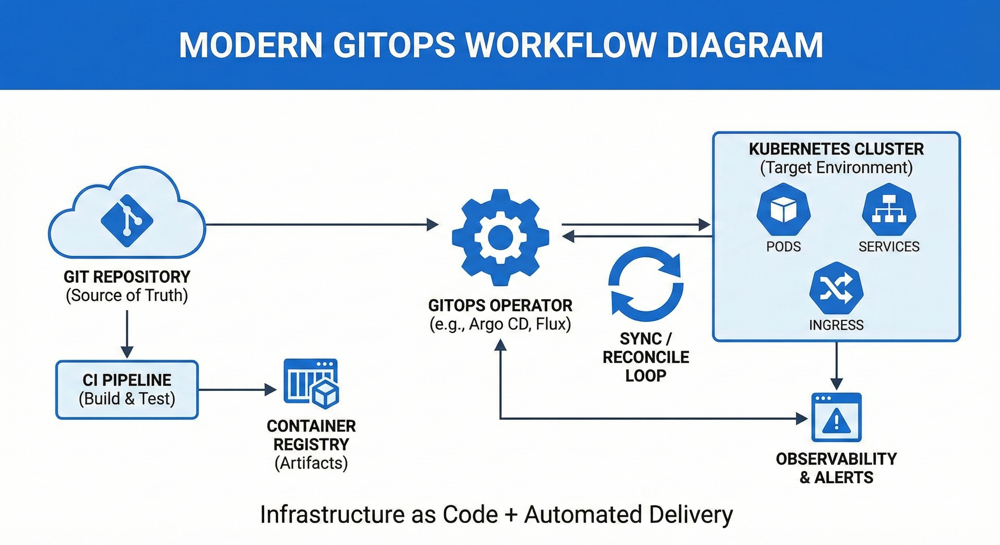

# GitOps: Continuous Delivery & ArgoCD

> **Language / Мова:** [English](#english-version) | [Українська](#українська-версія) | [Other](#other-version)

---

## English Version

### The Parable of the Sacred Repository

In the ancient mountains of DevOps, there lived a wise monk named Git, who tended a sacred repository—a garden of digital wisdom. The monk understood that all things in the garden must exist in harmony: the desired state and the actual state must be one.

One day, a young apprentice named Ops arrived at the monastery. Ops was diligent but struggled with chaos. He would manually plant seeds here, water there, and prune elsewhere, but storms of change would come—servers would fail, configurations would drift, and the garden would fall into disarray.

"Master," Ops pleaded, "how can I maintain this garden when chaos reigns?"

The wise monk Git replied, "Child, you must see the garden not as separate plants, but as a single, living declaration of perfection. Write down how the garden should be—not what to do, but what should exist. Store this declaration in my sacred repository, and let the garden reconcile itself to this truth."

Ops learned to write manifests: "There shall be three cherry trees in the east, watered every dawn. There shall be a stone path leading to the meditation hall." He committed these declarations to the repository, and through the power of automation (which the monk called "continuous reconciliation"), the garden maintained itself.

When storms came, the garden healed. When visitors trampled paths, they were restored. When seasons changed, the garden adapted according to the declarations in the sacred repository.

The lesson was clear: **GitOps is not about doing, but about declaring what should be**. The system continuously reconciles reality with this declaration. Through version control, collaboration becomes sacred. Through automation, human error becomes enlightenment. Through audit trails, wisdom is preserved.

And so Ops became enlightened, and the garden flourished eternally in perfect harmony.

### What You'll Learn

  

GitOps was coined in 2017 by Alexis Richardson (CEO of Weaveworks) as a way to apply software development best practices—version control, automation, and collaboration—to infrastructure operations. Today it is the industry standard for managing Kubernetes deployments at scale.

This course takes you from zero to confident practitioner. By the end, you will be able to:

- **Understand Continuous Delivery** — principles, pipelines, and why they matter
- **Think in GitOps** — Git as the single source of truth for infrastructure
- **Deploy with ArgoCD** — install, configure, and manage applications using ArgoCD CRDs
- **Build real-world setups** — App-of-Apps pattern, multi-environment Helm charts, automated sync & self-healing
- **Avoid common pitfalls** — security, monitoring, and operational best practices

### Course Roadmap

| # | Module | Topic | Go to |
|---|--------|-------|-------|
| 0 | Introduction to CD | Continuous Delivery fundamentals | [EN](0-Introduction-CD/EN/IntroductionToCD.md) \| [UA](0-Introduction-CD/UA/ВступДоCD.md) \| [Other](0-Introduction-CD/other/IntroductionToCD.md) |
| 1 | Introduction to GitOps | GitOps principles & history | [EN](1-Intrduction-GitOps/EN/IntroductionToGitOps.md) \| [UA](1-Intrduction-GitOps/UA/ВступДоGitOps.md) \| [Other](1-Intrduction-GitOps/other/IntroductionToGitOps.md) |
| 2 | Introduction to ArgoCD | Architecture & core concepts | [EN](2-Introduction-to-ArgoCD/EN/IntroductionToArgoCD.md) \| [UA](2-Introduction-to-ArgoCD/UA/ВступДоArgoCD.md) \| [Other](2-Introduction-to-ArgoCD/other/IntroductionToArgoCD.md) |
| 3 | ArgoCD Applications | Custom Resource Definitions | [EN](3-CRD-ArgoCD/EN/IntroductionToArgoApplications.md) \| [UA](3-CRD-ArgoCD/UA/АплікаціяArgoCD.md) \| [Other](3-CRD-ArgoCD/other/IntroductionToArgoApplications.md) |
| 4 | Practice Lab | Hands-on deployment with ArgoCD | [EN](4-Practice/EN/PracticeLab.md) \| [UA](4-Practice/UA/ПрактичнаРобота.md) \| [Other](4-Practice/other/PracticeLab.md) |
| 5 | Conclusion | Summary & next steps | [EN](5-Conclusion/EN/Conclusion.md) \| [UA](5-Conclusion/UA/Висновок.md) \| [Other](5-Conclusion/other/Conclusion.md) |

Each module includes a **quiz** to test your understanding.

### Who Is This For

- **DevOps Engineers** looking to adopt GitOps workflows
- **SREs & Platform Engineers** building self-healing infrastructure
- **Developers** moving into infrastructure and deployment automation
- **Team Leads** evaluating GitOps for their organizations

No prior ArgoCD experience required. Basic familiarity with Kubernetes and Git is helpful.

### Prerequisites & Getting Started

Before the practice lab, you'll need kubectl, a local Kubernetes cluster, and ArgoCD installed. See the full setup guide:

**[Prerequisites Installation Guide](4-Practice/PrerequisitesInstallation.md)**

---

## Українська версія

### Притча про священне сховище

У стародавніх горах DevOps жив мудрий монах на ім'я Git, який доглядав священне сховище—сад цифрової мудрості. Монах розумів, що все в саду має існувати в гармонії: бажаний стан і фактичний стан мають бути єдиними.

Одного дня до монастиря прийшов молодий учень на ім'я Ops. Ops був старанним, але боровся з хаосом. Він вручну сіяв насіння тут, поливав там, і підстригав скрізь, але приходили бурі змін—сервери виходили з ладу, конфігурації дрейфували, і сад занепадав у безлад.

"Майстре," благав Ops, "як мені підтримувати цей сад, коли панує хаос?"

Мудрий монах Git відповів: "Дитино, ти маєш бачити сад не як окремі рослини, а як єдине, живе оголошення досконалості. Запиши, яким має бути сад—не що робити, а що має існувати. Збережи це оголошення в моєму священному сховищі, і нехай сад узгоджує себе з цією істиною."

Ops навчився писати маніфести: "Нехай будуть три вишневі дерева на сході, поливані щодня на світанку. Нехай буде кам'яна стежка, що веде до зали медитації." Він фіксував ці оголошення в сховищі, і через силу автоматизації (яку монах називав "безперервним узгодженням"), сад підтримував себе сам.

Коли приходили бурі, сад зцілювався. Коли відвідувачі топтали стежки, вони відновлювалися. Коли змінювалися пори року, сад адаптувався відповідно до оголошень у священному сховищі.

Урок був ясним: **GitOps — це не про дії, а про оголошення того, що має бути**. Система безперервно узгоджує реальність із цим оголошенням. Через контроль версій співпраця стає священною. Через автоматизацію людська помилка стає просвітленням. Через аудиторські сліди мудрість зберігається.

І так Ops досяг просвітлення, і сад вічно процвітав у досконалій гармонії.

### Що ви вивчите

  

GitOps був запропонований у 2017 році Алексісом Річардсоном (CEO Weaveworks) як спосіб застосувати найкращі практики розробки—контроль версій, автоматизацію та співпрацю—до операцій інфраструктури. Сьогодні це індустріальний стандарт управління Kubernetes-розгортаннями у масштабі.

Цей курс проведе вас від нуля до впевненого практика. Після завершення ви зможете:

- **Розуміти Continuous Delivery** — принципи, пайплайни та чому це важливо
- **Мислити в GitOps** — Git як єдине джерело істини для інфраструктури
- **Розгортати з ArgoCD** — встановлювати, налаштовувати та керувати додатками через ArgoCD CRD
- **Будувати реальні конфігурації** — патерн App-of-Apps, мультисередовищні Helm-чарти, автоматична синхронізація та самовідновлення
- **Уникати типових помилок** — безпека, моніторинг та операційні найкращі практики

### Дорожня карта курсу

| # | Модуль | Тема | Перейти |
|---|--------|------|---------|
| 0 | Вступ до CD | Основи Continuous Delivery | [EN](0-Introduction-CD/EN/IntroductionToCD.md) \| [UA](0-Introduction-CD/UA/ВступДоCD.md) \| [Other](0-Introduction-CD/other/IntroductionToCD.md) |
| 1 | Вступ до GitOps | Принципи та історія GitOps | [EN](1-Intrduction-GitOps/EN/IntroductionToGitOps.md) \| [UA](1-Intrduction-GitOps/UA/ВступДоGitOps.md) \| [Other](1-Intrduction-GitOps/other/IntroductionToGitOps.md) |
| 2 | Вступ до ArgoCD | Архітектура та основні концепції | [EN](2-Introduction-to-ArgoCD/EN/IntroductionToArgoCD.md) \| [UA](2-Introduction-to-ArgoCD/UA/ВступДоArgoCD.md) \| [Other](2-Introduction-to-ArgoCD/other/IntroductionToArgoCD.md) |
| 3 | Додатки ArgoCD | Custom Resource Definitions | [EN](3-CRD-ArgoCD/EN/IntroductionToArgoApplications.md) \| [UA](3-CRD-ArgoCD/UA/АплікаціяArgoCD.md) \| [Other](3-CRD-ArgoCD/other/IntroductionToArgoApplications.md) |
| 4 | Практична робота | Практичне розгортання з ArgoCD | [EN](4-Practice/EN/PracticeLab.md) \| [UA](4-Practice/UA/ПрактичнаРобота.md) \| [Other](4-Practice/other/PracticeLab.md) |
| 5 | Висновок | Підсумки та наступні кроки | [EN](5-Conclusion/EN/Conclusion.md) \| [UA](5-Conclusion/UA/Висновок.md) \| [Other](5-Conclusion/other/Conclusion.md) |

Кожен модуль включає **тест** для перевірки знань.

### Для кого цей курс

- **DevOps-інженери**, які хочуть впровадити GitOps-підхід
- **SRE та Platform-інженери**, що будують інфраструктуру з самовідновленням
- **Розробники**, які переходять до автоматизації інфраструктури та розгортання
- **Тімліди**, що оцінюють GitOps для своїх організацій

Попередній досвід з ArgoCD не потрібен. Базове знайомство з Kubernetes та Git буде корисним.

### Передумови та початок роботи

Перед практичною лабораторною вам знадобляться kubectl, локальний Kubernetes-кластер та встановлений ArgoCD. Повний гайд з налаштування:

**[Гайд з встановлення передумов](4-Practice/PrerequisitesInstallation.md)**

---

## Other Version

### Притча о священном хранилище

В древних горах DevOps жил мудрый монах по имени Git, который хранил священное хранилище—сад цифровой мудрости. Монах понимал, что всё в саду должно существовать в гармонии: желаемое состояние и фактическое состояние должны быть едины.

Однажды в монастырь пришёл молодой ученик по имени Ops. Ops был прилежным, но боролся с хаосом. Он вручную сажал семена здесь, поливал там и подстригал повсюду, но приходили бури перемен—серверы выходили из строя, конфигурации дрейфовали, и сад приходил в беспорядок.

«Учитель,—умолял Ops,—как мне поддерживать этот сад, когда царит хаос?»

Мудрый монах Git ответил: «Чадо, ты должен видеть сад не как отдельные растения, а как единое, живое объявление совершенства. Запиши, каким должен быть сад—не что делать, а что должно существовать. Храни это объявление в моём священном хранилище, и пусть сад согласует себя с этой истиной.»

Ops научился писать манифесты: «Да будут три вишнёвых дерева на востоке, поливаемые каждое утро. Да будет каменная тропа, ведущая к залу медитации.» Он фиксировал эти объявления в хранилище, и силой автоматизации (которую монах называл «непрерывным согласованием») сад поддерживал себя сам.

Когда приходили бури, сад исцелялся. Когда посетители вытаптывали тропы, они восстанавливались. Когда сменялись времена года, сад адаптировался согласно объявлениям в священном хранилище.

Урок был ясен: **GitOps — это не про действия, а про объявление того, что должно быть**. Система непрерывно согласует реальность с этим объявлением. Через контроль версий совместная работа становится священной. Через автоматизацию человеческая ошибка становится просветлением. Через аудиторские следы мудрость сохраняется.

И так Ops достиг просветления, и сад вечно процветал в совершенной гармонии.

### Что вы изучите

  

GitOps был предложен в 2017 году Алексисом Ричардсоном (CEO Weaveworks) как способ применить лучшие практики разработки—контроль версий, автоматизацию и совместную работу—к операциям инфраструктуры. Сегодня это индустриальный стандарт управления Kubernetes-развёртываниями в масштабе.

Этот курс проведёт вас от нуля до уверенного практика. После завершения вы сможете:

- **Понимать Continuous Delivery** — принципы, пайплайны и почему это важно
- **Мыслить в GitOps** — Git как единственный источник истины для инфраструктуры
- **Развёртывать с ArgoCD** — устанавливать, настраивать и управлять приложениями через ArgoCD CRD
- **Строить реальные конфигурации** — паттерн App-of-Apps, мультисредовые Helm-чарты, автоматическая синхронизация и самовосстановление
- **Избегать типичных ошибок** — безопасность, мониторинг и операционные лучшие практики

### Дорожная карта курса

| # | Модуль | Тема | Перейти |
|---|--------|------|---------|
| 0 | Введение в CD | Основы Continuous Delivery | [EN](0-Introduction-CD/EN/IntroductionToCD.md) \| [UA](0-Introduction-CD/UA/ВступДоCD.md) \| [Other](0-Introduction-CD/other/IntroductionToCD.md) |
| 1 | Введение в GitOps | Принципы и история GitOps | [EN](1-Intrduction-GitOps/EN/IntroductionToGitOps.md) \| [UA](1-Intrduction-GitOps/UA/ВступДоGitOps.md) \| [Other](1-Intrduction-GitOps/other/IntroductionToGitOps.md) |
| 2 | Введение в ArgoCD | Архитектура и основные концепции | [EN](2-Introduction-to-ArgoCD/EN/IntroductionToArgoCD.md) \| [UA](2-Introduction-to-ArgoCD/UA/ВступДоArgoCD.md) \| [Other](2-Introduction-to-ArgoCD/other/IntroductionToArgoCD.md) |
| 3 | Приложения ArgoCD | Custom Resource Definitions | [EN](3-CRD-ArgoCD/EN/IntroductionToArgoApplications.md) \| [UA](3-CRD-ArgoCD/UA/АплікаціяArgoCD.md) \| [Other](3-CRD-ArgoCD/other/IntroductionToArgoApplications.md) |
| 4 | Практическая работа | Практическое развёртывание с ArgoCD | [EN](4-Practice/EN/PracticeLab.md) \| [UA](4-Practice/UA/ПрактичнаРобота.md) \| [Other](4-Practice/other/PracticeLab.md) |
| 5 | Заключение | Итоги и следующие шаги | [EN](5-Conclusion/EN/Conclusion.md) \| [UA](5-Conclusion/UA/Висновок.md) \| [Other](5-Conclusion/other/Conclusion.md) |

Каждый модуль включает **тест** для проверки знаний.

### Для кого этот курс

- **DevOps-инженеры**, желающие внедрить GitOps-подход
- **SRE и Platform-инженеры**, строящие инфраструктуру с самовосстановлением
- **Разработчики**, переходящие к автоматизации инфраструктуры и развёртывания
- **Тимлиды**, оценивающие GitOps для своих организаций

Предыдущий опыт с ArgoCD не требуется. Базовое знакомство с Kubernetes и Git будет полезным.

### Предварительные требования

Перед практической лабораторной вам понадобятся kubectl, локальный Kubernetes-кластер и установленный ArgoCD. Полное руководство по настройке:

**[Руководство по установке](4-Practice/PrerequisitesInstallation.md)**

---

*This course is designed to guide you from GitOps fundamentals to advanced implementation. May your infrastructure always be in harmony with your declarations.*

*Цей курс створений, щоб провести вас від основ GitOps до просунутої реалізації. Нехай ваша інфраструктура завжди буде в гармонії з вашими деклараціями.*

*Этот курс создан, чтобы провести вас от основ GitOps до продвинутой реализации. Пусть ваша инфраструктура всегда будет в гармонии с вашими декларациями.*
